# SGI EMCH — Diagrama de Clases

> Representación del modelo de dominio basada en el esquema de la base de datos `db_sgi_emch`.  
> Generado a partir del script `db_sgi_emch.sql`.

---

## Leyenda

| Símbolo | Significado |
|---|---|
| `PK` | Clave primaria |
| `FK` | Clave foránea |
| `UK` | Restricción de unicidad |
| `--\|>` | Herencia |
| `o--` | Asociación (FK referencial) |
| `*--` | Composición (CASCADE DELETE) |
| `<<Table>>` | Tabla de base de datos |
| `<<View>>` | Vista calculada (solo lectura) |

---

## Diagrama

```mermaid
classDiagram
    direction LR

    %% ─────────────────────────────────────────────────
    %% DOMINIO: Usuarios y Seguridad
    %% ─────────────────────────────────────────────────

    class Rol {
        <<Table>>
        INT id_rol PK
        VARCHAR(50) nombre_rol UK
        VARCHAR(255) descripcion
    }

    class Area {
        <<Table>>
        INT id_area PK
        VARCHAR(20) codigo_area UK
        VARCHAR(100) nombre_area
        VARCHAR(255) descripcion
        YEAR anio_vigencia
        TINYINT(1) activo
        TIMESTAMP created_at
    }

    class UsuarioSistema {
        <<Table>>
        INT id_usuario PK
        INT id_rol FK
        INT id_area FK
        VARCHAR(100) nombres
        VARCHAR(100) apellidos
        CHAR(8) dni UK
        VARCHAR(50) username UK
        VARCHAR(255) password_hash
        VARCHAR(150) email
        TINYINT(1) activo
        TIMESTAMP ultimo_acceso
        TIMESTAMP created_at
    }

    class AuditLog {
        <<Table>>
        BIGINT id_log PK
        INT id_usuario FK nullable
        VARCHAR(50) tabla_afectada
        ENUM operacion
        INT registro_id
        JSON datos_anteriores
        JSON datos_nuevos
        VARCHAR(45) ip_origen
        TIMESTAMP fecha_accion
    }

    %% ─────────────────────────────────────────────────
    %% DOMINIO: Catálogos
    %% ─────────────────────────────────────────────────

    class TipoEquipo {
        <<Table>>
        INT id_tipo PK
        VARCHAR(50) nombre_tipo UK
        VARCHAR(255) descripcion
    }

    class ConfigStock {
        <<Table>>
        INT id_config PK
        INT id_tipo FK UK
        TINYINT umbral_pct
        INT id_usuario_config FK
        TIMESTAMP fecha_modificacion
    }

    class Marca {
        <<Table>>
        INT id_marca PK
        VARCHAR(80) nombre_marca UK
    }

    class ModeloEquipo {
        <<Table>>
        INT id_modelo PK
        INT id_marca FK
        INT id_tipo FK
        VARCHAR(100) nombre_modelo
    }

    class SistemaOperativo {
        <<Table>>
        INT id_so PK
        VARCHAR(80) nombre_so
        VARCHAR(50) version_so
    }

    class TipoIncidente {
        <<Table>>
        INT id_tipo_incidente PK
        VARCHAR(50) nombre_tipo UK
        SMALLINT tiempo_respuesta_min
        SMALLINT tiempo_resolucion_min
        VARCHAR(255) descripcion
    }

    %% ─────────────────────────────────────────────────
    %% DOMINIO: Inventario de Equipos
    %% ─────────────────────────────────────────────────

    class Equipo {
        <<Table>>
        INT id_equipo PK
        VARCHAR(20) codigo_ejercito UK
        INT id_tipo FK
        INT id_modelo FK
        INT id_area FK
        INT id_so FK
        VARCHAR(80) numero_serie UK
        VARCHAR(150) nombre_responsable
        VARCHAR(17) mac_address UK
        VARCHAR(45) ip_address
        ENUM tipo_red
        ENUM estado
        DATE fecha_adquisicion
        DATE fecha_registro
        DATE fecha_baja
        TEXT observaciones
    }

    class EspecificacionTecnica {
        <<Table>>
        INT id_espec PK
        INT id_equipo FK UK
        VARCHAR(150) procesador
        TINYINT nucleos
        TINYINT hilos
        TINYINT ram_modulos
        SMALLINT ram_total_gb
        SMALLINT ram_velocidad_mhz
        VARCHAR(50) ram_marca
        VARCHAR(100) disco_modelo
        VARCHAR(20) disco_interface
        DECIMAL(8,2) disco_capacidad_gb
        DECIMAL(8,2) disco_usado_gb
        DECIMAL(8,2) disco_libre_gb
        VARCHAR(50) gpu_marca
        VARCHAR(100) gpu_modelo
        DECIMAL(4,2) gpu_vram_gb
        VARCHAR(50) monitor_marca
        VARCHAR(80) monitor_modelo
        VARCHAR(100) red_modelo
    }

    class HistorialEstado {
        <<Table>>
        INT id_historial PK
        INT id_equipo FK
        INT id_usuario FK
        ENUM estado_anterior
        ENUM estado_nuevo
        VARCHAR(255) motivo
        TIMESTAMP fecha_cambio
    }

    %% ─────────────────────────────────────────────────
    %% DOMINIO: Tickets de Incidencias
    %% ─────────────────────────────────────────────────

    class Ticket {
        <<Table>>
        INT id_ticket PK
        VARCHAR(20) numero_ticket UK
        INT id_equipo FK
        INT id_tecnico FK
        INT id_tipo_incidente FK
        VARCHAR(200) titulo
        TEXT descripcion
        ENUM estado
        ENUM prioridad
        TIMESTAMP fecha_apertura
        TIMESTAMP fecha_respuesta
        TIMESTAMP fecha_resolucion
        TIMESTAMP fecha_cierre
        TINYINT(1) fuera_de_sla
        VARCHAR(500) pdf_acta_path
    }

    class HistorialTicket {
        <<Table>>
        INT id_hist_ticket PK
        INT id_ticket FK
        INT id_usuario FK
        ENUM estado_anterior
        ENUM estado_nuevo
        TEXT comentario
        TIMESTAMP fecha_cambio
    }

    %% ─────────────────────────────────────────────────
    %% DOMINIO: Notificaciones
    %% ─────────────────────────────────────────────────

    class Notificacion {
        <<Table>>
        INT id_notif PK
        INT id_usuario FK
        ENUM tipo_notif
        VARCHAR(200) titulo
        TEXT mensaje
        TINYINT(1) leida
        VARCHAR(500) url_accion
        TIMESTAMP fecha_creacion
    }

    %% ─────────────────────────────────────────────────
    %% VISTAS (solo lectura)
    %% ─────────────────────────────────────────────────

    class v_dashboard_resumen {
        <<View>>
        VARCHAR nombre_tipo
        BIGINT total
        DECIMAL asignados
        DECIMAL en_bodega
        DECIMAL en_reparacion
        DECIMAL dados_de_baja
        DECIMAL stock_operativo
        TINYINT umbral_stock_pct
        DECIMAL(29,1) pct_operativo
        DECIMAL equipos_mayores_5_anios
    }

    class v_stock_critico {
        <<View>>
        INT id_tipo
        VARCHAR nombre_tipo
        BIGINT total_equipos
        DECIMAL stock_operativo
        TINYINT umbral_pct
        DECIMAL(29,1) pct_actual
        INT en_alerta
    }

    class v_tickets_activos {
        <<View>>
        INT id_ticket
        VARCHAR numero_ticket
        VARCHAR codigo_ejercito
        VARCHAR nombre_area
        VARCHAR tecnico
        VARCHAR tipo_incidente
        VARCHAR titulo
        ENUM estado
        ENUM prioridad
        TIMESTAMP fecha_apertura
        SMALLINT sla_minutos
        BIGINT minutos_transcurridos
        BIGINT minutos_restantes_sla
        INT sla_vencido
        TINYINT(1) fuera_de_sla
    }

    class v_inventario_completo {
        <<View>>
        INT id_equipo
        VARCHAR codigo_ejercito
        VARCHAR tipo
        VARCHAR marca
        VARCHAR modelo
        VARCHAR codigo_area
        VARCHAR area
        VARCHAR nombre_so
        VARCHAR numero_serie
        VARCHAR nombre_responsable
        ENUM tipo_red
        ENUM estado
        DATE fecha_adquisicion
        INT anios_antiguedad
        VARCHAR procesador
        SMALLINT ram_total_gb
        DECIMAL disco_capacidad_gb
        DECIMAL disco_uso_pct
    }

    %% ─────────────────────────────────────────────────
    %% RELACIONES ENTRE TABLAS
    %% ─────────────────────────────────────────────────

    Rol                "1" o-- "*"   UsuarioSistema    : id_rol
    Area               "1" o-- "*"   UsuarioSistema    : id_area
    UsuarioSistema     "0..1" o-- "*" AuditLog         : id_usuario

    TipoEquipo         "1" o-- "0..1" ConfigStock      : id_tipo
    UsuarioSistema     "1" o-- "*"   ConfigStock       : id_usuario_config
    Marca              "1" o-- "*"   ModeloEquipo      : id_marca
    TipoEquipo         "1" o-- "*"   ModeloEquipo      : id_tipo

    TipoEquipo         "1" o-- "*"   Equipo            : id_tipo
    ModeloEquipo       "1" o-- "*"   Equipo            : id_modelo
    Area               "1" o-- "*"   Equipo            : id_area
    SistemaOperativo   "1" o-- "*"   Equipo            : id_so

    Equipo             "1" *-- "0..1" EspecificacionTecnica : CASCADE DELETE
    Equipo             "1" *-- "*"   HistorialEstado   : CASCADE DELETE
    UsuarioSistema     "1" o-- "*"   HistorialEstado   : id_usuario

    TipoIncidente      "1" o-- "*"   Ticket            : id_tipo_incidente
    Equipo             "1" o-- "*"   Ticket            : id_equipo
    UsuarioSistema     "1" o-- "*"   Ticket            : id_tecnico

    Ticket             "1" *-- "*"   HistorialTicket   : CASCADE DELETE
    UsuarioSistema     "1" o-- "*"   HistorialTicket   : id_usuario

    UsuarioSistema     "1" *-- "*"   Notificacion      : CASCADE DELETE

    %% ─────────────────────────────────────────────────
    %% DEPENDENCIAS DE VISTAS
    %% ─────────────────────────────────────────────────

    TipoEquipo         ..>  v_dashboard_resumen   : alimenta
    Equipo             ..>  v_dashboard_resumen   : alimenta
    ConfigStock        ..>  v_dashboard_resumen   : alimenta

    TipoEquipo         ..>  v_stock_critico       : alimenta
    Equipo             ..>  v_stock_critico       : alimenta
    ConfigStock        ..>  v_stock_critico       : alimenta

    Ticket             ..>  v_tickets_activos     : alimenta
    Equipo             ..>  v_tickets_activos     : alimenta
    UsuarioSistema     ..>  v_tickets_activos     : alimenta
    TipoIncidente      ..>  v_tickets_activos     : alimenta

    Equipo             ..>  v_inventario_completo : alimenta
    EspecificacionTecnica ..> v_inventario_completo : alimenta
```

---

## Valores de ENUM

| Tabla | Columna | Valores válidos |
|---|---|---|
| `equipo` | `tipo_red` | `ETHERNET`, `WIFI`, `N/A` |
| `equipo` | `estado` | `EN_BODEGA`, `ASIGNADO`, `EN_REPARACION`, `PRESTADO`, `DADO_DE_BAJA` |
| `historial_estado` | `estado_anterior` / `estado_nuevo` | `EN_BODEGA`, `ASIGNADO`, `EN_REPARACION`, `PRESTADO`, `DADO_DE_BAJA` |
| `ticket` | `estado` | `ABIERTO`, `EN_PROCESO`, `RESUELTO`, `CERRADO` |
| `ticket` | `prioridad` | `BAJA`, `MEDIA`, `ALTA`, `CRITICA` |
| `historial_ticket` | `estado_anterior` / `estado_nuevo` | `ABIERTO`, `EN_PROCESO`, `RESUELTO`, `CERRADO` |
| `notificacion` | `tipo_notif` | `STOCK_CRITICO`, `SLA_VENCIDO`, `TICKET_ASIGNADO`, `INFO` |
| `audit_log` | `operacion` | `INSERT`, `UPDATE`, `DELETE` |

---

## Reglas de Integridad Referencial

| Relación | ON DELETE | ON UPDATE |
|---|---|---|
| `equipo → especificacion_tecnica` | CASCADE | CASCADE |
| `equipo → historial_estado` | CASCADE | CASCADE |
| `ticket → historial_ticket` | CASCADE | CASCADE |
| `usuario_sistema → notificacion` | CASCADE | CASCADE |
| `usuario_sistema → audit_log` | SET NULL | CASCADE |
| Todas las demás FK | RESTRICT | CASCADE |

---

## Procedimiento Almacenado

### `sp_generar_numero_ticket(OUT p_numero VARCHAR(20))`

Genera el número de ticket con formato `TKT-YYYYMM-NNNN`:
- `YYYYMM` → año y mes actuales
- `NNNN` → secuencia correlativa dentro del mes, con cero a la izquierda
- Ejemplo: `TKT-202605-0001`
