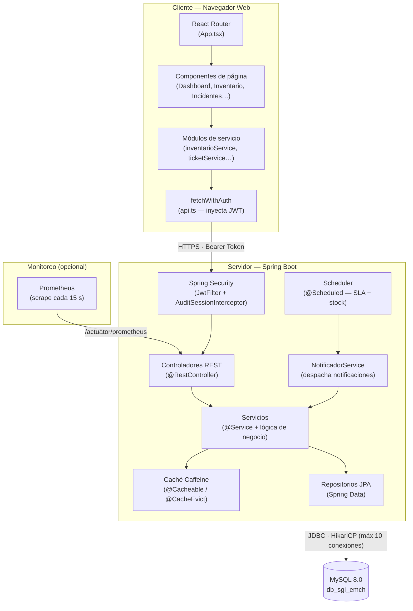

# Arquitectura de la aplicación

SGI-EMCH sigue una arquitectura **cliente-servidor de tres capas** con separación estricta entre frontend (SPA), backend (API REST) y base de datos.

## Vista general



## Capas del backend

| Capa | Anotación Spring | Responsabilidad |
|---|---|---|
| **Controlador** | `@RestController` | Mapear rutas HTTP, validar entrada, devolver HTTP status |
| **Servicio** | `@Service` | Lógica de negocio, transacciones, orquestación |
| **Repositorio** | `@Repository` (Spring Data) | Acceso a datos vía JPA/JPQL |
| **Entidad** | `@Entity` | Mapeo objeto-relacional a tablas MySQL |
| **DTO** | Records Java | Contratos de entrada (`*Request`) y salida (`*Response`) |

### Flujo de una request autenticada

```mermaid
sequenceDiagram
    participant B as Browser
    participant NP as Nginx Proxy Mgr
    participant FE as Frontend (Nginx)
    participant JF as JwtFilter
    participant ASI as AuditSessionInterceptor
    participant C as Controller
    participant S as Service
    participant R as Repository
    participant DB as MySQL

    B->>NP: HTTPS GET /api/inventario/equipos
    NP->>FE: proxea /api/*
    FE->>JF: HTTP interno
    JF->>JF: Valida JWT (firma + expiración)
    JF->>ASI: si válido, continúa cadena
    ASI->>DB: SET @id_usuario_activo, @ip_cliente
    ASI->>C: request con SecurityContext
    C->>S: listarEquipos(filtros, pageable)
    S->>R: findFiltered(...)
    R->>DB: SELECT ... FROM equipo
    DB-->>R: ResultSet
    R-->>S: Page&lt;Equipo&gt;
    S-->>C: PagedResponse&lt;EquipoResponse&gt;
    C-->>B: 200 OK + JSON
```

## Capas del frontend

| Capa | Archivos | Responsabilidad |
|---|---|---|
| **Enrutamiento** | `App.tsx` | Define rutas SPA con React Router |
| **Layout** | `Layout.tsx` | Shell global: sidebar, navegación, logout |
| **Páginas** | `Dashboard.tsx`, `Inventario.tsx`, etc. | Composición de UI + orquestación de servicios |
| **Servicios** | `src/services/*.ts` | Llamadas HTTP centralizadas, tipado de respuestas |
| **Infraestructura HTTP** | `src/lib/api.ts` | `fetchWithAuth`: inyecta JWT, maneja 401, dispara evento `sgi:unauthorized` |
| **Componentes UI** | `src/app/components/ui/` | shadcn/ui — botones, tablas, diálogos, badges |

## Seguridad

- Autenticación **stateless** con JWT: access token (1 h) + refresh token (24 h).
- El `JwtFilter` intercepta cada request, valida la firma con la clave secreta y carga el contexto de Spring Security.
- El `AuditSessionInterceptor` establece variables de sesión MySQL (`@id_usuario_activo`, `@ip_cliente`) para los triggers de auditoría en la BD.
- Roles: `ADMIN`, `TECNICO`, `VISUALIZADOR` — el acceso a endpoints se controla con `@PreAuthorize`.

## Escalabilidad y caché

- **HikariCP** gestiona el pool de conexiones (máx. 10) para evitar saturar MySQL.
- **Caffeine** cachea en memoria los datos de catálogo (áreas, tipos, marcas, modelos, SO, tipos de incidente) con TTL de 1 hora y máx. 1 000 entradas.
- Los reportes en PDF y Excel se generan bajo demanda con Apache POI / OpenPDF y no se almacenan en BD.
