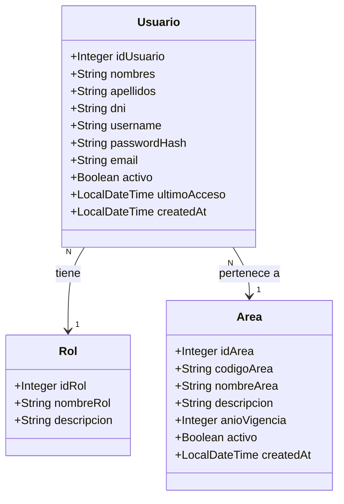
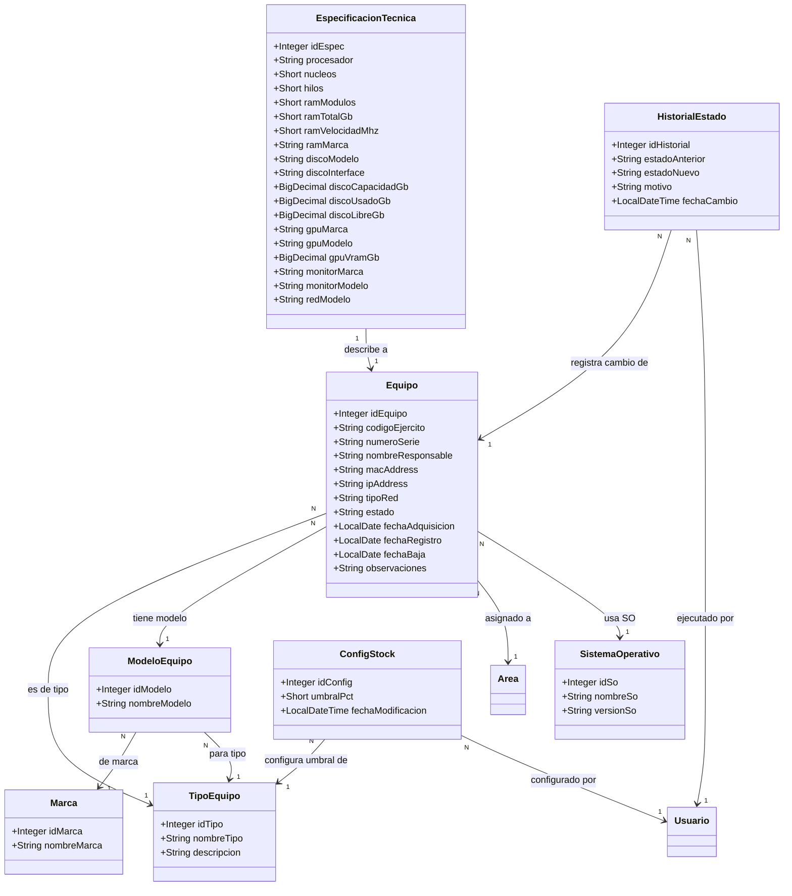
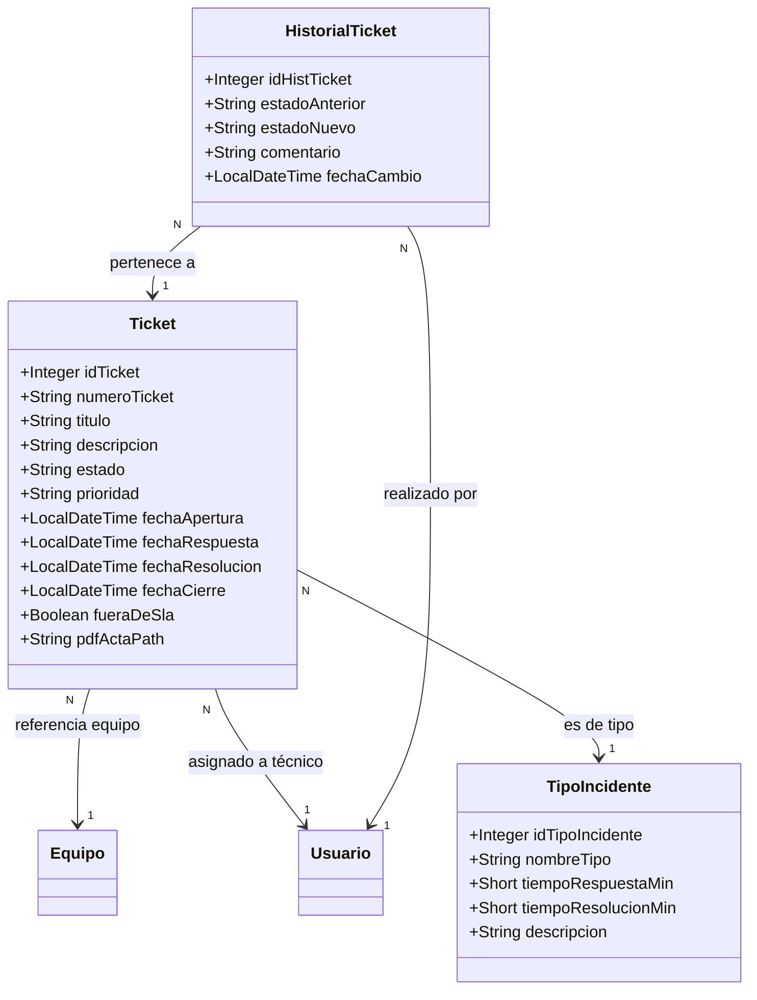
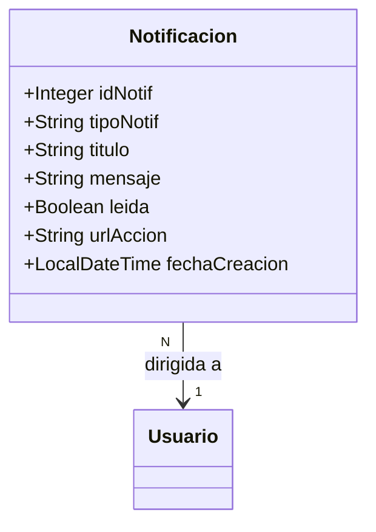

# Diagrama de clases

Muestra las entidades JPA del backend (mapeos objeto-relacional) con sus atributos y relaciones. El diagrama se divide por módulo para mayor legibilidad.

## Módulo de Usuarios y Roles

## Módulo de Inventario

## Módulo de Tickets / Incidentes

## Módulo de Notificaciones

## Enumeraciones

| Clase | Campo | Valores posibles |
|---|---|---|
| `Equipo` | `estado` | `EN_BODEGA`, `ASIGNADO`, `EN_REPARACION`, `PRESTADO`, `DADO_DE_BAJA` |
| `Equipo` | `tipoRed` | `ETHERNET`, `WIFI`, `N/A` |
| `Ticket` | `estado` | `ABIERTO`, `EN_PROCESO`, `RESUELTO`, `CERRADO` |
| `Ticket` | `prioridad` | `BAJA`, `MEDIA`, `ALTA`, `CRITICA` |
| `HistorialEstado` | `estadoAnterior` / `estadoNuevo` | Mismo que `Equipo.estado` |
| `HistorialTicket` | `estadoAnterior` / `estadoNuevo` | Mismo que `Ticket.estado` |
| `Notificacion` | `tipoNotif` | `STOCK_CRITICO`, `SLA_VENCIDO`, `TICKET_ASIGNADO`, `INFO` |

## Vistas SQL (entidades de solo lectura)

| Vista | Descripción |
|---|---|
| `v_dashboard_resumen` | Agrega totales de equipos por tipo y estado para el dashboard |
| `v_inventario_completo` | Join desnormalizado equipo + modelo + marca + área + SO + especificaciones |
| `v_stock_critico` | Tipos de equipo por debajo del umbral configurado en `config_stock` |
| `v_tickets_activos` | Tickets abiertos/en proceso con cálculo de minutos SLA restantes |
