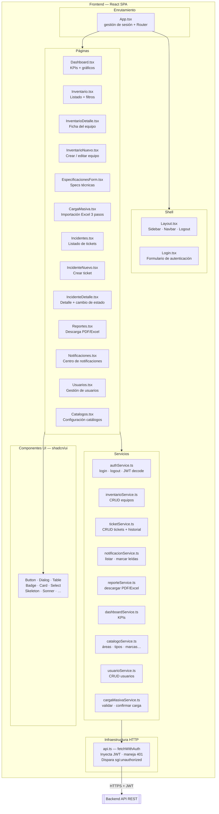
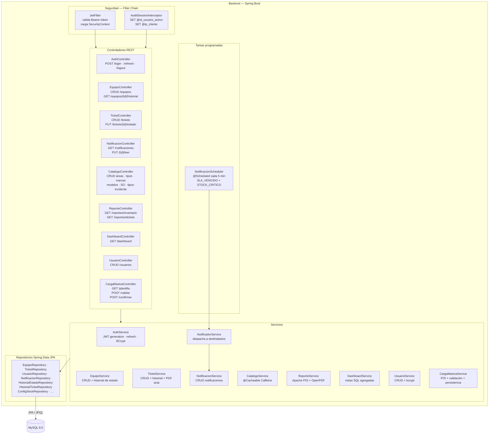
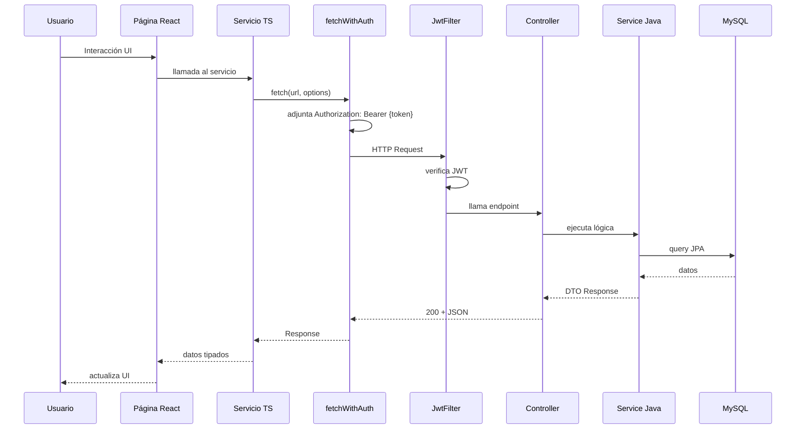

# Diagrama de componentes

## Componentes del frontend

```mermaid
graph TB
    subgraph SPA["Frontend — React SPA"]
        subgraph Routing["Enrutamiento"]
            APP["App.tsx\ngestión de sesión + Router"]
        end

        subgraph Shell["Shell"]
            LAY["Layout.tsx\nSidebar · Navbar · Logout"]
            LOG["Login.tsx\nFormulario de autenticación"]
        end

        subgraph Pages["Páginas"]
            DASH["Dashboard.tsx\nKPIs + gráficos"]
            INV["Inventario.tsx\nListado + filtros"]
            INV_DET["InventarioDetalle.tsx\nFicha del equipo"]
            INV_NEW["InventarioNuevo.tsx\nCrear / editar equipo"]
            ESPEC["EspecificacionesForm.tsx\nSpecs técnicas"]
            CARGA["CargaMasiva.tsx\nImportación Excel 3 pasos"]
            INC["Incidentes.tsx\nListado de tickets"]
            INC_NEW["IncidenteNuevo.tsx\nCrear ticket"]
            INC_DET["IncidenteDetalle.tsx\nDetalle + cambio de estado"]
            REP["Reportes.tsx\nDescarga PDF/Excel"]
            NOTIF["Notificaciones.tsx\nCentro de notificaciones"]
            USR["Usuarios.tsx\nGestión de usuarios"]
            CAT["Catalogos.tsx\nConfiguración catálogos"]
        end

        subgraph Services["Servicios"]
            AUTH_SVC["authService.ts\nlogin · logout · JWT decode"]
            INV_SVC["inventarioService.ts\nCRUD equipos"]
            TKT_SVC["ticketService.ts\nCRUD tickets + historial"]
            NOTIF_SVC["notificacionService.ts\nlistar · marcar leídas"]
            REP_SVC["reporteService.ts\ndescargar PDF/Excel"]
            DASH_SVC["dashboardService.ts\nKPIs"]
            CAT_SVC["catalogoService.ts\náreas · tipos · marcas…"]
            USR_SVC["usuarioService.ts\nCRUD usuarios"]
            CARGA_SVC["cargaMasivaService.ts\nvalidar · confirmar carga"]
        end

        subgraph Infra["Infraestructura HTTP"]
            API["api.ts — fetchWithAuth\nInyecta JWT · maneja 401\nDispara sgi:unauthorized"]
        end

        subgraph UI["Componentes UI — shadcn/ui"]
            UICOMP["Button · Dialog · Table\nBadge · Card · Select\nSkeleton · Sonner · …"]
        end
    end

    APP --> Shell
    APP --> Pages
    Pages --> Services
    Services --> API
    Pages --> UICOMP
    API -->|"HTTPS + JWT"| BACKEND[["Backend API REST"]]
```

## Componentes del backend

```mermaid
graph TB
    subgraph Backend["Backend — Spring Boot"]
        subgraph Security["Seguridad — Filter Chain"]
            JF["JwtFilter\nvalida Bearer token\ncarga SecurityContext"]
            ASI["AuditSessionInterceptor\nSET @id_usuario_activo\nSET @ip_cliente"]
        end

        subgraph Controllers["Controladores REST"]
            AUTH_C["AuthController\nPOST /login · /refresh · /logout"]
            EQ_C["EquipoController\nCRUD /equipos\nGET /equipos/{id}/historial"]
            TKT_C["TicketController\nCRUD /tickets\nPUT /tickets/{id}/estado"]
            NOTIF_C["NotificacionController\nGET /notificaciones\nPUT /{id}/leer"]
            CAT_C["CatalogoController\nCRUD áreas · tipos · marcas\nmodelos · SO · tipos-incidente"]
            REP_C["ReporteController\nGET /reportes/inventario\nGET /reportes/tickets"]
            DASH_C["DashboardController\nGET /dashboard"]
            USR_C["UsuarioController\nCRUD /usuarios"]
            CARGA_C["CargaMasivaController\nGET /plantilla\nPOST /validar\nPOST /confirmar"]
        end

        subgraph Services["Servicios"]
            AUTH_S["AuthService\nJWT generation · refresh · BCrypt"]
            EQ_S["EquipoService\nCRUD + historial de estado"]
            TKT_S["TicketService\nCRUD + historial + PDF acta"]
            NOTIF_S["NotificacionService\nCRUD notificaciones"]
            CAT_S["CatalogoService\n@Cacheable Caffeine"]
            REP_S["ReporteService\nApache POI + OpenPDF"]
            DASH_S["DashboardService\nvistas SQL agregadas"]
            USR_S["UsuarioService\nCRUD + bcrypt"]
            CARGA_S["CargaMasivaService\nPOI + validación + persistencia"]
            NOTIFR_S["NotificadorService\ndespacha a destinatarios"]
        end

        subgraph Scheduled["Tareas programadas"]
            SCH["NotificacionScheduler\n@Scheduled cada 5 min\nSLA_VENCIDO + STOCK_CRITICO"]
        end

        subgraph Repositories["Repositorios Spring Data JPA"]
            REPOS["EquipoRepository · TicketRepository\nUsuarioRepository · NotificacionRepository\nHistorialEstadoRepository\nHistorialTicketRepository\nConfigStockRepository · …"]
        end
    end

    JF --> Controllers
    ASI --> Controllers
    Controllers --> Services
    SCH --> NOTIFR_S --> NOTIF_S
    Services --> REPOS
    REPOS -->|"JPA / JPQL"| DB[("MySQL 8.0")]
```

## Comunicación frontend ↔ backend

```mermaid
sequenceDiagram
    participant U as Usuario
    participant P as Página React
    participant SVC as Servicio TS
    participant API as fetchWithAuth
    participant JF as JwtFilter
    participant C as Controller
    participant S as Service Java
    participant DB as MySQL

    U->>P: Interacción UI
    P->>SVC: llamada al servicio
    SVC->>API: fetch(url, options)
    API->>API: adjunta Authorization: Bearer {token}
    API->>JF: HTTP Request
    JF->>JF: verifica JWT
    JF->>C: llama endpoint
    C->>S: ejecuta lógica
    S->>DB: query JPA
    DB-->>S: datos
    S-->>C: DTO Response
    C-->>API: 200 + JSON
    API-->>SVC: Response
    SVC-->>P: datos tipados
    P-->>U: actualiza UI
```
