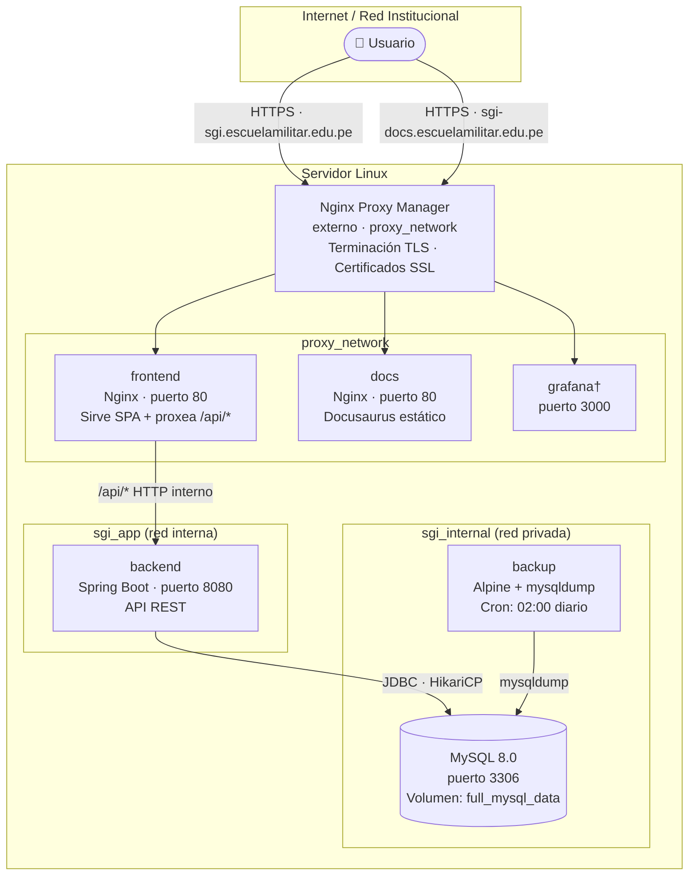
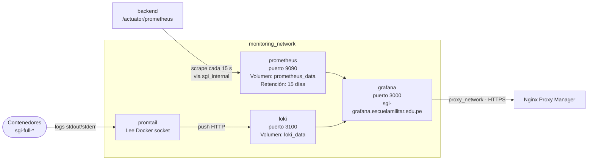

# Diagrama de despliegue

El sistema se despliega íntegramente en un servidor Linux usando **Docker Compose**. Cada servicio corre en su propio contenedor y se comunica a través de redes Docker internas.

## Stack principal (`docker-compose.yml`)

## Stack de monitoreo (`docker-compose.monitoring.yml`)

Stack opcional desplegado por separado.

## Nodos de despliegue

| Nodo | Tipo | Artefactos desplegados |
|---|---|---|
| Servidor Linux | VM / Bare Metal | Todos los contenedores Docker |
| Contenedor `frontend` | Docker (Nginx) | Build de React/Vite compilado a archivos estáticos |
| Contenedor `backend` | Docker (JRE 21) | JAR de Spring Boot |
| Contenedor `docs` | Docker (Nginx) | Build de Docusaurus compilado a archivos estáticos |
| Contenedor `db` | Docker (MySQL 8.0) | Datos en volumen persistente `full_mysql_data` |
| Contenedor `backup` | Docker (Alpine) | Script `backup.sh` ejecutado por crond |
| Contenedor `prometheus` | Docker | Binario Prometheus + datos en `prometheus_data` |
| Contenedor `loki` | Docker | Binario Loki + datos en `loki_data` |
| Contenedor `promtail` | Docker | Binario Promtail + acceso al socket Docker |
| Contenedor `grafana` | Docker | Grafana + dashboards provisioned + datos en `grafana_data` |

## Puertos y acceso externo

Solo Nginx Proxy Manager expone puertos al exterior (80 y 443). Todos los demás servicios son internos.

| URL pública | Servicio destino |
|---|---|
| `https://sgi.escuelamilitar.edu.pe` | frontend (SPA React) |
| `https://sgi-docs.escuelamilitar.edu.pe` | docs (Docusaurus) |
| `https://sgi-grafana.escuelamilitar.edu.pe` | grafana (monitoreo) |

## Healthchecks

| Contenedor | Healthcheck |
|---|---|
| `db` | `mysqladmin ping` cada 10 s — 10 reintentos |
| `backend` | `wget /actuator/health` cada 15 s — 8 reintentos |
| `frontend` | Depende de `backend: healthy` |
