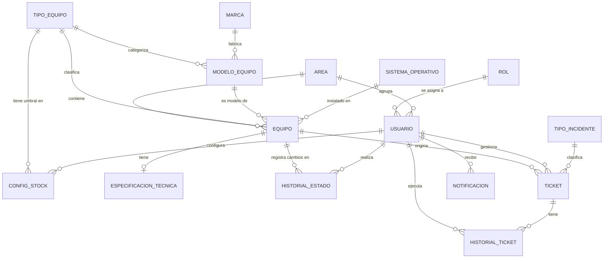

# Diseño conceptual de la base de datos

El diseño conceptual modela las **entidades del dominio** y sus relaciones a un nivel de abstracción alto, sin detalles de implementación (sin tipos de datos, sin claves físicas).

## Entidades identificadas

| Entidad | Descripción |
|---|---|
| **ÁREA** | Dependencia o sección organizacional de la institución |
| **ROL** | Perfil de acceso de un usuario (ADMIN, TECNICO, VISUALIZADOR) |
| **USUARIO** | Persona con acceso al sistema |
| **TIPO_EQUIPO** | Categoría de equipo (PC, Laptop, Impresora…) |
| **MARCA** | Fabricante del hardware |
| **MODELO_EQUIPO** | Modelo específico de un fabricante para un tipo de equipo |
| **SISTEMA_OPERATIVO** | Sistema operativo instalable en un equipo |
| **EQUIPO** | Bien patrimonial tecnológico registrado en el inventario |
| **ESPECIFICACION_TECNICA** | Características de hardware de un equipo concreto |
| **HISTORIAL_ESTADO** | Registro de cada cambio de estado de un equipo |
| **CONFIG_STOCK** | Umbral de alerta de stock por tipo de equipo |
| **TIPO_INCIDENTE** | Categoría de incidente con tiempos SLA definidos |
| **TICKET** | Incidente o solicitud de soporte técnico |
| **HISTORIAL_TICKET** | Registro de cada cambio de estado de un ticket |
| **NOTIFICACIÓN** | Alerta generada automáticamente para un usuario |

## Diagrama Entidad-Relación conceptual

## Relaciones y cardinalidades

| Relación | Tipo | Descripción |
|---|---|---|
| USUARIO — ROL | N:1 | Cada usuario tiene un rol; un rol puede tener muchos usuarios |
| USUARIO — AREA | N:1 | Cada usuario pertenece a un área; un área tiene muchos usuarios |
| EQUIPO — AREA | N:1 | Cada equipo está asignado a un área; un área tiene muchos equipos |
| EQUIPO — TIPO_EQUIPO | N:1 | Cada equipo es de un tipo; un tipo agrupa muchos equipos |
| EQUIPO — MODELO_EQUIPO | N:1 | Cada equipo tiene un modelo específico |
| EQUIPO — SISTEMA_OPERATIVO | N:1 | Cada equipo usa un SO |
| EQUIPO — ESPECIFICACION_TECNICA | 1:0..1 | Un equipo puede tener cero o una ficha de especificaciones |
| EQUIPO — HISTORIAL_ESTADO | 1:N | Un equipo puede tener muchos cambios de estado registrados |
| EQUIPO — TICKET | 1:N | Un equipo puede originar muchos tickets |
| MODELO_EQUIPO — MARCA | N:1 | Cada modelo es de una marca; una marca tiene muchos modelos |
| MODELO_EQUIPO — TIPO_EQUIPO | N:1 | Cada modelo es para un tipo de equipo |
| TICKET — TIPO_INCIDENTE | N:1 | Cada ticket clasifica como un tipo de incidente con SLA |
| TICKET — USUARIO (técnico) | N:1 | Cada ticket es asignado a un técnico |
| TICKET — HISTORIAL_TICKET | 1:N | Un ticket tiene muchos registros de cambio de estado |
| NOTIFICACION — USUARIO | N:1 | Muchas notificaciones pueden dirigirse a un mismo usuario |
| CONFIG_STOCK — TIPO_EQUIPO | N:1 | La configuración de stock aplica a un tipo de equipo |

## Restricciones de dominio

- Un equipo solo puede estar en **un estado** a la vez: `EN_BODEGA`, `ASIGNADO`, `EN_REPARACION`, `PRESTADO`, `DADO_DE_BAJA`.
- Un ticket solo puede estar en **un estado** a la vez: `ABIERTO`, `EN_PROCESO`, `RESUELTO`, `CERRADO`.
- La **prioridad** de un ticket es: `BAJA`, `MEDIA`, `ALTA` o `CRITICA`.
- El campo `fuera_de_sla` en TICKET se establece automáticamente cuando el ticket excede el `tiempo_resolucion_min` de su `TIPO_INCIDENTE`.
- El campo `numero_ticket` se genera automáticamente con el procedimiento `sp_generar_numero_ticket` en formato `TKT-YYYYMM-NNNN`.
- La combinación `(nombre_so, version_so)` en SISTEMA_OPERATIVO es única.
