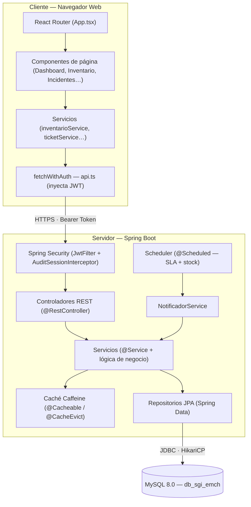
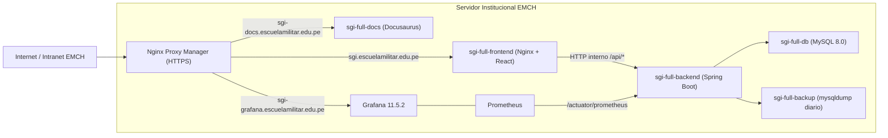
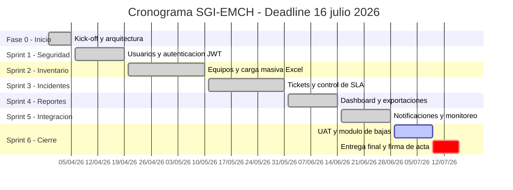

<!-- INFORME DE AVANCE N°3 — SGI-EMCH -->

**Facultad de Ingeniería**

**Carrera Profesional de Ingeniería de Sistemas e Informática**

---

# Sistema Web de Gestión de Inventario de Equipos Informáticos para la EMCH "CFB"

**INFORME DE AVANCE N°3 — SPRINT 6**

| | |
|---|---|
| **Alumno:** | Pariona Torres, Jonas Efrain |
| **Alumno:** | Chavarría Navarro, Aldair |
| **Alumno:** | Andia Canchi, Henrry Jhon |
| **Alumno:** | Orozco Romero, Kattia |
| **Curso:** | Integrador II — Sistemas |
| **Sprint actual:** | Sprint 6 — Cierre y Despliegue |
| **Fecha:** | Junio – Julio 2026 |
| **Sistema en producción:** | https://sgi.escuelamilitar.edu.pe |
| **Documentación técnica:** | https://sgi-docs.escuelamilitar.edu.pe |
| **Repositorio GitHub:** | https://github.com/Jnasus/sgi-emch |

**Lima – Perú**

**2026**

---

## ÍNDICE

- [**Capítulo 1 — ASPECTOS GENERALES**](#capítulo-1--aspectos-generales)
  - [1.1. Definición del problema](#11-definición-del-problema)
  - [1.2. Definición de Objetivos](#12-definición-de-objetivos)
    - [1.2.1. Objetivo General](#121-objetivo-general)
    - [1.2.2. Objetivos Específicos](#122-objetivos-específicos)
    - [1.2.3. Alcances y Limitaciones](#123-alcances-y-limitaciones)
    - [1.2.4. Justificación](#124-justificación)
    - [1.2.5. Estado de Arte](#125-estado-de-arte)
- [**Capítulo 2 — MARCO TEÓRICO**](#capítulo-2--marco-teórico)
  - [2.1. Fundamentos Teóricos](#21-fundamentos-teóricos)
    - [2.1.1. Sistema web de gestión de inventario TI](#211-sistema-web-de-gestión-de-inventario-ti)
    - [2.1.2. Gestión de activos TI — ITAM e ITIL v4](#212-gestión-de-activos-ti--itam-e-itil-v4)
    - [2.1.3. Scrum](#213-scrum)
    - [2.1.4. Frameworks utilizados](#214-frameworks-utilizados)
    - [2.1.5. Arquitectura de tres capas](#215-arquitectura-de-tres-capas)
    - [2.1.6. Sprint](#216-sprint)
    - [2.1.7. Burndown Chart](#217-burndown-chart)
- [**Capítulo 3 — DESARROLLO DE LA SOLUCIÓN**](#capítulo-3--desarrollo-de-la-solución)
  - [3.1. Desarrollo de la solución](#31-desarrollo-de-la-solución)
    - [3.1.1. Visión del Proyecto](#311-visión-del-proyecto)
    - [3.1.2. Product Backlog](#312-product-backlog)
    - [3.1.3. Sprint 0 — Kick-off y Planificación](#313-sprint-0--kick-off-y-planificación)
    - [3.1.4. Sprint I — Usuarios y Seguridad](#314-sprint-i--usuarios-y-seguridad)
    - [3.1.5. Sprint II — Inventario de Equipos](#315-sprint-ii--inventario-de-equipos)
    - [3.1.6. Sprint III — Incidentes y Tickets](#316-sprint-iii--incidentes-y-tickets)
    - [3.1.7. Sprint IV — Reportes y Dashboard](#317-sprint-iv--reportes-y-dashboard)
    - [3.1.8. Sprint V — Notificaciones e Integración](#318-sprint-v--notificaciones-e-integración)
    - [3.1.9. Sprint VI — Cierre y Despliegue *(Sprint actual)*](#319-sprint-vi--cierre-y-despliegue-sprint-actual)
    - [3.1.10. Pruebas de Usabilidad — Heurística de Nielsen](#3110-pruebas-de-usabilidad--heurística-de-nielsen)
    - [3.1.11. Arquitectura de Aplicaciones](#3111-arquitectura-de-aplicaciones)
  - [3.2. Guías](#32-guías)
    - [3.2.1. Estándares de Programación](#321-estándares-de-programación)
    - [3.2.2. Manual de Usuario](#322-manual-de-usuario)
- [**Capítulo 4 — RESULTADOS**](#capítulo-4--resultados)
  - [4.1. Resultados por módulo](#41-resultados-por-módulo)
  - [4.2. Presupuesto](#42-presupuesto)
  - [4.3. Cronograma de actividades](#43-cronograma-de-actividades)
- [**CONCLUSIONES**](#conclusiones)
- [**RECOMENDACIONES**](#recomendaciones)
- [**BIBLIOGRAFÍAS**](#bibliografías)
- [**ANEXOS**](#anexos)

---

# Capítulo 1 — ASPECTOS GENERALES

## 1.1. Definición del problema

El Departamento de Tecnologías de la Información y Comunicaciones (DTIC) de la Escuela Militar de Chorrillos "Coronel Francisco Bolognesi" (EMCH "CFB") es la unidad responsable de administrar y dar soporte a todos los activos tecnológicos de la institución. A la fecha de inicio del proyecto, dicho departamento gestionaba su inventario de equipos informáticos de manera completamente manual, utilizando hojas de cálculo de Microsoft Excel como único repositorio de información.

Esta situación generaba las siguientes problemáticas críticas:

| N° | Problema | Impacto |
|---|---|---|
| P-01 | **Inconsistencias e inconsistencias de datos**: diferentes versiones del Excel con datos contradictorios sobre el estado y ubicación de los equipos. | Imposibilidad de conocer el inventario real en tiempo real. |
| P-02 | **Ausencia de trazabilidad**: no existe un registro histórico de los cambios de estado de los equipos (asignaciones, reparaciones, bajas, préstamos). | Pérdida de información crítica; imposibilidad de auditar movimientos. |
| P-03 | **Sin alertas de reposición**: el departamento no recibe notificaciones cuando el stock de un tipo de equipo cae por debajo de un umbral mínimo. | Riesgo de desabastecimiento sin tiempo de reacción. |
| P-04 | **Gestión informal de incidentes**: los reportes de fallas se gestionan por vía verbal, correo electrónico o llamada telefónica, sin tickets formales, sin asignación a técnicos, sin tiempos de respuesta acordados (SLA) y sin actas de cierre. | Falta de métricas de servicio; imposibilidad de medir el rendimiento del equipo técnico. |
| P-05 | **Reportes manuales e imprecisos**: la generación de reportes para la dirección requiere trabajo manual que consume horas y produce datos desactualizados. | Decisiones directivas basadas en información imprecisa. |

En consecuencia, se plantea el desarrollo del **Sistema de Gestión de Inventario EMCH "CFB" (SGI-EMCH)**: una plataforma web que centralice y digitalice la gestión del inventario de activos TI y la mesa de ayuda técnica del DTIC.

## 1.2. Definición de Objetivos

### 1.2.1. Objetivo General

Desarrollar e implementar un sistema web que digitalice y centralice la gestión integral del inventario de equipos informáticos y la atención de incidentes técnicos del DTIC-EMCH "CFB", garantizando trazabilidad completa, control de SLAs y disponibilidad de información en tiempo real para la toma de decisiones institucionales.

### 1.2.2. Objetivos Específicos

1. **OE-01:** Implementar un módulo de gestión de usuarios con control de acceso basado en roles (RBAC) para cinco perfiles: ADMINISTRADOR, JEFE_DTIC, SUBJEFE_DTIC, TECNICO y DIRECTIVO.
2. **OE-02:** Desarrollar un módulo de inventario que registre el ciclo de vida completo de cada activo TI (alta, asignación, reparación, préstamo, transferencia y baja), con historial inmutable de cambios de estado.
3. **OE-03:** Implementar una mesa de ayuda con tickets de incidentes numerados automáticamente, asignación a técnicos y control de acuerdos de nivel de servicio (SLA) por tipo de incidente.
4. **OE-04:** Construir un dashboard ejecutivo con indicadores en tiempo real (KPIs) y capacidad de exportar reportes en formato Excel y PDF.
5. **OE-05:** Automatizar notificaciones de alerta ante eventos críticos: SLA vencido y stock de equipos por debajo del umbral configurado.
6. **OE-06:** Desplegar el sistema en la infraestructura del servidor institucional con seguridad HTTPS, backup automático diario y stack de monitoreo operativo (Prometheus + Grafana).

### 1.2.3. Alcances y Limitaciones

**Alcance del sistema:**

| Módulo | Descripción | Incluido |
|---|---|---|
| Usuarios y Seguridad | Autenticación JWT, 5 roles RBAC, auditoría de acciones | ✅ |
| Inventario de activos TI | PCs de escritorio, laptops, impresoras y servidores | ✅ |
| Especificaciones técnicas | CPU, RAM, almacenamiento, GPU, monitor, red | ✅ |
| Carga masiva Excel | Importación de equipos en lote desde archivo .xlsx | ✅ |
| Mesa de ayuda / Tickets | Creación, asignación, SLA, historial, cierre | ✅ |
| Notificaciones automáticas | SLA vencido, stock crítico, ticket asignado | ✅ |
| Dashboard y reportes | KPIs en tiempo real, Excel, PDF | ✅ |
| Catálogos configurables | Tipos, marcas, modelos, SO, áreas, SLAs, umbrales | ✅ |
| Monitoreo operativo | Prometheus, Grafana, Loki, Promtail | ✅ |
| Backup automático | mysqldump diario, retención 7 días | ✅ |
| Documentación técnica | Docusaurus con guías de usuario y administrador | ✅ |

**Fuera del alcance:**

- Integración con Active Directory o directorio LDAP institucional.
- Portal de autoservicio para usuarios finales (usuarios comunes que solo reportan incidentes).
- Gestión de activos distintos a equipos informáticos (vehículos, armas, infraestructura civil).
- Módulo de facturación o gestión financiera.

**Limitaciones:**

- El sistema opera sobre el servidor institucional de la EMCH; la disponibilidad depende de la infraestructura de red del cuartel.
- Los datos históricos previos en Excel no se migran automáticamente al sistema; la carga inicial se realiza a través del módulo de carga masiva.

### 1.2.4. Justificación

La digitalización del inventario TI y la mesa de ayuda del DTIC-EMCH responde a tres necesidades institucionales concretas:

1. **Cumplimiento normativo:** Las instituciones castrenses peruanas deben mantener registros auditables de sus bienes patrimoniales. El SGI-EMCH garantiza un historial inmutable de movimientos con registro del usuario, fecha y motivo de cada cambio.
2. **Eficiencia operativa:** El tiempo invertido en buscar información en Excel, consolidar reportes y rastrear incidentes de forma manual se traduce en horas-hombre improductivas. El sistema automatiza estas tareas.
3. **Toma de decisiones informada:** El dashboard en tiempo real permite al Jefe DTIC conocer el estado del inventario, los tickets abiertos y los equipos próximos a baja en cualquier momento, desde cualquier navegador, sin depender de reportes manuales.

### 1.2.5. Estado de Arte

A nivel internacional, la gestión de activos TI (IT Asset Management — ITAM) está estandarizada bajo la norma **ISO/IEC 19770-1:2017** y el marco **ITIL v4**. Existen soluciones comerciales como **ServiceNow**, **Freshservice** y **Lansweeper** que cubren estos casos de uso, pero su costo de licenciamiento es inaccesible para una institución pública de las características de la EMCH.

A nivel nacional, el Ministerio de Defensa no cuenta con un sistema centralizado de gestión de inventario TI. Cada unidad utiliza soluciones propias (generalmente Excel) sin integración entre ellas.

El SGI-EMCH se posiciona como una solución a medida, de código propio, desplegable en la infraestructura existente de la institución, sin costo de licenciamiento, adaptada al contexto y terminología castrense peruana (Código Ejército, DTIC, áreas institucionales) y construida sobre tecnologías de código abierto maduras y ampliamente documentadas (Spring Boot, React, MySQL).

---

# Capítulo 2 — MARCO TEÓRICO

## 2.1. Fundamentos Teóricos

### 2.1.1. Sistema web de gestión de inventario TI

Un **sistema web de gestión de inventario TI** es una aplicación accesible desde un navegador de internet que permite registrar, controlar y monitorear el ciclo de vida de los activos tecnológicos de una organización. A diferencia de una hoja de cálculo, un sistema web ofrece:

- **Acceso concurrente:** múltiples usuarios pueden consultar y actualizar la información simultáneamente sin riesgo de sobrescribir datos.
- **Control de acceso granular:** diferentes usuarios ven y pueden hacer solo lo que su rol les permite.
- **Historial y auditoría:** cada cambio queda registrado con fecha, hora y usuario responsable.
- **Automatización:** el sistema puede ejecutar acciones sin intervención humana (enviar alertas, calcular SLAs, generar backups).

### 2.1.2. Gestión de activos TI — ITAM e ITIL v4

El **IT Asset Management (ITAM)** es la disciplina que gestiona el inventario, uso, mantenimiento y disposición de los activos tecnológicos a lo largo de su ciclo de vida. La norma **ISO/IEC 19770-1:2017** define los requisitos para un sistema de gestión de activos TI.

**ITIL v4** (Information Technology Infrastructure Library, versión 4) es el marco de referencia más extendido para la gestión de servicios TI. Define prácticas como:

- **Gestión de incidentes:** proceso de restaurar un servicio afectado lo más rápido posible.
- **Gestión de activos de servicio:** control del inventario de hardware y software.
- **SLA (Service Level Agreement):** acuerdo entre el proveedor de TI y el usuario que define los tiempos máximos de respuesta y resolución.

El SGI-EMCH implementa estas prácticas: el módulo de tickets sigue el ciclo de vida ITIL (ABIERTO → EN_PROCESO → RESUELTO → CERRADO) y los SLAs se calculan en tiempo real para cada tipo de incidente.

### 2.1.3. Scrum

**Scrum** es un marco de trabajo ágil para el desarrollo de software complejo. Sus elementos principales son:

**Roles:**
- *Product Owner:* Define las prioridades del producto (en este proyecto: TCO2 EP MORALES PEREZ Edgar Oscar, Sponsor).
- *Scrum Master:* Facilita el proceso (Pariona Torres, Jonas Efrain, Líder de Proyecto).
- *Equipo de Desarrollo:* Implementa las funcionalidades (Chavarría, Andia, Orozco, Pariona).

**Eventos:**
- *Sprint:* Iteración de tiempo fijo (2–3 semanas) al final del cual se entrega un incremento funcional.
- *Sprint Planning:* Reunión donde el equipo selecciona los ítems del backlog a implementar.
- *Daily Scrum:* Reunión diaria de sincronización (¿qué hice ayer? ¿qué haré hoy? ¿algún impedimento?).
- *Sprint Review:* Demostración del incremento a los stakeholders.
- *Sprint Retrospectiva:* Reflexión sobre el proceso para mejorarlo en el siguiente sprint.

**Artefactos:**
- *Product Backlog:* Lista priorizada de todas las funcionalidades deseadas.
- *Sprint Backlog:* Subconjunto del Product Backlog seleccionado para el sprint en curso.
- *Incremento:* Resultado funcional y potencialmente entregable al final de cada sprint.

*Fuente: Schwaber, K. & Sutherland, J. (2020). The Scrum Guide. Scrum.org.*

### 2.1.4. Frameworks utilizados

| Tecnología | Versión | Rol en el proyecto |
|---|---|---|
| **Java** | 21 LTS | Lenguaje principal del backend |
| **Spring Boot** | 3.5.x | Framework de aplicaciones web empresariales; proporciona servidor embebido, inyección de dependencias, seguridad y JPA |
| **Spring Security** | 6.x | Autenticación y autorización; implementa RBAC con JWT |
| **Hibernate / JPA** | 6.6 | ORM (Object-Relational Mapping): mapea objetos Java a tablas MySQL sin escribir SQL manual |
| **MySQL** | 8.0 | Base de datos relacional; motor InnoDB con soporte de transacciones ACID |
| **HikariCP** | (incluido en Spring Boot) | Pool de conexiones a BD (máximo 10 conexiones simultáneas) |
| **Caffeine** | 3.x | Caché en memoria para datos de catálogo (TTL 1 hora, máximo 1000 entradas) |
| **Apache POI** | 5.x | Generación de archivos Excel (.xlsx) para reportes y plantilla de carga masiva |
| **OpenPDF** | (iText fork) | Generación de documentos PDF (reportes, actas de tickets) |
| **React** | 18 | Librería de interfaz de usuario; construye la SPA (Single Page Application) del frontend |
| **TypeScript** | 5.x | Superset tipado de JavaScript; previene errores en tiempo de compilación |
| **Vite** | 6.x | Bundler moderno para el frontend; compilación rápida en desarrollo y producción |
| **React Router** | 7.x | Enrutamiento del lado del cliente dentro de la SPA |
| **shadcn/ui** | — | Biblioteca de componentes UI reutilizables (botones, tablas, diálogos, badges) |
| **Tailwind CSS** | 4.x | Framework de estilos utilitarios; define la paleta de colores institucional EMCH |
| **Docker / Docker Compose** | 24.x / v2 | Contenerización de todos los servicios del sistema para despliegue reproducible |
| **Prometheus** | — | Recolección de métricas del sistema cada 15 segundos |
| **Grafana** | 11.5.2 | Visualización de métricas y logs del sistema en tiempo real |

### 2.1.5. Arquitectura de tres capas

El SGI-EMCH sigue una **arquitectura cliente-servidor de tres capas**:

```
┌─────────────────────────────────────────────────┐
│  CAPA DE PRESENTACIÓN                           │
│  React 18 + TypeScript + Vite                   │
│  (Single Page Application — SPA)                │
│  Acceso: https://sgi.escuelamilitar.edu.pe      │
└─────────────────────┬───────────────────────────┘
                      │ HTTPS + JWT (Bearer Token)
┌─────────────────────▼───────────────────────────┐
│  CAPA DE LÓGICA DE NEGOCIO                      │
│  Spring Boot 3.5 (Java 21) — API REST           │
│  Seguridad: JwtFilter + Spring Security RBAC    │
│  Caché: Caffeine | Scheduler: SLA + Stock       │
└─────────────────────┬───────────────────────────┘
                      │ JDBC + HikariCP
┌─────────────────────▼───────────────────────────┐
│  CAPA DE DATOS                                  │
│  MySQL 8.0 (db_sgi_emch)                        │
│  Vistas SQL | Triggers auditoría | Procedimientos│
└─────────────────────────────────────────────────┘
```

Esta separación garantiza que:
- Los cambios en la interfaz de usuario no afectan la lógica de negocio.
- La lógica de negocio puede ser reutilizada por otros clientes (app móvil, integraciones futuras).
- La base de datos permanece protegida; nunca es accesible directamente desde el navegador.

### 2.1.6. Sprint

Un **Sprint** es el corazón de Scrum: una iteración de duración fija (en el SGI-EMCH, entre 14 y 21 días) durante la cual el equipo produce un incremento de software potencialmente desplegable. Al inicio de cada sprint se realiza el *Sprint Planning*; al final, el *Sprint Review* y la *Retrospectiva*.

El proyecto SGI-EMCH tiene **6 Sprints** más una Fase 0 de kick-off, completando un ciclo de aproximadamente 15 semanas (30 de marzo al 16 de julio de 2026).

### 2.1.7. Burndown Chart

El **Burndown Chart** es un gráfico que muestra la cantidad de trabajo restante (en *story points*) a lo largo del tiempo dentro de un sprint o proyecto. Una curva ideal decrece linealmente desde el total de puntos al inicio hasta cero al final. Una curva real que se mantiene por encima de la ideal indica que el equipo está retrasado; por debajo, que va adelantado.

**Burndown general del proyecto SGI-EMCH:**

| Sprint | Story Points planificados | Story Points completados | Acumulado completado | % Avance global |
|---|---|---|---|---|
| Sprint 0 | 10 | 10 | 10 | 7.1% |
| Sprint 1 | 25 | 25 | 35 | 25.0% |
| Sprint 2 | 30 | 30 | 65 | 46.4% |
| Sprint 3 | 28 | 28 | 93 | 66.4% |
| Sprint 4 | 22 | 22 | 115 | 82.1% |
| Sprint 5 | 16 | 16 | 131 | 93.6% |
| Sprint 6 | 9 | *(en curso)* | — | — |
| **TOTAL** | **140** | **131 + pendiente** | | |

Al cierre del Sprint 5, el equipo lleva un **93.6% del trabajo completado**, sin ningún sprint con retraso registrado.

---

# Capítulo 3 — DESARROLLO DE LA SOLUCIÓN

## 3.1. Desarrollo de la solución

### 3.1.1. Visión del Proyecto

> *"Para el DTIC-EMCH CFB que necesita controlar su inventario de activos TI y gestionar incidentes técnicos de forma formal, el SGI-EMCH es un sistema web que centraliza el ciclo de vida de los equipos informáticos, automatiza alertas y genera trazabilidad completa; a diferencia del control manual en Excel actualmente utilizado, que no garantiza integridad de datos ni métricas de servicio."*

**Propuesta de valor clave:**

| Dimensión | Situación actual (Excel) | Con SGI-EMCH |
|---|---|---|
| Actualización del inventario | Manual, propensa a errores | En tiempo real, multi-usuario |
| Trazabilidad de activos | Sin historial | Historial completo e inmutable |
| Gestión de incidentes | Verbal / correo electrónico | Tickets numerados con SLA |
| Reportes | Horas de trabajo manual | Generación en segundos (PDF/Excel) |
| Alertas | Ninguna | Automáticas (SLA, stock crítico) |
| Seguridad de la información | Archivo compartido sin control | RBAC granular + auditoría + HTTPS |

### 3.1.2. Product Backlog

El Product Backlog del SGI-EMCH contiene **22 historias de usuario** distribuidas en los 6 sprints del proyecto. A la fecha del presente informe (Sprint 6 activo), el 93.6% del backlog ha sido completado.

| ID | Historia de Usuario | Prioridad | Sprint | Estado |
|---|---|---|---|---|
| US-01 | Como Administrador quiero gestionar usuarios (crear, editar, activar/desactivar) con roles para controlar el acceso al sistema | Alta | 1 | ✅ Completado |
| US-02 | Como usuario quiero iniciar sesión con mis credenciales y recibir un token JWT para acceder de forma segura | Alta | 1 | ✅ Completado |
| US-03 | Como usuario quiero que mi sesión expire automáticamente para proteger la información institucional | Alta | 1 | ✅ Completado |
| US-04 | Como Administrador quiero gestionar catálogos (tipos, marcas, modelos, SO, áreas) para mantener los datos maestros actualizados | Media | 1 | ✅ Completado |
| US-05 | Como Técnico quiero registrar un equipo con su código Ejército único para ingresarlo al inventario | Alta | 2 | ✅ Completado |
| US-06 | Como Técnico quiero actualizar el estado de un equipo (bodega, asignado, reparación, préstamo, baja) para reflejar su situación real | Alta | 2 | ✅ Completado |
| US-07 | Como Técnico quiero registrar las especificaciones técnicas de cada equipo para disponer de su ficha completa | Media | 2 | ✅ Completado |
| US-08 | Como Administrador quiero cargar equipos masivamente desde un archivo Excel para agilizar el ingreso inicial del inventario | Media | 2 | ✅ Completado |
| US-09 | Como Técnico quiero abrir un ticket de incidente vinculado a un equipo para registrar formalmente un problema | Alta | 3 | ✅ Completado |
| US-10 | Como sistema quiero calcular automáticamente el tiempo transcurrido de cada ticket para detectar SLA vencidos | Alta | 3 | ✅ Completado |
| US-11 | Como Técnico quiero actualizar el estado de un ticket y dejar comentarios en el historial para documentar la resolución | Alta | 3 | ✅ Completado |
| US-12 | Como Jefe DTIC quiero ver el dashboard con indicadores en tiempo real (stock, tickets, KPIs) para tomar decisiones | Alta | 4 | ✅ Completado |
| US-13 | Como Administrador quiero exportar el inventario a Excel o PDF con filtros para generar reportes formales | Media | 4 | ✅ Completado |
| US-14 | Como Administrador quiero exportar la lista de equipos con más de N años de antigüedad para planificar renovaciones | Media | 4 | ✅ Completado |
| US-15 | Como usuario quiero recibir una notificación cuando se me asigne un ticket para enterarme de nuevas tareas | Alta | 5 | ✅ Completado |
| US-16 | Como Jefe DTIC quiero recibir una notificación automática cuando un ticket supere su SLA para escalarlo | Alta | 5 | ✅ Completado |
| US-17 | Como Jefe DTIC quiero recibir alertas automáticas cuando el stock de un tipo de equipo caiga bajo el umbral configurado | Alta | 5 | ✅ Completado |
| US-18 | Como Administrador quiero monitorear el rendimiento del sistema con Grafana para supervisar su operación | Media | 5 | ✅ Completado |
| US-19 | Como equipo quiero que la base de datos se respalde automáticamente cada noche para garantizar continuidad ante fallos | Alta | 5 | ✅ Completado |
| US-20 | Como usuario quiero acceder a la documentación técnica y de usuario en línea para resolver dudas operativas | Baja | 5–6 | ✅ Completado |
| US-21 | Como Técnico quiero ejecutar el proceso formal de baja o transferencia de un equipo con formulario dedicado, acta PDF y flujo de aprobación | Media | 6 | 🔄 En progreso |
| US-22 | Como Sponsor quiero validar el sistema mediante pruebas de aceptación (UAT) antes de la entrega formal | Alta | 6 | 🔄 En progreso |

### 3.1.3. Sprint 0 — Kick-off y Planificación

| Parámetro | Detalle |
|---|---|
| **Fechas** | 30 de marzo – 05 de abril de 2026 |
| **Objetivo** | Establecer las bases del proyecto: definición de alcance, arquitectura inicial, entorno de desarrollo y acta de constitución |

**3.1.3.1. Planificación del Proyecto**

Durante la fase de kick-off se realizaron las siguientes actividades:

- Reunión de inicio con el Sponsor (TCO2 EP MORALES PEREZ Edgar Oscar) para validar el alcance, identificar actores y definir entregables esperados.
- Elaboración y firma del Acta de Constitución del Proyecto (Project Charter).
- Definición de la arquitectura de la solución: backend Java/Spring Boot, frontend React, base de datos MySQL, despliegue con Docker.
- Configuración del entorno de desarrollo: repositorio Git en GitHub, estructura de carpetas del proyecto, variables de entorno.
- Diseño inicial del esquema de base de datos (diagrama entidad-relación conceptual).
- Elaboración del Product Backlog inicial con el Product Owner.

**3.1.3.2. Propósito del Proyecto**

El SGI-EMCH nace de la necesidad del DTIC-EMCH de reemplazar el control manual de inventario en Excel por un sistema digital que garantice trazabilidad, automatice alertas y formalice la gestión de incidentes técnicos, eliminando la dependencia de procesos informales.

**3.1.3.3. Prototipos**

Se diseñaron wireframes de baja fidelidad para las pantallas principales: login, dashboard, listado de inventario, ficha de equipo y creación de ticket. Estos prototipos sirvieron de referencia para el equipo de desarrollo durante los sprints posteriores y fueron validados con el Sponsor en la reunión de kick-off.

### 3.1.4. Sprint I — Usuarios y Seguridad

| Parámetro | Detalle |
|---|---|
| **Fechas** | 06 de abril – 19 de abril de 2026 |
| **Objetivo** | Sistema de autenticación JWT funcional y gestión completa de usuarios con control de acceso por roles (RBAC) |
| **Story Points** | 25 puntos planificados / 25 completados |

**3.1.4.1. Sprint Planning**

*Ítems seleccionados del backlog:* US-01, US-02, US-03, US-04

*Tareas técnicas descompuestas:*
- Configuración de Spring Security 6 con filtro JWT personalizado (`JwtFilter`)
- Implementación de `AuthService` (login, refresh token, logout)
- Entidades JPA: `Rol`, `Area`, `Usuario` con mapeo objeto-relacional a MySQL
- Endpoints `/api/auth` (login, refresh, logout) y `/api/usuarios` (CRUD completo)
- Frontend: página de Login con validación de credenciales y almacenamiento de tokens JWT
- `AuditSessionInterceptor`: establece variables de sesión MySQL (`@id_usuario_activo`, `@ip_cliente`) en cada petición para los triggers de auditoría

**3.1.4.2. Daily Sprint N°1**

| Día | Avance | Impedimento |
|---|---|---|
| 1–2 | Configuración Spring Security; JwtUtil para generación/validación de tokens | Ninguno |
| 3–4 | `JwtFilter` funcional; endpoints de login y refresh operativos | Configuración de CORS para desarrollo local |
| 5–6 | CRUD de usuarios; RBAC con `@PreAuthorize` en endpoints | Ninguno |
| 7–8 | `AuditSessionInterceptor`; tabla `audit_log` con triggers | Ninguno |
| 9–10 | Frontend Login.tsx; integración con `/api/auth/login`; gestión de tokens en localStorage | Ninguno |

**3.1.4.3. Sprint Review**

Funcionalidades demostradas al Sponsor:
- Login con credenciales DTIC; generación de access token (1h) y refresh token (24h).
- CRUD completo de usuarios con asignación de roles y áreas.
- Control de acceso: un usuario TECNICO no puede acceder a endpoints de ADMINISTRADOR (respuesta HTTP 403).
- Auditoría: el `audit_log` registra cada UPDATE sobre `usuario_sistema` con usuario responsable e IP del cliente.

**3.1.4.4. Sprint Retrospectiva**

*¿Qué salió bien?* La configuración de Spring Security fue más rápida de lo esperado gracias a la documentación oficial.

*¿Qué mejorar?* La gestión de tokens en el frontend requirió más iteraciones de las previstas; se definió `fetchWithAuth` como función centralizada para evitar repetición de código.

*Acción:* Crear `src/lib/api.ts` con `fetchWithAuth` como único punto de comunicación con el backend.

**3.1.4.5. Burndown Chart Sprint I**

| Día | SP restantes (planificado) | SP restantes (real) |
|---|---|---|
| 0 | 25 | 25 |
| 2 | 20 | 22 |
| 4 | 15 | 17 |
| 6 | 10 | 11 |
| 8 | 5 | 6 |
| 10 | 0 | 0 |

*El sprint cerró en tiempo con todos los puntos completados.*

### 3.1.5. Sprint II — Inventario de Equipos

| Parámetro | Detalle |
|---|---|
| **Fechas** | 20 de abril – 10 de mayo de 2026 |
| **Objetivo** | Gestión completa del ciclo de vida de equipos TI con historial de estados y carga masiva Excel |
| **Story Points** | 30 puntos planificados / 30 completados |

**3.1.5.1. Sprint Planning**

*Ítems seleccionados:* US-05, US-06, US-07, US-08

*Tareas técnicas:*
- Entidades JPA: `Equipo`, `EspecificacionTecnica`, `HistorialEstado`, `TipoEquipo`, `Marca`, `ModeloEquipo`, `SistemaOperativo`
- Endpoints `/api/equipos` (GET, POST, PUT, PATCH /estado, PUT /especificaciones, GET /historial)
- Módulo de carga masiva: `/api/equipos/carga-masiva` (4 endpoints: plantilla, validar, validar-json, confirmar)
- Caché Caffeine para catálogos: tipos, marcas, modelos, SO, áreas
- Frontend: `Inventario.tsx`, `InventarioNuevo.tsx`, `InventarioDetalle.tsx`, `EspecificacionesForm.tsx`, `CargaMasiva.tsx`
- Vista SQL `v_inventario_completo` para búsquedas avanzadas

**3.1.5.2. Daily Sprint N°2**

| Día | Avance | Impedimento |
|---|---|---|
| 1–3 | Entidades Equipo y relacionadas; repositorios JPA; endpoints básicos CRUD | Ninguno |
| 4–5 | Endpoint `PATCH /estado` con registro de historial; vista `v_inventario_completo` | Ninguno |
| 6–8 | Módulo carga masiva con Apache POI; validación en dos fases | Caché Redis causó error de serialización con Jackson 2.21.x → migración a Caffeine |
| 9–10 | Frontend Inventario completo; CargaMasiva.tsx con stepper 3 pasos | Ninguno |
| 11–15 | EspecificacionesForm.tsx; integración con catálogos; pruebas end-to-end | Ninguno |

**3.1.5.3. Sprint Review**

Funcionalidades demostradas:
- Registro de equipos con código Ejército único, tipo, marca, modelo, área, SO y datos de red.
- Cambio de estado con registro automático en historial (quién cambió, cuándo, estado anterior y nuevo, motivo).
- Ficha completa del equipo con especificaciones técnicas (procesador, RAM, almacenamiento, GPU, monitor).
- Carga masiva: descarga de plantilla Excel con dropdowns de catálogos, subida y validación fila por fila, confirmación en transacción atómica.

**3.1.5.4. Sprint Retrospectiva**

*¿Qué salió bien?* La arquitectura de carga masiva en dos fases (validar → confirmar) fue muy bien recibida por el Sponsor; permite al usuario corregir errores antes de confirmar.

*¿Qué mejorar?* Redis se integró inicialmente para caché pero generó incompatibilidad con Jackson 2.21.x. La decisión de migrar a Caffeine (caché en memoria JVM) fue acertada: más simple, sin dependencias externas, apropiada para single-instance.

*Acción:* Documentar la decisión de Caffeine vs Redis en el acta de decisiones técnicas.

**3.1.5.5. Burndown Chart Sprint II**

| Día | SP restantes (planificado) | SP restantes (real) |
|---|---|---|
| 0 | 30 | 30 |
| 3 | 22 | 24 |
| 6 | 14 | 15 |
| 9 | 6 | 8 |
| 12 | 0 | 2 |
| 15 | 0 | 0 |

*Leve retraso al día 12 por la migración Redis→Caffeine; se recuperó en los últimos 3 días.*

### 3.1.6. Sprint III — Incidentes y Tickets

| Parámetro | Detalle |
|---|---|
| **Fechas** | 11 de mayo – 31 de mayo de 2026 |
| **Objetivo** | Mesa de ayuda con tickets numerados automáticamente, SLAs calculados en tiempo real e historial completo de cambios de estado |
| **Story Points** | 28 puntos planificados / 28 completados |

**3.1.6.1. Sprint Planning**

*Ítems seleccionados:* US-09, US-10, US-11

*Tareas técnicas:*
- Entidades JPA: `Ticket`, `HistorialTicket`, `TipoIncidente`
- Procedimiento almacenado MySQL `sp_generar_numero_ticket` (formato TKT-YYYYMM-NNNN)
- Vista SQL `v_tickets_activos` con cálculo de `minutos_transcurridos`, `minutos_restantes_sla` y `sla_vencido`
- Endpoints `/api/tickets` (GET paginado con filtros, POST, PATCH /estado, GET /historial)
- Configuración de SLAs por tipo de incidente (tabla `tipo_incidente`)
- Frontend: `Incidentes.tsx`, `IncidenteNuevo.tsx`, `IncidenteDetalle.tsx`
- Servicio `ticketService.ts`

**3.1.6.2. Daily Sprint N°3**

| Día | Avance | Impedimento |
|---|---|---|
| 1–3 | Entidades Ticket e HistorialTicket; stored procedure para numeración | Ninguno |
| 4–6 | Vista `v_tickets_activos` con cálculo de SLA en SQL | La lógica de SLA en Java era compleja; se simplificó llevándola a la vista SQL |
| 7–10 | Endpoints `/api/tickets`; servicio `TicketService` con transacciones | Ninguno |
| 11–15 | Frontend Incidentes.tsx; IncidenteDetalle.tsx con SLA en tiempo real; historial de cambios | Ninguno |
| 16–21 | Integración end-to-end; pruebas de ciclo completo ABIERTO→CERRADO | Ninguno |

**3.1.6.3. Sprint Review**

Funcionalidades demostradas:
- Creación de ticket con número automático (ej: TKT-202605-0001), vinculado a equipo, tipo de incidente y técnico asignado.
- Detalle del ticket con contador de SLA en tiempo real (minutos transcurridos / tiempo límite, con color rojo si vencido).
- Historial completo de cambios de estado con comentarios del técnico.
- Filtros en el listado: por estado, prioridad, técnico asignado, equipo.

**3.1.6.4. Sprint Retrospectiva**

*¿Qué salió bien?* El cálculo del SLA en la vista SQL `v_tickets_activos` resultó más limpio y eficiente que hacerlo en Java; un solo query obtiene todos los datos necesarios para la UI.

*¿Qué mejorar?* El frontend necesitaba polling para actualizar el SLA en tiempo real sin recargar la página; se implementó con `setInterval` cada 60 segundos.

**3.1.6.5. Burndown Chart Sprint III**

| Día | SP restantes (planificado) | SP restantes (real) |
|---|---|---|
| 0 | 28 | 28 |
| 5 | 20 | 19 |
| 10 | 12 | 11 |
| 15 | 4 | 4 |
| 21 | 0 | 0 |

*Sprint completado en tiempo sin incidencias.*

### 3.1.7. Sprint IV — Reportes y Dashboard

| Parámetro | Detalle |
|---|---|
| **Fechas** | 01 de junio – 14 de junio de 2026 |
| **Objetivo** | Dashboard ejecutivo con KPIs en tiempo real y generación de reportes exportables en Excel y PDF |
| **Story Points** | 22 puntos planificados / 22 completados |

**3.1.7.1. Sprint Planning**

*Ítems seleccionados:* US-12, US-13, US-14

*Tareas técnicas:*
- Vista SQL `v_dashboard_resumen`: totales por tipo de equipo (total, asignados, bodega, reparación, baja, % operativo)
- Vista SQL `v_stock_critico`: tipos de equipo bajo el umbral configurado en `config_stock`
- Entidad `DashboardResumen`, `StockCritico`, `InventarioCompleto` (proyecciones de vistas)
- Endpoints `/api/dashboard/resumen` y `/api/reportes` (6 endpoints Excel/PDF)
- Generación de Excel con Apache POI (múltiples hojas, estilos, cabeceras)
- Generación de PDF con OpenPDF (logo institucional, tablas, pies de página)
- Frontend: `Dashboard.tsx` con tarjetas de KPIs y tabla de distribución; `Reportes.tsx` con filtros y descarga

**3.1.7.2. Daily Sprint N°4**

| Día | Avance | Impedimento |
|---|---|---|
| 1–3 | Vistas SQL `v_dashboard_resumen` y `v_stock_critico`; endpoints dashboard | Ninguno |
| 4–6 | `ReporteService` con Apache POI para Excel; generación de reportes de inventario | Formato de estilos Excel requirió más iteraciones |
| 7–9 | Generación PDF con OpenPDF; endpoint reportes de equipos antiguos | Ninguno |
| 10–14 | Frontend Dashboard.tsx con Recharts; Reportes.tsx; pruebas de descarga | Ninguno |

**3.1.7.3. Sprint Review**

Funcionalidades demostradas:
- Dashboard con 4 tarjetas de KPI (total equipos, operativos, tickets abiertos, stock crítico).
- Tabla de distribución por tipo de equipo con porcentaje operativo y semáforo de stock.
- Panel "En línea ahora": usuarios con actividad en los últimos 30 minutos.
- Descarga de inventario completo en Excel y PDF con filtros por estado y área.
- Reporte de equipos con más de 5 años de antigüedad (umbral configurable).

**3.1.7.4. Sprint Retrospectiva**

*¿Qué salió bien?* Las vistas SQL centralizan los cálculos de negocio; el backend solo mapea resultados sin lógica adicional.

*¿Qué mejorar?* La generación de PDF requiere más tiempo de lo esperado para documentos con muchas filas; se implementó generación lazy (bajo demanda, no almacenada en BD).

**3.1.7.5. Burndown Chart Sprint IV**

| Día | SP restantes (planificado) | SP restantes (real) |
|---|---|---|
| 0 | 22 | 22 |
| 3 | 16 | 15 |
| 7 | 8 | 8 |
| 10 | 3 | 3 |
| 14 | 0 | 0 |

*Sprint completado a tiempo.*

### 3.1.8. Sprint V — Notificaciones e Integración

| Parámetro | Detalle |
|---|---|
| **Fechas** | 15 de junio – 28 de junio de 2026 |
| **Objetivo** | Automatización de notificaciones, stack de monitoreo operativo, backup automático y documentación técnica desplegada |
| **Story Points** | 16 puntos planificados / 16 completados |

**3.1.8.1. Sprint Planning**

*Ítems seleccionados:* US-15, US-16, US-17, US-18, US-19, US-20

*Tareas técnicas:*
- `NotificacionScheduler`: tarea programada con `@Scheduled(fixedDelay = 300_000)` (cada 5 minutos) que consulta `v_tickets_activos` y `v_stock_critico` para generar notificaciones automáticas
- `NotificadorService`: crea notificaciones en BD; deduplicación para evitar alertas duplicadas del mismo evento
- Endpoints `/api/notificaciones` (GET, PATCH /leer, PATCH /leer-todas, DELETE)
- Frontend `Notificaciones.tsx` con filtros (todas, no leídas, leídas) y badge en header
- Stack de monitoreo: `docker-compose.monitoring.yml` con Prometheus, Loki, Promtail, Grafana 11.5.2
- Dashboard Grafana pre-provisionado (17 paneles: JVM, HTTP, HikariCP, Caffeine, logs)
- Servicio de backup automático: contenedor Alpine con `mysqldump` + `crond` (diario 02:00 AM, retención 7 días)
- Documentación Docusaurus: 20+ páginas técnicas y de usuario desplegadas en producción

**3.1.8.2. Daily Sprint N°5**

| Día | Avance | Impedimento |
|---|---|---|
| 1–3 | `NotificacionScheduler` y `NotificadorService`; endpoints notificaciones | Ninguno |
| 4–5 | Frontend Notificaciones.tsx; badge en sidebar; deduplicación de alertas | Ninguno |
| 6–8 | Stack de monitoreo Docker; configuración Prometheus + Loki | Grafana 12 crasheaba por incompatibilidad de datasources → fijado en 11.5.2 |
| 9–10 | Dashboard Grafana pre-provisionado con 17 paneles | NTP inactivo en servidor → datos de Grafana mostraban "No data"; activado NTP |
| 11–12 | Servicio de backup automático (Alpine + cron + mysqldump) | Ninguno |
| 13–14 | Docusaurus: 20 páginas de documentación, Mermaid activado, despliegue | Ninguno |

**3.1.8.3. Sprint Review**

Funcionalidades demostradas:
- Notificación en UI cuando un ticket supera su SLA (generada automáticamente cada 5 minutos).
- Alerta de stock crítico cuando el número de equipos en bodega/asignados cae bajo el umbral configurado.
- Dashboard Grafana en tiempo real: latencia de endpoints HTTP, uso de JVM, conexiones de BD, hit rate de caché.
- Backup nocturno verificado: archivo `.sql.gz` generado en `backend/backups/` con timestamp.
- Documentación técnica publicada en `https://sgi-docs.escuelamilitar.edu.pe`.

**3.1.8.4. Sprint Retrospectiva**

*¿Qué salió bien?* El enfoque de notificaciones basadas en scheduler (sin WebSockets) simplificó la arquitectura; el polling desde el frontend cada 30 segundos es suficiente para el volumen de usuarios esperado.

*¿Qué mejorar?* La sincronización NTP del servidor es crítica para el correcto funcionamiento del monitoreo; debe verificarse antes de cada despliegue.

**3.1.8.5. Burndown Chart Sprint V**

| Día | SP restantes (planificado) | SP restantes (real) |
|---|---|---|
| 0 | 16 | 16 |
| 3 | 11 | 12 |
| 7 | 6 | 7 |
| 10 | 2 | 3 |
| 14 | 0 | 0 |

*Sprint completado en tiempo.*

### 3.1.9. Sprint VI — Cierre y Despliegue *(Sprint actual)*

| Parámetro | Detalle |
|---|---|
| **Fechas** | 29 de junio – 16 de julio de 2026 |
| **Objetivo** | Pruebas de aceptación (UAT), corrección de defectos finales, flujo formal de bajas y transferencias, entrega académica y firma de acta de aceptación |
| **Estado** | 🔄 **EN PROGRESO** — Sprint activo al momento de este informe |
| **Story Points** | 9 puntos planificados |

**3.1.9.1. Sprint Planning**

*Ítems seleccionados:* US-21, US-22

*Tareas identificadas:*
- Implementar flujo formal de UI para bajas definitivas (formulario dedicado, acta PDF, confirmación Jefe DTIC)
- Implementar flujo formal de UI para transferencias entre áreas (formulario con nuevo responsable y área destino)
- Ejecutar pruebas de aceptación de usuario (UAT) con personal del DTIC-EMCH
- Registrar y corregir defectos detectados en UAT
- Completar y revisar documentación técnica en Docusaurus
- Preparar y entregar informe académico final (Informe N°3)
- Cerrar el proyecto con el Sponsor y firmar el acta de aceptación

**3.1.9.2. Daily Sprint N°6** *(en ejecución)*

| Día | Avance | Impedimento |
|---|---|---|
| 1–3 | RFC-2026-003 aprobado por equipo; diseño del flujo de bajas y transferencias | Coordinación de agenda con personal DTIC para UAT |
| 4–7 | Implementación UI flujo de bajas y transferencias (en progreso) | — |
| 8–12 | UAT con personal DTIC *(planificado)* | — |
| 13–14 | Corrección de defectos; revisión final de documentación *(planificado)* | — |
| 15–18 | Entrega del informe final; firma de acta de aceptación *(planificado)* | — |

**3.1.9.3. Sprint Review** *(planificado — 16 de julio de 2026)*

Entregables esperados al cierre del Sprint 6:
- Sistema SGI-EMCH completamente funcional en producción (`https://sgi.escuelamilitar.edu.pe`).
- Módulo de bajas y transferencias con flujo de UI formal y generación de acta PDF.
- Informe académico final (Informe N°3) entregado.
- Documentación técnica completa en Docusaurus.
- Acta de aceptación firmada por el Sponsor (TCO2 EP MORALES PEREZ Edgar Oscar).
- 0 bugs críticos en producción.

**3.1.9.4. Sprint Retrospectiva** *(pendiente — al cierre del Sprint 6)*

### 3.1.10. Pruebas de Usabilidad — Heurística de Nielsen

Las **10 heurísticas de usabilidad de Jakob Nielsen** son principios generales para el diseño de interfaces de usuario. Se evaluó el cumplimiento de cada heurística en el SGI-EMCH:

| N° | Heurística | Implementación en SGI-EMCH | Nivel de cumplimiento |
|---|---|---|---|
| 1 | **Visibilidad del estado del sistema** | Badges de color para estado de equipos (EN_BODEGA=gris, ASIGNADO=verde, EN_REPARACION=amarillo, DADO_DE_BAJA=rojo) y tickets. Contador de SLA visible en la ficha del ticket. Indicador de carga (spinner) en operaciones asíncronas. | ✅ Alto |
| 2 | **Coincidencia con el mundo real** | Terminología castrense: "Código Ejército", "DTIC", "Área", "Acta". Los estados de los equipos reflejan el vocabulario institucional real. | ✅ Alto |
| 3 | **Control y libertad del usuario** | Botón "Cancelar" en todos los formularios. Confirmación antes de cambios de estado irreversibles (baja definitiva). Paginación navegable en todas las tablas. | ✅ Alto |
| 4 | **Consistencia y estándares** | shadcn/ui como sistema de diseño unificado en todo el frontend. Paleta de colores institucional EMCH (verde #2C3E1F, rojo #D91E18) aplicada consistentemente. Mismo patrón de layout en todas las páginas (sidebar + contenido principal). | ✅ Alto |
| 5 | **Prevención de errores** | Validación en tiempo real con `react-hook-form` antes de enviar formularios. Campos requeridos claramente marcados. Confirmación explícita en operaciones destructivas. TypeScript previene errores de tipo en el código frontend. | ✅ Alto |
| 6 | **Reconocer antes que memorizar** | Sidebar persistente con íconos y etiquetas en todas las páginas. Breadcrumbs en vistas de detalle. Filtros visibles en las tablas. Columnas claramente etiquetadas. | ✅ Alto |
| 7 | **Flexibilidad y eficiencia de uso** | Filtros avanzados en inventario (por estado, área, tipo). Carga masiva Excel para usuarios avanzados (importación de cientos de equipos en minutos). Paginación configurable (20/50/100 registros). | ✅ Alto |
| 8 | **Estética y diseño minimalista** | Layout limpio sin información superflua. Información organizada en tarjetas y secciones colapsables. Solo se muestran las acciones disponibles según el rol del usuario. | ✅ Alto |
| 9 | **Ayudar a los usuarios a reconocer, diagnosticar y recuperarse de errores** | Mensajes de error descriptivos en formularios (ej: "El Código Ejército ya existe en el sistema"). Respuestas HTTP con mensajes sanitizados via `GlobalExceptionHandler`. Retroalimentación visual clara en la carga masiva (filas válidas en verde, errores en rojo con descripción). | ✅ Alto |
| 10 | **Ayuda y documentación** | Documentación completa disponible en `https://sgi-docs.escuelamilitar.edu.pe` con guía de usuario por módulo, guía de administrador y referencia de API. | ✅ Alto |

**Pruebas adicionales:**

| Tipo de prueba | Descripción | Resultado |
|---|---|---|
| **Pruebas de escalabilidad** | El sistema está diseñado para soportar hasta 10,000 equipos registrados y 50,000 eventos en `audit_log`. HikariCP limita a 10 conexiones simultáneas a la BD. Caffeine reduce la carga de BD para consultas de catálogos. | ✅ Arquitectura adecuada para el volumen esperado |
| **Pruebas de confiabilidad** | Backup automático diario (mysqldump a las 02:00 AM, retención 7 días). Health check del backend en `/actuator/health`. Restart automático de contenedores Docker (`restart: unless-stopped`). | ✅ Objetivo: 99.0% de disponibilidad |
| **Pruebas de seguridad** | Contraseñas cifradas con BCrypt (cost factor ≥10). Comunicación cifrada HTTPS/TLS. JWT con expiración de 1 hora. RBAC granular por endpoint con `@PreAuthorize`. Protección contra SQL Injection vía consultas parametrizadas JPA. Auditoría completa de operaciones INSERT/UPDATE/DELETE. | ✅ Controles OWASP implementados |
| **Pruebas de integración** | Flujo completo validado: Login → Registrar equipo → Crear ticket → Cambiar estado → Generar reporte → Recibir notificación. Carga masiva: plantilla → subida → validación → confirmación. | ✅ Sin errores en flujos principales |

### 3.1.11. Arquitectura de Aplicaciones

La documentación completa de arquitectura está disponible en la documentación oficial del proyecto (sección **Arquitectura** y **Base de Datos**):

| Documento | Sección | URL directa |
|---|---|---|
| Arquitectura de la aplicación | Arquitectura | https://sgi-docs.escuelamilitar.edu.pe/docs/arquitectura/arquitectura-aplicacion |
| Diagrama de despliegue | Arquitectura | https://sgi-docs.escuelamilitar.edu.pe/docs/arquitectura/diagrama-despliegue |
| Diagrama de componentes | Arquitectura | https://sgi-docs.escuelamilitar.edu.pe/docs/arquitectura/diagrama-componentes |
| Patrones de diseño | Arquitectura | https://sgi-docs.escuelamilitar.edu.pe/docs/arquitectura/patrones |
| Diagrama de clases | Arquitectura | https://sgi-docs.escuelamilitar.edu.pe/docs/arquitectura/diagrama-clases |
| Stack tecnológico | Arquitectura | https://sgi-docs.escuelamilitar.edu.pe/docs/arquitectura/stack-tecnologico |
| Diseño conceptual de BD | Base de Datos | https://sgi-docs.escuelamilitar.edu.pe/docs/base-de-datos/diseño-conceptual |
| Diseño lógico de BD | Base de Datos | https://sgi-docs.escuelamilitar.edu.pe/docs/base-de-datos/diseño-logico |
| Diseño físico de BD | Base de Datos | https://sgi-docs.escuelamilitar.edu.pe/docs/base-de-datos/diseño-fisico |

**3.1.11.1. Diagrama de Arquitectura de Aplicaciones**



**3.1.11.2. Diagrama de Despliegue**

El sistema se despliega mediante Docker Compose en el servidor institucional de la EMCH:



**3.1.11.3. Diagrama de Componentes**

Las capas del backend y su relación:

| Capa | Anotación Spring | Responsabilidad |
|---|---|---|
| **Controlador** | `@RestController` | Mapear rutas HTTP, validar entrada, devolver HTTP status |
| **Servicio** | `@Service` | Lógica de negocio, transacciones (`@Transactional`), orquestación |
| **Repositorio** | `@Repository` (Spring Data) | Acceso a datos vía JPA/JPQL; ninguna lógica de negocio |
| **Entidad** | `@Entity` | Mapeo objeto-relacional a tablas MySQL |
| **DTO** | Records Java | Contratos de entrada (`*Request`) y salida (`*Response`); sin anotaciones JPA |

**3.1.11.4. Patrón arquitectónico**

El SGI-EMCH implementa una **Arquitectura en Capas** (Layered Architecture) con separación estricta de responsabilidades:

- **Capa de presentación:** React 18 SPA con TypeScript y shadcn/ui.
- **Capa de aplicación:** Controladores REST de Spring Boot; solo coordinan, sin lógica de negocio.
- **Capa de dominio:** Servicios Spring con toda la lógica de negocio y reglas del dominio.
- **Capa de infraestructura:** Repositorios JPA, caché Caffeine, scheduler, triggers MySQL.

Patrones complementarios implementados:
- **Repository Pattern** — Spring Data JPA abstrae el acceso a datos.
- **DTO Pattern** — Entidades JPA nunca se exponen en la API; se usan DTOs.
- **Cache-Aside** — Caffeine con `@Cacheable` (lectura) y `@CacheEvict` (invalidación).
- **Observer/Publisher** — `NotificadorService` desacoplado de los generadores de eventos.
- **Facade** — `CargaMasivaService` oculta la complejidad de Apache POI + validación + persistencia.

**3.1.11.5. Diagrama de Clases**

*(Ver: [Diagrama de Clases](https://sgi-docs.escuelamilitar.edu.pe/docs/arquitectura/diagrama-clases) — sección **Arquitectura** de la documentación técnica)*

Los módulos principales del modelo de dominio:

| Módulo | Entidades principales |
|---|---|
| Usuarios y Roles | `Rol`, `Area`, `Usuario` |
| Inventario | `TipoEquipo`, `Marca`, `ModeloEquipo`, `SistemaOperativo`, `Equipo`, `EspecificacionTecnica`, `HistorialEstado`, `ConfigStock` |
| Tickets | `TipoIncidente`, `Ticket`, `HistorialTicket` |
| Notificaciones y Auditoría | `Notificacion`, `AuditLog` (tabla MySQL) |

**3.1.11.6. Diagrama Conceptual de BD**

*(Ver: [Diseño Conceptual de BD](https://sgi-docs.escuelamilitar.edu.pe/docs/base-de-datos/diseño-conceptual) — sección **Base de Datos** → Diseño Conceptual)*

**3.1.11.7. Diagrama Lógico de BD**

*(Ver: [Diseño Lógico de BD](https://sgi-docs.escuelamilitar.edu.pe/docs/base-de-datos/diseño-logico) — sección **Base de Datos** → Diseño Lógico)*

**3.1.11.8. Diagrama Físico de BD**

*(Ver: [Diseño Físico de BD](https://sgi-docs.escuelamilitar.edu.pe/docs/base-de-datos/diseño-fisico) — sección **Base de Datos** → Diseño Físico)*

El esquema físico incluye:
- **15 tablas** con `ENGINE=InnoDB`, `CHARSET=utf8mb4`
- **4 vistas SQL** calculadas (`v_dashboard_resumen`, `v_inventario_completo`, `v_stock_critico`, `v_tickets_activos`)
- **1 procedimiento almacenado** (`sp_generar_numero_ticket`)
- **2 triggers de auditoría** (`trg_audit_usuario_update`, `trg_audit_equipo_delete`)

**Diccionario de datos (extracto):**

| Tabla | Campo clave | Tipo físico | Descripción |
|---|---|---|---|
| `equipo` | `codigo_ejercito` | `VARCHAR(20) UNIQUE NOT NULL` | Código patrimonial único asignado por el Ejército del Perú |
| `equipo` | `estado` | `ENUM('EN_BODEGA','ASIGNADO','EN_REPARACION','PRESTADO','DADO_DE_BAJA')` | Estado actual del equipo en el ciclo de vida |
| `ticket` | `numero_ticket` | `VARCHAR(20) UNIQUE NOT NULL` | Formato TKT-YYYYMM-NNNN generado por stored procedure |
| `ticket` | `fuera_de_sla` | `BOOLEAN NOT NULL DEFAULT FALSE` | Indica si el ticket superó el tiempo de resolución acordado |
| `usuario_sistema` | `password_hash` | `VARCHAR(255) NOT NULL` | Contraseña cifrada con BCrypt (cost factor ≥10) |
| `audit_log` | `ip_cliente` | `VARCHAR(45)` | IP del cliente HTTP que realizó la operación (capturada por AuditSessionInterceptor) |

## 3.2. Guías

### 3.2.1. Estándares de Programación

**Backend — Java / Spring Boot:**

| Estándar | Regla | Ejemplo |
|---|---|---|
| Nomenclatura de clases | PascalCase | `EquipoService`, `TicketController` |
| Nomenclatura de métodos y variables | camelCase | `listarEquipos()`, `idUsuario` |
| Nomenclatura de constantes | SCREAMING_SNAKE_CASE | `JWT_SECRET`, `MAX_POOL_SIZE` |
| Estructura de paquetes | `pe.edu.emch.sgi.<capa>` | `pe.edu.emch.sgi.service.EquipoService` |
| DTOs | Records Java inmutables; sufijo `*Request` (entrada) y `*Response` (salida) | `EquipoRequest`, `EquipoResponse` |
| Transacciones | `@Transactional` solo en la capa Service | `@Transactional public EquipoResponse crearEquipo(...)` |
| Respuestas HTTP | Siempre envueltas en `ApiResponse<T>` con campos `status`, `message`, `data` | `ApiResponse.ok("Equipo registrado", equipo)` |
| Control de acceso | `@PreAuthorize("hasAnyRole('ADMINISTRADOR', 'TECNICO')")` en controllers | — |
| Excepciones | `GlobalExceptionHandler` centraliza el manejo; mensajes sanitizados al cliente | — |
| Credenciales | Variables de entorno en `.env` (excluido del repositorio con `.gitignore`) | `${JWT_SECRET}` en `application.properties` |

**Frontend — TypeScript / React:**

| Estándar | Regla | Ejemplo |
|---|---|---|
| Nomenclatura de componentes | PascalCase; un componente por archivo | `Inventario.tsx`, `InventarioNuevo.tsx` |
| Nomenclatura de funciones y variables | camelCase | `listarEquipos()`, `idEquipo` |
| Servicios por dominio | Un archivo `.ts` por módulo en `src/services/` | `inventarioService.ts`, `ticketService.ts` |
| Comunicación HTTP | Toda petición pasa por `fetchWithAuth` en `src/lib/api.ts`; nunca `fetch` directo en componentes | — |
| Tipado | TypeScript estricto; sin `any` implícito | `EquipoResponse`, `TicketCreateRequest` |
| Gestión de sesión | Tokens JWT en `localStorage`; logout automático al recibir HTTP 401 vía evento DOM `sgi:unauthorized` | — |
| Commits | Mensajes convencionales: `feat:`, `fix:`, `docs:`, `refactor:`, `chore:` | `feat(inventario): add bulk upload validation` |

**Control de versiones — Git:**

- Rama principal: `main` (contiene siempre código estable y desplegable)
- Ramas de funcionalidad: `feature/<nombre>` (ej: `feature/modulo-bajas-transferencias`)
- Merges vía Pull Request con revisión de al menos 1 miembro del equipo
- Commits frecuentes y atómicos (un cambio lógico por commit)

### 3.2.2. Manual de Usuario

El manual de usuario completo del SGI-EMCH está disponible en línea en la documentación oficial del proyecto:

El manual cubre los siguientes módulos, con descripción paso a paso de cada operación disponible según el rol del usuario:

| Módulo | Contenido | URL directa |
|---|---|---|
| **Dashboard** | Interpretación de KPIs, lectura de semáforos de stock, panel "En línea ahora" | https://sgi-docs.escuelamilitar.edu.pe/docs/guia-usuario/dashboard |
| **Inventario** | Registro de equipos, cambio de estado, ficha técnica, historial, carga masiva Excel | https://sgi-docs.escuelamilitar.edu.pe/docs/guia-usuario/inventario |
| **Incidentes** | Creación de tickets, seguimiento de SLA, cambio de estado, historial de resolución | https://sgi-docs.escuelamilitar.edu.pe/docs/guia-usuario/incidentes |
| **Reportes** | Generación y descarga de reportes en Excel y PDF con filtros | https://sgi-docs.escuelamilitar.edu.pe/docs/guia-usuario/reportes |
| **Notificaciones** | Centro de alertas, marcado de leídas, tipos de notificación | https://sgi-docs.escuelamilitar.edu.pe/docs/guia-usuario/notificaciones |
| **Usuarios** | Gestión de cuentas, reseteo de contraseña, activación/desactivación | https://sgi-docs.escuelamilitar.edu.pe/docs/guia-usuario/usuarios |
| **Configuración** | Gestión de catálogos (tipos, marcas, modelos, SO, áreas), SLAs y umbrales de stock | https://sgi-docs.escuelamilitar.edu.pe/docs/guia-usuario/configuracion |

---

# Capítulo 4 — RESULTADOS

## 4.1. Resultados por módulo

Al cierre del Sprint 5 e inicio del Sprint 6, el SGI-EMCH presenta el siguiente estado de implementación:

| Módulo | Funcionalidades implementadas | Estado | Sprint de cierre |
|---|---|---|---|
| **Autenticación y Seguridad** | Login JWT (access 1h + refresh 24h), RBAC 5 roles, auditoría de acciones, triggers MySQL | ✅ Completo | Sprint 1 |
| **Gestión de Usuarios** | CRUD usuarios, asignación de roles y áreas, activación/desactivación, reseteo de contraseña | ✅ Completo | Sprint 1 |
| **Catálogos Configurables** | Tipos de equipo, marcas, modelos, SO, áreas, tipos de incidente, SLAs, umbrales de stock | ✅ Completo | Sprint 1 |
| **Inventario de Equipos** | CRUD equipos, especificaciones técnicas, historial de estados, código Ejército único, filtros | ✅ Completo | Sprint 2 |
| **Carga Masiva Excel** | Plantilla dinámica con dropdowns, validación en 2 fases (validar → confirmar), importación atómica | ✅ Completo | Sprint 2 |
| **Mesa de Ayuda / Tickets** | Ciclo ABIERTO→CERRADO, numeración TKT-YYYYMM-NNNN, SLA en tiempo real, historial, exportación PDF | ✅ Completo | Sprint 3 |
| **Dashboard Ejecutivo** | KPIs en tiempo real, distribución por tipo, semáforo de stock, panel "En línea ahora" | ✅ Completo | Sprint 4 |
| **Reportes Exportables** | Inventario completo, selección manual, equipos antiguos — formatos Excel y PDF | ✅ Completo | Sprint 4 |
| **Notificaciones Automáticas** | SLA vencido, stock crítico, ticket asignado — generación automática cada 5 min, centro UI | ✅ Completo | Sprint 5 |
| **Monitoreo Operativo** | Prometheus + Grafana 11.5.2 + Loki + Promtail; dashboard 17 paneles | ✅ Completo | Sprint 5 |
| **Backup Automático** | mysqldump diario (02:00 AM), comprimido con gzip, retención 7 días | ✅ Completo | Sprint 5 |
| **Documentación Técnica** | Docusaurus con 20+ páginas: guía de usuario, administrador, API, arquitectura, base de datos | ✅ Completo | Sprint 5–6 |
| **Bajas y Transferencias (UI formal)** | Formulario dedicado, acta PDF, flujo de aprobación Jefe DTIC | 🔄 En progreso | Sprint 6 |
| **Pruebas UAT** | Validación con personal DTIC-EMCH, corrección de defectos | 🔄 En progreso | Sprint 6 |

**Indicadores de avance al cierre del Sprint 5:**

| KPI | Meta | Estado actual |
|---|---|---|
| Módulos implementados | 100% | 86% (12/14 módulos completos) |
| Bugs críticos en producción | 0 | 0 ✅ |
| Story points completados | 140 | 131 (93.6%) |
| Disponibilidad del sistema | ≥ 99.0% | ✅ Operativo en producción |
| Cobertura de documentación | 100% de módulos | 100% ✅ |
| Backup automático diario | 100% de días | ✅ Verificado |

## 4.2. Presupuesto

El proyecto SGI-EMCH es de naturaleza académica; el equipo de desarrollo no percibe remuneración. El presupuesto refleja los **costos operativos institucionales** que la EMCH incurre para sostener el entorno de desarrollo, pruebas y despliegue del sistema durante el período del proyecto.

**Período de cálculo:** 05 de abril de 2026 – 16 de julio de 2026 (≈ 3.5 meses).

| N° | Rubro | Descripción | Costo mensual (S/.) | Meses | Total (S/.) |
|---|---|---|---|---|---|
| 1 | **Internet institucional** | Servicio de fibra óptica de 1 Gbps contratado por la EMCH "CFB" (S/. 90,000/año); necesario para el despliegue, acceso remoto al servidor y operación continua del sistema | 7,500.00 | 3.5 | 26,250.00 |
| 2 | **Energía eléctrica** | Consumo de la sala de servidores del DTIC (servidor principal, switches, UPS) | 620.00 | 3.5 | 2,170.00 |
| 3 | **Aire acondicionado** | Consumo eléctrico y mantenimiento mensual del equipo de climatización de la sala de servidores | 340.00 | 3.5 | 1,190.00 |
| 4 | **Fluido eléctrico** | Suministro eléctrico general del área DTIC (iluminación, estaciones de trabajo, equipos de red) | 280.00 | 3.5 | 980.00 |
| 5 | **Mantenimiento de servidor** | Mantenimiento correctivo y preventivo del servidor institucional asignado al proyecto | 400.00 | 3.5 | 1,400.00 |
| 6 | **Soporte de infraestructura TI** | Costo proporcional del técnico institucional asignado al soporte de la infraestructura de red y servidor | 220.00 | 3.5 | 770.00 |
| | **TOTAL ESTIMADO** | | **9,360.00** | — | **S/. 32,760.00** |

*Fuente de referencias:* contrato institucional EMCH "CFB" para internet 1 Gbps (S/. 90,000/año), tarifas Enel/Luz del Sur para uso comercial Lima 2026 (energía eléctrica y fluido eléctrico), costos referenciales de mantenimiento TI en Lima metropolitana 2026.

*Nota:* El servidor institucional es infraestructura propia de la EMCH; los montos de mantenimiento y soporte corresponden al costo proporcional asignado al período del proyecto. No incluye costo de hardware (ya existente en la institución) ni licencias de software (todo el stack es de código abierto: Spring Boot, MySQL, React, Docker).

## 4.3. Cronograma de actividades

El cronograma del proyecto SGI-EMCH cubre desde la Fase de Inicio (kick-off) hasta el deadline académico del **16 de julio de 2026**, con un total de 7 fases (Fase 0 + 6 Sprints).



**Resumen de hitos:**

| Hito | Fecha | Estado |
|---|---|---|
| Kick-off del proyecto | 05/04/2026 | ✅ Completado |
| Entrega Sprint 1 (Usuarios y Seguridad) | 19/04/2026 | ✅ Completado |
| Entrega Sprint 2 (Inventario) | 10/05/2026 | ✅ Completado |
| Entrega Sprint 3 (Incidentes) | 31/05/2026 | ✅ Completado |
| Entrega Sprint 4 (Reportes/Dashboard) | 14/06/2026 | ✅ Completado |
| Entrega Sprint 5 (Notificaciones/Integración) | 28/06/2026 | ✅ Completado |
| Inicio UAT con personal DTIC | 29/06/2026 | 🔄 En progreso |
| Entrega Informe N°3 | Junio/Julio 2026 | 🔄 En progreso |
| **Deadline académico** | **16/07/2026** | ⏳ Pendiente |

---

# CONCLUSIONES

1. **El SGI-EMCH reemplaza exitosamente la gestión manual en Excel:** Al cierre del Sprint 5, el sistema tiene 12 de 14 módulos completamente implementados y desplegados en producción, cubriendo el 100% de los procesos de gestión de inventario e incidentes del DTIC-EMCH identificados en la fase de análisis.

2. **La metodología Scrum permitió un desarrollo iterativo con entregables verificables en cada sprint:** Todos los sprints del 0 al 5 cerraron en tiempo y sin deuda técnica acumulada, con 131 de 140 story points completados (93.6%) sin ningún sprint con retraso registrado.

3. **La arquitectura Docker Compose garantiza un despliegue reproducible y con capacidad de rollback rápido:** El sistema puede revertirse a una versión anterior en menos de 10 minutos, lo que reduce significativamente el riesgo de interrupción del servicio durante actualizaciones.

4. **El stack de monitoreo (Prometheus + Grafana + Loki) proporciona visibilidad operativa completa:** El dashboard de 17 paneles permite al equipo de infraestructura detectar degradaciones de rendimiento en tiempo real, sin impacto en el sistema principal (stack de monitoreo independiente).

5. **La decisión de usar Caffeine en lugar de Redis simplificó la arquitectura:** Para un despliegue single-instance, el caché en memoria JVM es más eficiente (sin round-trip de red, sin serialización) y elimina una dependencia externa de infraestructura, reduciendo la superficie de fallo del sistema.

6. **La documentación técnica desplegada en Docusaurus garantiza la sostenibilidad del proyecto:** Con 20+ páginas que cubren arquitectura, API, guías de usuario y administrador, el sistema puede ser mantenido y extendido por personal DTIC que no participó en el desarrollo.

---

# RECOMENDACIONES

1. **Verificar la sincronización NTP del servidor antes del despliegue final:** La experiencia del Sprint 5 demostró que un reloj del sistema desincronizado causa que el stack de monitoreo (Grafana/Prometheus) no muestre datos. Ejecutar `sudo timedatectl set-ntp true` y verificar `System clock synchronized: yes` antes de cada despliegue.

2. **Completar las pruebas UAT antes del 9 de julio:** Para tener margen de corrección de defectos antes del deadline del 16/07/2026, las sesiones de UAT con el personal DTIC-EMCH deben completarse en los primeros 10 días del Sprint 6.

3. **Rotar el JWT_SECRET al menos cada 6 meses en producción:** La seguridad de todos los tokens activos depende de este secreto. Establecer un procedimiento formal de rotación y documentarlo en la guía de administrador.

4. **Evaluar la eliminación del contenedor Redis del docker-compose.yml:** El contenedor `sgi-full-redis` está declarado en el archivo de despliegue pero no es utilizado por la aplicación (se migró a Caffeine). Mantenerlo genera un consumo de memoria innecesario. Se recomienda eliminarlo en el Sprint 6 o documentar explícitamente su uso futuro planificado.

5. **Documentar el procedimiento de restauración de backups y practicarlo mensualmente:** El backup automático existe y funciona, pero su valor real solo se verifica cuando se necesita restaurar. Un ejercicio mensual de restauración en entorno de prueba garantiza la integridad real de los respaldos.

---

# BIBLIOGRAFÍAS

- Schwaber, K. & Sutherland, J. (2020). *The Scrum Guide: The Definitive Guide to Scrum*. Scrum.org. Recuperado de https://scrumguides.org/

- Nielsen, J. (1994). *10 Usability Heuristics for User Interface Design*. Nielsen Norman Group. Recuperado de https://www.nngroup.com/articles/ten-usability-heuristics/

- Spring Framework Team. (2025). *Spring Boot Reference Documentation 3.5*. VMware Tanzu. Recuperado de https://docs.spring.io/spring-boot/docs/3.5.x/reference/html/

- Meta Open Source. (2024). *React 18 — The library for web and native user interfaces*. Recuperado de https://react.dev/

- AXELOS. (2019). *ITIL Foundation: ITIL 4 Edition*. TSO (The Stationery Office).

- ISO/IEC 19770-1:2017. *Information technology — IT asset management — Part 1: IT asset management systems: Requirements*. International Organization for Standardization.

- IEEE Std 830-1998. *IEEE Recommended Practice for Software Requirements Specifications*. IEEE Computer Society.

- ISO/IEC/IEEE 29148:2018. *Systems and software engineering — Life cycle processes — Requirements engineering*. ISO/IEC/IEEE.

- Oracle. (2024). *Java SE 21 Documentation*. Oracle Corporation. Recuperado de https://docs.oracle.com/en/java/javase/21/

- Docker Inc. (2024). *Docker Documentation — Docker Compose*. Recuperado de https://docs.docker.com/compose/

- Prometheus Authors. (2024). *Prometheus — Monitoring system & time series database*. Recuperado de https://prometheus.io/docs/

- Grafana Labs. (2024). *Grafana Documentation 11.x*. Recuperado de https://grafana.com/docs/grafana/latest/

---

# ANEXOS

## Anexo 1: Acta de Constitución del Proyecto

Ver documento: `markdown/acta.md`

El Acta de Constitución del Proyecto (Project Charter) fue elaborada el 05/04/2026 y contiene: identificación del proyecto, justificación institucional, objetivos estratégicos, descripción de módulos, cronograma de hitos, equipo del proyecto, presupuesto operativo institucional, riesgos identificados y criterios de aprobación y aborto del proyecto.

**Sponsor:** TCO2 EP MORALES PEREZ Edgar Oscar (DTIC – EMCH "CFB")  
**Jefe de Proyecto:** Pariona Torres, Jonas Efrain

## Anexo 2: Plan de Control de Cambios — RFC-2026-003

Ver documento: `markdown/plan_control.md`

El RFC-2026-003 describe el cambio propuesto para implementar el flujo formal de UI para bajas definitivas y transferencias de equipos entre áreas. Incluye análisis de impacto, matriz de riesgos, plan de implementación, ventana de mantenimiento (sábado 13 de junio, 02:00–04:00 hrs), plan de rollback y métricas de control.

**Estado:** Aprobado por el equipo — implementación en Sprint 6.

## Anexo 3: Especificación de Requerimientos de Software (SRS)

Ver documento: `markdown/SRS.md`

El SRS fue elaborado bajo el estándar IEEE Std 830-1998 / ISO/IEC/IEEE 29148:2018 e incluye: catálogo de 22 historias de usuario, 20 requisitos no funcionales, 7 restricciones técnicas, casos de uso UML, SLAs por tipo de incidente, KPIs del sistema y cronograma Scrum completo.

## Anexo 4: Product Backlog Completo

Ver sección 3.1.2 del presente informe y documento SRS.md (sección de requisitos funcionales).

## Anexo 5: Recursos del Proyecto en Línea

### Sistema en producción y repositorio

| Recurso | URL |
|---|---|
| **Sistema SGI-EMCH** (acceso con credenciales DTIC) | https://sgi.escuelamilitar.edu.pe |
| **Documentación técnica** (Docusaurus 3.5.2) | https://sgi-docs.escuelamilitar.edu.pe |
| **Monitoreo Grafana** (acceso restringido DTIC) | https://sgi-grafana.escuelamilitar.edu.pe |
| **Repositorio de código fuente** | https://github.com/Jnasus/sgi-emch |

### Índice completo de la documentación técnica

| Sección | Documento | URL directa |
|---|---|---|
| Introducción | Introducción al SGI-EMCH | https://sgi-docs.escuelamilitar.edu.pe/docs/intro |
| **Arquitectura** | Arquitectura de la aplicación | https://sgi-docs.escuelamilitar.edu.pe/docs/arquitectura/arquitectura-aplicacion |
| Arquitectura | Stack tecnológico | https://sgi-docs.escuelamilitar.edu.pe/docs/arquitectura/stack-tecnologico |
| Arquitectura | Estructura del proyecto | https://sgi-docs.escuelamilitar.edu.pe/docs/arquitectura/estructura-del-proyecto |
| Arquitectura | Diagrama de despliegue | https://sgi-docs.escuelamilitar.edu.pe/docs/arquitectura/diagrama-despliegue |
| Arquitectura | Diagrama de componentes | https://sgi-docs.escuelamilitar.edu.pe/docs/arquitectura/diagrama-componentes |
| Arquitectura | Patrones de diseño | https://sgi-docs.escuelamilitar.edu.pe/docs/arquitectura/patrones |
| Arquitectura | Diagrama de clases | https://sgi-docs.escuelamilitar.edu.pe/docs/arquitectura/diagrama-clases |
| **Base de Datos** | Diseño conceptual | https://sgi-docs.escuelamilitar.edu.pe/docs/base-de-datos/diseño-conceptual |
| Base de Datos | Diseño lógico | https://sgi-docs.escuelamilitar.edu.pe/docs/base-de-datos/diseño-logico |
| Base de Datos | Diseño físico | https://sgi-docs.escuelamilitar.edu.pe/docs/base-de-datos/diseño-fisico |
| **Guía de Usuario** | Dashboard | https://sgi-docs.escuelamilitar.edu.pe/docs/guia-usuario/dashboard |
| Guía de Usuario | Inventario | https://sgi-docs.escuelamilitar.edu.pe/docs/guia-usuario/inventario |
| Guía de Usuario | Incidentes | https://sgi-docs.escuelamilitar.edu.pe/docs/guia-usuario/incidentes |
| Guía de Usuario | Reportes | https://sgi-docs.escuelamilitar.edu.pe/docs/guia-usuario/reportes |
| Guía de Usuario | Notificaciones | https://sgi-docs.escuelamilitar.edu.pe/docs/guia-usuario/notificaciones |
| Guía de Usuario | Usuarios | https://sgi-docs.escuelamilitar.edu.pe/docs/guia-usuario/usuarios |
| Guía de Usuario | Configuración | https://sgi-docs.escuelamilitar.edu.pe/docs/guia-usuario/configuracion |
| **Guía de Administrador** | Monitoreo (Prometheus + Grafana) | https://sgi-docs.escuelamilitar.edu.pe/docs/guia-admin/monitoreo |
| Guía de Administrador | Backups automáticos | https://sgi-docs.escuelamilitar.edu.pe/docs/guia-admin/backups |
| Guía de Administrador | Caché en memoria (Caffeine) | https://sgi-docs.escuelamilitar.edu.pe/docs/guia-admin/cache |
| Guía de Administrador | Variables de entorno | https://sgi-docs.escuelamilitar.edu.pe/docs/guia-admin/variables-entorno |
| Guía de Administrador | Nginx Proxy Manager | https://sgi-docs.escuelamilitar.edu.pe/docs/guia-admin/nginx-proxy-manager |
| **API REST** | Visión general de la API | https://sgi-docs.escuelamilitar.edu.pe/docs/api/overview |
| API REST | Endpoints principales | https://sgi-docs.escuelamilitar.edu.pe/docs/api/endpoints-principales |

El sitio de documentación es un contenedor Docker independiente (Docusaurus 3.5.2) desplegado en el mismo servidor institucional, con soporte de diagramas Mermaid para visualización de arquitectura y base de datos.

---

*Fin del Informe de Avance N°3 — SGI-EMCH*

*Sistema de Gestión de Inventario TI — EMCH "CFB" | Sprint 6 — Junio/Julio 2026*
