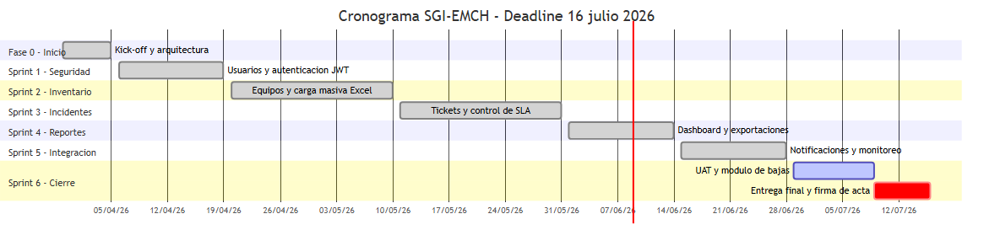

<!-- INFORME DE AVANCE N°3 — SGI-EMCH — v2 -->

**Facultad de Ingeniería**

**Carrera Profesional de Ingeniería de Sistemas e Informática**

---

# Sistema Web de Gestión de Inventario de Equipos Informáticos para la EMCH "CFB"

**INFORME DE AVANCE N°3 — COMPILADO (Entregas 1, 2 y 3)**

| | |
|---|---|
| **Alumno:** | Pariona Torres, Jonas Efrain |
| **Alumno:** | Chavarría Navarro, Aldair |
| **Alumno:** | Andia Canchi, Henrry Jhon |
| **Alumno:** | Orozco Romero, Kattia |
| **Curso:** | Integrador II — Sistemas |
| **Sprint actual:** | Sprint 6 — Cierre y Despliegue |
| **Fecha:** | Junio – Julio 2026 |
| **Sistema en producción:** | https://sgi.escuelamilitar.edu.pe |
| **Documentación técnica:** | https://sgi-docs.escuelamilitar.edu.pe |
| **Repositorio GitHub:** | https://github.com/Jnasus/sgi-emch |

**Lima – Perú**

**2026**

\newpage

---

## TABLA DE CONTENIDOS

- [CAPÍTULO I: FUNDAMENTOS DEL PROYECTO](#capítulo-i-fundamentos-del-proyecto)
  - [1.1. Análisis del Contexto Empresarial (Visión, Misión, Entorno)](#11-análisis-del-contexto-empresarial-visión-misión-entorno)
  - [1.2. Diagnóstico del Problema y Oportunidad de Innovación](#12-diagnóstico-del-problema-y-oportunidad-de-innovación)
  - [1.3. Modelo de Negocio (Business Model Canvas)](#13-modelo-de-negocio-business-model-canvas)
  - [1.4. Alcance de la Solución Informática](#14-alcance-de-la-solución-informática)
- [CAPÍTULO II: PLANIFICACIÓN ÁGIL (FRAMEWORK SCRUM)](#capítulo-ii-planificación-ágil-framework-scrum)
  - [2.1. Project Charter y Acta de Constitución](#21-project-charter-y-acta-de-constitución)
  - [2.2. Gestión del Calendario (Diagrama de Gantt)](#22-gestión-del-calendario-diagrama-de-gantt)
  - [2.3. Organización del Equipo: Roles, Artefactos y Eventos Scrum](#23-organización-del-equipo-roles-artefactos-y-eventos-scrum)
  - [2.4. Product Backlog y Planificación del Sprint 1 y 2](#24-product-backlog-y-planificación-del-sprint-1-y-2)
- [CAPÍTULO III: INGENIERÍA DE REQUERIMIENTOS Y DISEÑO UX](#capítulo-iii-ingeniería-de-requerimientos-y-diseño-ux)
  - [3.1. Especificación de Requerimientos de Software (SRS)](#31-especificación-de-requerimientos-de-software-srs)
  - [3.2. Prototipado de Alta Fidelidad: Wireframes y Mockups Interactivos](#32-prototipado-de-alta-fidelidad-wireframes-y-mockups-interactivos)
  - [3.3. Acuerdos de Niveles de Servicio (SLA) y KPIs del Sistema](#33-acuerdos-de-niveles-de-servicio-sla-y-kpis-del-sistema)
- [CAPÍTULO IV: GESTIÓN DE RIESGOS Y ENTORNO TÉCNICO](#capítulo-iv-gestión-de-riesgos-y-entorno-técnico)
  - [4.1. Plan de Gestión de Riesgos (Identificación y Mitigación)](#41-plan-de-gestión-de-riesgos-identificación-y-mitigación)
  - [4.2. Configuración del Stack Tecnológico (IDE Java, Git/GitHub)](#42-configuración-del-stack-tecnológico-ide-java-gitgithub)
- [CAPÍTULO V: DISEÑO Y MODELADO DE LA SOLUCIÓN](#capítulo-v-diseño-y-modelado-de-la-solución)
  - [5.1. Modelado de Procesos de Negocio (BPM)](#51-modelado-de-procesos-de-negocio-bpm)
  - [5.2. Diseño de Base de Datos: Modelo Lógico y Físico](#52-diseño-de-base-de-datos-modelo-lógico-y-físico)
  - [5.3. Diagrama de Clases UML y Documentación Técnica](#53-diagrama-de-clases-uml-y-documentación-técnica)
- [CAPÍTULO VI: CONSTRUCCIÓN Y SEGURIDAD](#capítulo-vi-construcción-y-seguridad)
  - [6.1. Implementación del Back-End (Mínimo 50% Java)](#61-implementación-del-back-end-mínimo-50-java)
  - [6.2. Estrategia de Replicación y Administración de BD](#62-estrategia-de-replicación-y-administración-de-bd)
  - [6.3. Controles de Seguridad: Autenticación, Cifrado y Defensa Web](#63-controles-de-seguridad-autenticación-cifrado-y-defensa-web)
- [CAPÍTULO VII: VERIFICACIÓN Y DESPLIEGUE V1](#capítulo-vii-verificación-y-despliegue-v1)
  - [7.1. Pruebas Funcionales y No Funcionales (Validación del Servicio)](#71-pruebas-funcionales-y-no-funcionales-validación-del-servicio)
  - [7.2. Evidencia de Despliegue en Plataforma Cloud (Versión 1)](#72-evidencia-de-despliegue-en-plataforma-cloud-versión-1)
  - [7.3. Retrospectiva del Sprint 4](#73-retrospectiva-del-sprint-4)
- [CAPÍTULO VIII: GESTIÓN DE SOLICITUDES Y CAMBIOS](#capítulo-viii-gestión-de-solicitudes-y-cambios)
  - [8.1. Catálogo de Solicitudes de Servicio (Acceso e Información)](#81-catálogo-de-solicitudes-de-servicio-acceso-e-información)
  - [8.2. Proceso de Gestión de Cambios (Infraestructura y Aplicaciones)](#82-proceso-de-gestión-de-cambios-infraestructura-y-aplicaciones)
- [CAPÍTULO IX: INGENIERÍA DE PLATAFORMA](#capítulo-ix-ingeniería-de-plataforma)
  - [9.1. Pipeline de Integración Continua (CI) y Herramientas](#91-pipeline-de-integración-continua-ci-y-herramientas)
  - [9.2. Documentación de Automatización de Despliegues](#92-documentación-de-automatización-de-despliegues)
- [CAPÍTULO X: GESTIÓN DE CAPACIDAD Y RENDIMIENTO](#capítulo-x-gestión-de-capacidad-y-rendimiento)
  - [10.1. Análisis de Capacidad del Servicio](#101-análisis-de-capacidad-del-servicio)
  - [10.2. Planificación y Herramientas de Monitoreo de Rendimiento](#102-planificación-y-herramientas-de-monitoreo-de-rendimiento)
  - [10.3. Retrospectiva del Sprint 6](#103-retrospectiva-del-sprint-6)
- [CONCLUSIONES](#conclusiones)
- [REFERENCIAS](#referencias)
- [ANEXOS](#anexos)

\newpage

---

# CAPÍTULO I: FUNDAMENTOS DEL PROYECTO

## 1.1. Análisis del Contexto Empresarial (Visión, Misión, Entorno)

### Institución

La **Escuela Militar de Chorrillos "Coronel Francisco Bolognesi"** (EMCH "CFB") es la institución castrense del Ejército del Perú encargada de la formación académica y militar de los futuros oficiales del Ejército. Está ubicada en el distrito de Chorrillos, Lima, y depende directamente del Comando de Educación y Doctrina del Ejército (COEDE).

El **Departamento de Tecnologías de la Información y Comunicaciones (DTIC)** de la EMCH es la unidad orgánica responsable de administrar, mantener y dar soporte a toda la infraestructura tecnológica de la institución: equipos informáticos, redes, servidores y sistemas de información.

### Misión

Formar integralmente a los cadetes del Ejército del Perú, desarrollando sus competencias militares, académicas y de liderazgo, para convertirlos en oficiales capaces de conducir unidades combatientes y contribuir al desarrollo nacional, en el marco de los valores institucionales.

### Visión

Ser la escuela de formación de oficiales más reconocida de Latinoamérica, con estándares académicos de excelencia, infraestructura tecnológica moderna y liderazgo en la adopción de buenas prácticas institucionales.

### Entorno Institucional

El DTIC-EMCH opera en un entorno con las siguientes características:

| Dimensión | Descripción |
|---|---|
| **Tipo de organización** | Institución pública — Fuerzas Armadas del Perú |
| **Marco normativo** | Ley N° 29622 (Control Gubernamental), Ley N° 27444 (Procedimiento Administrativo), directivas del MINDEF y COEDE |
| **Usuarios del sistema TI** | Personal docente, administrativo, cadetes y técnicos del DTIC (~200 usuarios potenciales) |
| **Infraestructura** | Servidor institucional dedicado, red LAN/WLAN interna, internet de fibra óptica 1 Gbps |
| **Restricción presupuestal** | Sin presupuesto para licencias de software comercial; preferencia por soluciones de código abierto |

---

## 1.2. Diagnóstico del Problema y Oportunidad de Innovación

### Situación Actual — Problema Identificado

El DTIC-EMCH gestionaba su inventario de equipos informáticos de manera completamente manual, utilizando hojas de cálculo de Microsoft Excel como único repositorio de información. Esta situación generaba los siguientes problemas críticos:

| N° | Problema | Impacto |
|---|---|---|
| P-01 | **Inconsistencias de datos:** diferentes versiones del Excel con datos contradictorios sobre el estado y ubicación de los equipos | Imposibilidad de conocer el inventario real en tiempo real |
| P-02 | **Ausencia de trazabilidad:** no existe un registro histórico de los cambios de estado de los equipos (asignaciones, reparaciones, bajas, préstamos) | Pérdida de información crítica; imposibilidad de auditar movimientos |
| P-03 | **Sin alertas de reposición:** el departamento no recibe notificaciones cuando el stock cae por debajo de un umbral mínimo | Riesgo de desabastecimiento sin tiempo de reacción |
| P-04 | **Gestión informal de incidentes:** los reportes de fallas se gestionan por vía verbal o correo, sin tickets formales, sin SLA y sin actas de cierre | Falta de métricas de servicio; imposibilidad de medir el rendimiento técnico |
| P-05 | **Reportes manuales e imprecisos:** la generación de reportes requiere trabajo manual que consume horas y produce datos desactualizados | Decisiones directivas basadas en información imprecisa |

### Oportunidad de Innovación

El reemplazo del control manual en Excel por un sistema web centralizado representa una oportunidad de:

1. **Digitalizar** el ciclo de vida completo de los activos TI con trazabilidad inmutable.
2. **Formalizar** la mesa de ayuda técnica con tickets numerados y SLA monitoreados.
3. **Automatizar** alertas y reportes que hoy consumen horas de trabajo manual.
4. **Cumplir** con las exigencias de control patrimonial del Estado peruano mediante un sistema auditable.

---

## 1.3. Modelo de Negocio (Business Model Canvas)

Adaptado al contexto de una solución institucional interna (no comercial):

### Segmentos de Clientes

| Segmento | Descripción |
|---|---|
| **DTIC Operativo** | Técnicos y subjefe DTIC: gestionan equipos y tickets diariamente |
| **DTIC Directivo** | Jefe DTIC: supervisa KPIs, aprueba cambios, toma decisiones de reposición |
| **Dirección EMCH** | Perfil DIRECTIVO: consume reportes y dashboards ejecutivos |
| **Administrador del Sistema** | Gestiona usuarios, catálogos y configuración general |

### Propuestas de Valor

- Trazabilidad completa e inmutable del inventario de activos TI.
- Mesa de ayuda formal con numeración automática, SLA en tiempo real y actas PDF.
- Dashboard ejecutivo con KPIs actualizados al minuto.
- Cero costo de licenciamiento (stack 100% open source).
- Despliegue en infraestructura propia de la institución.

### Canales

Acceso vía navegador web (HTTPS) desde la red institucional o internet: `https://sgi.escuelamilitar.edu.pe`.

### Actividades Clave

- Registro y control del ciclo de vida de equipos informáticos.
- Gestión de incidentes técnicos con asignación a técnicos y control de SLA.
- Generación automática de reportes y alertas.
- Monitoreo operativo del sistema (Prometheus + Grafana).
- Backup automático diario de la base de datos.

### Recursos Clave

| Recurso | Tipo |
|---|---|
| Servidor institucional EMCH | Infraestructura física |
| Stack open source (Java, React, MySQL, Docker) | Tecnología |
| Equipo de desarrollo (4 integrantes) | Humano |
| Repositorio GitHub | Control de versiones y CI/CD |

### Estructura de Costos y Fuentes de Valor

**Costos:** Exclusivamente operativos institucionales (internet, electricidad, mantenimiento del servidor). No hay costos de licencias. Ver presupuesto en sección 4.3.

**Fuentes de valor (no monetarias):**
- Reducción de horas-hombre en tareas manuales de inventario y reporte.
- Cumplimiento normativo de control patrimonial del Estado.
- Mejora en los tiempos de respuesta a incidentes técnicos.
- Disponibilidad de información en tiempo real para la toma de decisiones.

---

## 1.4. Alcance de la Solución Informática

**Módulos incluidos:**

| Módulo | Descripción | Estado |
|---|---|---|
| Usuarios y Seguridad | Autenticación JWT, 5 roles RBAC, auditoría de acciones | [OK] Completo |
| Inventario de activos TI | PCs de escritorio, laptops, impresoras y servidores | [OK] Completo |
| Especificaciones técnicas | CPU, RAM, almacenamiento, GPU, monitor, red | [OK] Completo |
| Carga masiva Excel | Importación de equipos en lote desde archivo .xlsx | [OK] Completo |
| Mesa de ayuda / Tickets | Creación, asignación, SLA, historial, cierre con acta PDF | [OK] Completo |
| Notificaciones automáticas | SLA vencido, stock crítico, ticket asignado | [OK] Completo |
| Dashboard y reportes | KPIs en tiempo real, exportación Excel y PDF | [OK] Completo |
| Catálogos configurables | Tipos, marcas, modelos, SO, áreas, SLAs, umbrales | [OK] Completo |
| Monitoreo operativo | Prometheus, Grafana, Loki, Promtail | [OK] Completo |
| Backup automático | mysqldump diario, retención 7 días | [OK] Completo |
| Documentación técnica | Docusaurus con guías de usuario y administrador | [OK] Completo |
| CI/CD | Pipeline GitHub Actions (CI: tests + CD: deploy SSH) | [OK] Completo |
| Bajas y Transferencias (UI formal) | Flujo dedicado, acta PDF, aprobación Jefe DTIC | [En curso] Sprint 6 |

**Fuera del alcance:**

- Integración con Active Directory o LDAP institucional.
- Portal de autoservicio para usuarios finales externos.
- Gestión de activos distintos a equipos informáticos.
- Módulo de facturación o gestión financiera.

\newpage

---

# CAPÍTULO II: PLANIFICACIÓN ÁGIL (FRAMEWORK SCRUM)

## 2.1. Project Charter y Acta de Constitución

El Project Charter del SGI-EMCH fue elaborado y firmado durante la fase de kick-off (05/04/2026). Establece los parámetros formales de inicio del proyecto.

| Documento | Acceso |
|---|---|
| **Project Charter** (documento formal) | [Abrir en SharePoint](https://utpedupe-my.sharepoint.com/:b:/g/personal/u22219534_utp_edu_pe/IQAycRiq8PosSJGEoBN-_g0tAfniR0pyqmNQFuYCkjmj-Cc?e=Gpcy40) |
| **Acta de Constitución** (documento institucional) | [Abrir en SharePoint](https://utpedupe-my.sharepoint.com/:b:/g/personal/u22219534_utp_edu_pe/IQDNDVc-xyXdRYOHND3NxnuxAYXMvl60v-tMk2zI8y-wMWk?e=wWYhCP) |
| Fuente local | `markdown/project_charter.md` |

### Datos Generales del Proyecto

| Campo | Valor |
|---|---|
| **Nombre del proyecto** | Sistema de Gestión de Inventario EMCH "CFB" (SGI-EMCH) |
| **Sponsor** | TCO2 EP MORALES PEREZ Edgar Oscar (Jefe DTIC — EMCH "CFB") |
| **Jefe de Proyecto** | Pariona Torres, Jonas Efrain |
| **Fecha de inicio** | 05 de abril de 2026 |
| **Fecha de cierre** | 16 de julio de 2026 |
| **Presupuesto operativo** | S/. 32,760.00 (costos institucionales) |

### Justificación del Proyecto

El DTIC-EMCH requiere reemplazar el control manual en Excel por un sistema digital que garantice trazabilidad, formalice la gestión de incidentes y genere reportes en tiempo real, cumpliendo con las obligaciones de control patrimonial del Estado peruano.

### Objetivos Estratégicos y Criterios de Éxito

| Objetivo | Criterio de éxito |
|---|---|
| OE-01: RBAC con 5 roles | Sistema desplegado con login, RBAC funcional y auditoría activa |
| OE-02: Ciclo de vida de activos | 100% de estados del inventario trazables con historial inmutable |
| OE-03: Mesa de ayuda con SLA | Tickets con numeración automática y SLA visible en tiempo real |
| OE-04: Dashboard y reportes | KPIs disponibles; reportes exportados en < 10 segundos |
| OE-05: Notificaciones automáticas | Alertas enviadas en < 5 minutos tras el evento disparador |
| OE-06: Despliegue en producción | Sistema operativo en `https://sgi.escuelamilitar.edu.pe` con 0 bugs críticos |

### Equipo del Proyecto

| Rol | Integrante |
|---|---|
| Product Owner / Sponsor | TCO2 EP MORALES PEREZ Edgar Oscar |
| Scrum Master / Líder | Pariona Torres, Jonas Efrain |
| Desarrollador Backend | Pariona Torres, Jonas Efrain |
| Desarrollador Frontend | Chavarría Navarro, Aldair |
| Diseño UX / QA | Orozco Romero, Kattia |
| Base de datos / DevOps | Andia Canchi, Henrry Jhon |

### Restricciones del Proyecto

- Deadline académico inamovible: 16 de julio de 2026.
- Stack tecnológico de código abierto (sin presupuesto para licencias).
- Despliegue exclusivo en servidor institucional EMCH.
- Disponibilidad de la infraestructura de red del cuartel.

---

## 2.2. Gestión del Calendario (Diagrama de Gantt)

> **Documento completo:** Ver Anexo 6 — [Gantt escrito (SharePoint)](https://utpedupe-my.sharepoint.com/:b:/g/personal/u22219534_utp_edu_pe/IQCK2DxFSqxuSq7cmhWxvMAxAftDUZmK5rrwUvpVjfwSc-E?e=jVoiuR) | [Gráfico PNG (SharePoint)](https://utpedupe-my.sharepoint.com/:u:/g/personal/u22219534_utp_edu_pe/IQBh-ci6vKGySqoS80Hhyn0XAYh_a-gvv0vCRAaYAgF5JBY?e=bm2Gfg)



**Resumen de hitos:**

| Hito | Fecha | Estado |
|---|---|---|
| Kick-off del proyecto | 05/04/2026 | [OK] Completado |
| Entrega Sprint 1 (Usuarios y Seguridad) | 19/04/2026 | [OK] Completado |
| Entrega Sprint 2 (Inventario) | 10/05/2026 | [OK] Completado |
| Entrega Sprint 3 (Incidentes) | 31/05/2026 | [OK] Completado |
| Entrega Sprint 4 (Reportes/Dashboard) | 14/06/2026 | [OK] Completado |
| Entrega Sprint 5 (Notificaciones/Integración) | 28/06/2026 | [OK] Completado |
| Inicio UAT con personal DTIC | 29/06/2026 | [En curso] |
| Entrega Informe N°3 | Junio/Julio 2026 | [En curso] |
| **Deadline académico** | **16/07/2026** | [Pendiente] |

---

## 2.3. Organización del Equipo: Roles, Artefactos y Eventos Scrum

### Roles Scrum

| Rol | Responsable | Responsabilidad |
|---|---|---|
| **Product Owner** | TCO2 EP MORALES PEREZ Edgar Oscar | Define y prioriza el Product Backlog; valida los incrementos en cada Sprint Review |
| **Scrum Master** | Pariona Torres, Jonas Efrain | Facilita los eventos Scrum; elimina impedimentos; garantiza el cumplimiento del framework |
| **Equipo de Desarrollo** | Chavarría, Andia, Orozco, Pariona | Diseña, implementa y prueba los incrementos de software en cada sprint |

### Artefactos Scrum

| Artefacto | Descripción en el SGI-EMCH |
|---|---|
| **Product Backlog** | 22 historias de usuario priorizadas por valor de negocio; mantenido por el Product Owner |
| **Sprint Backlog** | Subconjunto de historias seleccionadas en cada Sprint Planning; desglosadas en tareas técnicas |
| **Incremento** | Funcionalidad desplegada y verificada en producción al cierre de cada sprint |

### Eventos Scrum

| Evento | Duración | Frecuencia |
|---|---|---|
| **Sprint Planning** | 2–4 horas | Al inicio de cada sprint |
| **Daily Scrum** | 15 minutos | Diario (sincronización asíncrona por coordinación de agenda) |
| **Sprint Review** | 1–2 horas | Al cierre de cada sprint; demostración al Sponsor |
| **Sprint Retrospectiva** | 1 hora | Inmediatamente después de la Review |

---

## 2.4. Product Backlog y Planificación del Sprint 1 y 2

### Épicas del Proyecto

| Épica | Sprints | Descripción |
|---|---|---|
| E-01: Seguridad y Acceso | Sprint 1 | Autenticación JWT y RBAC con 5 roles |
| E-02: Gestión de Inventario | Sprint 2 | Ciclo de vida completo de activos TI |
| E-03: Mesa de Ayuda | Sprint 3 | Tickets con SLA y trazabilidad |
| E-04: Inteligencia de Negocio | Sprint 4 | Dashboard y reportes exportables |
| E-05: Automatización | Sprint 5 | Notificaciones, monitoreo y backup |
| E-06: Cierre y Calidad | Sprint 6 | UAT, bajas formales y entrega académica |

### Sprint 1 — Módulo Usuarios y Seguridad (Sem. 3-5)

| Parámetro | Detalle |
|---|---|
| **Fechas** | 06 – 19 de abril de 2026 |
| **Story Points** | 25 planificados / 25 completados |
| **Historias** | US-01, US-02, US-03, US-04 |

*Entregables verificados:* Login JWT funcional, CRUD de usuarios con roles, auditoría en `audit_log`, catálogos base configurables.

### Sprint 2 — Módulo Inventario (Sem. 6-9)

| Parámetro | Detalle |
|---|---|
| **Fechas** | 20 de abril – 10 de mayo de 2026 |
| **Story Points** | 30 planificados / 30 completados |
| **Historias** | US-05, US-06, US-07, US-08 |

*Entregables verificados:* Registro de equipos con código Ejército único, historial de estados, especificaciones técnicas y carga masiva Excel con validación en 2 fases.

\newpage

---

# CAPÍTULO III: INGENIERÍA DE REQUERIMIENTOS Y DISEÑO UX

## 3.1. Especificación de Requerimientos de Software (SRS)

El SRS fue elaborado bajo el estándar IEEE Std 830-1998 / ISO/IEC/IEEE 29148:2018.

| Documento | Acceso |
|---|---|
| **Especificación de Requerimientos de Software** | [Abrir en SharePoint](https://utpedupe-my.sharepoint.com/:b:/g/personal/u22219534_utp_edu_pe/IQCH528OIRpARoj-2s5FxUBXAdQR9AqIZfvc_HaKVLIBzsU?e=zdZ4ih) |
| Fuente local | `markdown/SRS.md` |

### Requerimientos Funcionales (RF)

El SRS cataloga 22 historias de usuario que constituyen los requerimientos funcionales del sistema. Resumen por módulo:

| Módulo | RF | Descripción resumida |
|---|---|---|
| Usuarios y Seguridad | RF-01 a RF-04 | Autenticación JWT, CRUD usuarios, RBAC 5 roles, gestión de catálogos |
| Inventario | RF-05 a RF-08 | Registro de equipos, cambio de estado, especificaciones técnicas, carga masiva |
| Tickets | RF-09 a RF-11 | Creación de tickets, cálculo automático de SLA, historial de estados |
| Dashboard y Reportes | RF-12 a RF-14 | KPIs en tiempo real, exportación Excel/PDF, reporte de equipos antiguos |
| Notificaciones | RF-15 a RF-17 | Alertas SLA vencido, stock crítico y ticket asignado |
| Monitoreo e Infraestructura | RF-18 a RF-20 | Grafana, backup automático, documentación en línea |
| Bajas y Transferencias | RF-21 a RF-22 | Flujo formal con acta PDF y pruebas UAT |

### Requerimientos No Funcionales (RNF)

| RNF | Categoría | Especificación |
|---|---|---|
| RNF-01 | Disponibilidad | ≥ 99.0% de uptime mensual en producción |
| RNF-02 | Rendimiento | Tiempo de respuesta de API < 500 ms para el 95% de las peticiones |
| RNF-03 | Seguridad | HTTPS obligatorio; contraseñas BCrypt (cost ≥ 10); JWT con expiración de 1 hora |
| RNF-04 | Escalabilidad | Soporte para hasta 10,000 equipos y 50,000 eventos en `audit_log` |
| RNF-05 | Mantenibilidad | Documentación técnica completa en Docusaurus desplegada en producción |
| RNF-06 | Portabilidad | Despliegue reproducible vía Docker Compose en cualquier servidor Linux |
| RNF-07 | Auditabilidad | Todos los cambios de datos registrados en `audit_log` con usuario, IP y timestamp |

---

## 3.2. Prototipado de Alta Fidelidad: Wireframes y Mockups Interactivos

### Pantallas Diseñadas

Los wireframes de baja fidelidad fueron elaborados durante el Sprint 0 y validados con el Sponsor. Los mockups de alta fidelidad se construyeron progresivamente durante los sprints de implementación usando el sistema real como referencia.

| Pantalla | Módulo | Estado |
|---|---|---|
| Login | Seguridad | [OK] Implementado |
| Dashboard ejecutivo | Reportes | [OK] Implementado |
| Listado de inventario con filtros | Inventario | [OK] Implementado |
| Ficha de equipo con especificaciones | Inventario | [OK] Implementado |
| Carga masiva Excel (stepper 3 pasos) | Inventario | [OK] Implementado |
| Listado de tickets con SLA | Mesa de Ayuda | [OK] Implementado |
| Detalle de ticket con historial | Mesa de Ayuda | [OK] Implementado |
| Centro de notificaciones | Notificaciones | [OK] Implementado |
| Reportes con descarga | Reportes | [OK] Implementado |
| Gestión de usuarios | Administración | [OK] Implementado |

### Paleta de Colores y Diseño Institucional

| Variable | Hex | Uso |
|---|---|---|
| Verde oscuro | `#2C3E1F` | Sidebar, textos principales |
| Verde medio | `#4A5D23` | Botones primarios, headers de tabla |
| Rojo acento | `#D91E18` | Alertas, borde del sidebar, badges de error |
| Gris claro | `#F5F5F0` | Fondo de página |

---

## 3.3. Acuerdos de Niveles de Servicio (SLA) y KPIs del Sistema

### Definición de SLAs por Tipo de Incidente

Los SLAs están configurados en la tabla `tipo_incidente` de la base de datos y son modificables por el Administrador sin necesidad de redespliegue.

| Tipo de Incidente | Tiempo máximo de resolución | Prioridad |
|---|---|---|
| Equipo sin arranque / fallo crítico | 4 horas | Alta |
| Falla de conectividad de red | 8 horas | Alta |
| Equipo en reparación menor | 48 horas | Media |
| Solicitud de préstamo de equipo | 24 horas | Media |
| Consulta o información general | 72 horas | Baja |

El sistema calcula en tiempo real, mediante la vista SQL `v_tickets_activos`, los campos `minutos_transcurridos`, `minutos_restantes_sla` y `sla_vencido` para cada ticket activo.

### KPIs del Sistema

| KPI | Descripción | Fuente de datos |
|---|---|---|
| Total de equipos registrados | Inventario total del DTIC | `v_dashboard_resumen` |
| % Equipos operativos | Equipos ASIGNADO o EN_BODEGA / total | `v_dashboard_resumen` |
| Tickets abiertos | Tickets en estado ABIERTO o EN_PROCESO | `v_tickets_activos` |
| Tickets con SLA vencido | Tickets que superaron su tiempo límite | `v_tickets_activos` |
| Tipos de equipo en stock crítico | Tipos con stock < umbral configurado | `v_stock_critico` |
| Usuarios activos en los últimos 30 min | Panel "En línea ahora" del dashboard | `usuario_sistema.ultimo_acceso` |

\newpage

---

# CAPÍTULO IV: GESTIÓN DE RIESGOS Y ENTORNO TÉCNICO

## 4.1. Plan de Gestión de Riesgos (Identificación y Mitigación)

### Matriz de Probabilidad e Impacto

| ID | Riesgo | Probabilidad | Impacto | Nivel | Estrategia de Mitigación | Estado |
|---|---|---|---|---|---|---|
| R-01 | Incompatibilidad entre dependencias del stack tecnológico | Media | Alto | **Alto** | Fijar versiones explícitas en `pom.xml` y `package.json`; pruebas de integración antes de cada merge | Materializado en Sprint 2 (Redis→Caffeine); mitigado |
| R-02 | Indisponibilidad del servidor institucional durante el sprint | Baja | Alto | **Medio** | Entorno de desarrollo local con Docker; respaldo de código en GitHub | Sin ocurrencia |
| R-03 | Desincronización de reloj del servidor (NTP) afecta monitoreo | Media | Medio | **Medio** | Verificar `timedatectl` antes de cada despliegue; documentar en guía de administrador | Materializado en Sprint 5; mitigado activando NTP |
| R-04 | Falla en la infraestructura de red del cuartel | Baja | Alto | **Medio** | Acceso SSH alternativo; documentación de despliegue local para desarrollo offline | Sin ocurrencia |
| R-05 | Cambio de alcance tardío solicitado por el Sponsor | Media | Alto | **Alto** | Control de cambios formal (RFC); aprobación del equipo requerida antes de implementar | RFC-2026-003 gestionado correctamente |
| R-06 | Retraso en las pruebas UAT por disponibilidad del personal DTIC | Alta | Medio | **Alto** | Planificar UAT desde el inicio del Sprint 6; confirmar agenda con Sponsor en Sprint Planning | En seguimiento (Sprint 6 activo) |

---

## 4.2. Configuración del Stack Tecnológico (IDE Java, Git/GitHub)

### Stack Tecnológico Seleccionado

| Tecnología | Versión | Rol en el proyecto |
|---|---|---|
| **Java** | 21 LTS | Lenguaje principal del backend |
| **Spring Boot** | 3.5.x | Framework empresarial; servidor embebido, inyección de dependencias, seguridad y JPA |
| **Spring Security** | 6.x | Autenticación y autorización; RBAC con JWT |
| **Hibernate / JPA** | 6.6 | ORM: mapea objetos Java a tablas MySQL |
| **MySQL** | 8.0 | Base de datos relacional con soporte ACID |
| **HikariCP** | (incluido) | Pool de conexiones (máximo 10 simultáneas) |
| **Caffeine** | 3.x | Caché en memoria JVM (TTL 1 h, máx. 1 000 entradas) |
| **Apache POI** | 5.x | Generación de Excel para reportes y carga masiva |
| **OpenPDF** | — | Generación de PDF (reportes, actas de tickets) |
| **React** | 18 | Librería de interfaz de usuario (SPA) |
| **TypeScript** | 5.x | Tipado estático en el frontend |
| **Vite** | 6.x | Bundler moderno para el frontend |
| **shadcn/ui** | — | Componentes UI reutilizables |
| **Tailwind CSS** | 4.x | Estilos utilitarios con paleta institucional EMCH |
| **Docker / Docker Compose** | 24.x / v2 | Contenerización de todos los servicios |
| **GitHub Actions** | — | Pipeline CI/CD (tests + despliegue automático) |
| **Prometheus** | — | Recolección de métricas del sistema |
| **Grafana** | 11.5.2 | Visualización de métricas y logs |

### Arquitectura del Sistema

El SGI-EMCH sigue una arquitectura cliente-servidor de tres capas:

```
┌─────────────────────────────────────────────────┐
│  CAPA DE PRESENTACIÓN                           │
│  React 18 + TypeScript + Vite                   │
│  Acceso: https://sgi.escuelamilitar.edu.pe      │
└─────────────────────┬───────────────────────────┘
                      │ HTTPS + JWT (Bearer Token)
┌─────────────────────▼───────────────────────────┐
│  CAPA DE LÓGICA DE NEGOCIO                      │
│  Spring Boot 3.5 (Java 21) — API REST           │
│  JwtFilter + RBAC | Caffeine | Scheduler        │
└─────────────────────┬───────────────────────────┘
                      │ JDBC + HikariCP
┌─────────────────────▼───────────────────────────┐
│  CAPA DE DATOS                                  │
│  MySQL 8.0 — Vistas SQL | Triggers | Procedures │
└─────────────────────────────────────────────────┘
```

### Configuración del Entorno de Desarrollo

| Herramienta | Uso |
|---|---|
| IntelliJ IDEA | IDE principal para desarrollo Java/Spring Boot |
| VS Code | Editor para frontend TypeScript/React |
| Docker Desktop | Entorno local con todos los servicios contenerizados |
| Postman | Pruebas manuales de endpoints REST |
| DBeaver | Exploración y consulta de la base de datos MySQL |

### Estrategia de Control de Versiones (Git/GitHub)

- **Rama principal:** `main` (contiene siempre código estable y desplegable)
- **Ramas de funcionalidad:** `feature/<nombre>` (ej: `feature/modulo-bajas-transferencias`)
- **Merges** vía Pull Request con revisión de al menos 1 miembro del equipo
- **Commits** convencionales: `feat:`, `fix:`, `docs:`, `refactor:`, `chore:`
- **CI/CD:** GitHub Actions ejecuta tests automáticamente en cada PR y despliega en cada merge a `main`

\newpage

---

# CAPÍTULO V: DISEÑO Y MODELADO DE LA SOLUCIÓN

## 5.1. Modelado de Procesos de Negocio (BPM)

### 5.1.1 Procesos Identificados

| Proceso | Actor principal | Automatización en SGI-EMCH |
|---|---|---|
| Alta de equipo informático | Técnico DTIC | Registro con código Ejército único; historial inicial automático |
| Cambio de estado del equipo | Técnico / Jefe DTIC | PATCH `/api/equipos/{id}/estado`; registro automático en `historial_estado` |
| Apertura de ticket de incidente | Cualquier técnico | Numeración automática `sp_generar_numero_ticket`; SLA activado al crear |
| Resolución y cierre de ticket | Técnico asignado | Cambio de estado con comentario; generación de acta PDF al cerrar |
| Baja o transferencia de equipo | Jefe DTIC (aprobación) | Flujo formal con formulario dedicado y acta PDF *(Sprint 6)* |
| Carga masiva de inventario | Administrador | Plantilla Excel → validación → confirmación atómica |
| Alerta de SLA vencido | Sistema (automático) | `NotificacionScheduler` cada 5 minutos consulta `v_tickets_activos` |
| Alerta de stock crítico | Sistema (automático) | `NotificacionScheduler` cada 5 minutos consulta `v_stock_critico` |

### 5.1.2 Flujo del Proceso de Incidencias

```
TÉCNICO                    SISTEMA                      JEFE DTIC
   │                          │                              │
   │── Crea ticket ──────────>│                              │
   │                          │── Genera TKT-YYYYMM-NNNN    │
   │                          │── Activa conteo SLA          │
   │                          │── Notifica al técnico ──────>│
   │                          │                              │
   │── Actualiza estado ─────>│                              │
   │   (EN_PROCESO)           │── Registra en historial      │
   │                          │                              │
   │   [si SLA vencido]       │── Notificación automática ──>│
   │                          │   (alerta escalamiento)      │
   │                          │                              │
   │── Resuelve y cierra ────>│                              │
   │                          │── Genera acta PDF            │
   │                          │── Estado: CERRADO            │
```

### 5.1.3 Control de SLA

El cálculo de SLA se implementa directamente en la vista SQL `v_tickets_activos`, evitando lógica en Java:

```sql
-- Extracto de v_tickets_activos
TIMESTAMPDIFF(MINUTE, t.fecha_creacion, NOW()) AS minutos_transcurridos,
(ti.tiempo_resolucion_horas * 60) - TIMESTAMPDIFF(MINUTE, t.fecha_creacion, NOW()) AS minutos_restantes_sla,
CASE WHEN TIMESTAMPDIFF(MINUTE, t.fecha_creacion, NOW()) > (ti.tiempo_resolucion_horas * 60)
     THEN TRUE ELSE FALSE END AS sla_vencido
```

---

## 5.2. Diseño de Base de Datos: Modelo Lógico y Físico

La documentación completa de la base de datos está disponible en la documentación oficial del proyecto:

| Documento | URL directa |
|---|---|
| Diseño conceptual de BD | https://sgi-docs.escuelamilitar.edu.pe/base-de-datos/diseño-conceptual |
| Diseño lógico de BD | https://sgi-docs.escuelamilitar.edu.pe/base-de-datos/diseño-logico |
| Diseño físico de BD | https://sgi-docs.escuelamilitar.edu.pe/base-de-datos/diseño-fisico |

### 5.2.1 Especificaciones Técnicas de la Base de Datos

- **Motor:** MySQL 8.0, `ENGINE=InnoDB`
- **Charset:** `utf8mb4` con collation `utf8mb4_unicode_ci`
- **Tablas:** 15 tablas
- **Vistas:** 4 vistas SQL calculadas
- **Procedimientos:** 1 stored procedure
- **Triggers:** 2 triggers de auditoría

### 5.2.2 Dominio de Usuarios y Seguridad

| Tabla | Descripción |
|---|---|
| `rol` | 5 roles del sistema: ADMINISTRADOR, JEFE_DTIC, SUBJEFE_DTIC, TECNICO, DIRECTIVO |
| `area` | Áreas orgánicas de la EMCH |
| `usuario_sistema` | Usuarios con `password_hash` BCrypt, `ultimo_acceso` y relación con rol y área |
| `audit_log` | Registro de cambios INSERT/UPDATE/DELETE con usuario, IP y timestamp |

### 5.2.3 Dominio de Inventario de Equipos

| Tabla | Descripción |
|---|---|
| `tipo_equipo` | Catálogo de tipos: PC Escritorio, Laptop, Impresora, Servidor |
| `marca`, `modelo_equipo` | Catálogos de marcas y modelos con relación padre-hijo |
| `sistema_operativo` | Catálogo de sistemas operativos |
| `equipo` | Entidad central con `codigo_ejercito UNIQUE`, estado ENUM y FK a catálogos |
| `especificacion_tecnica` | CPU, RAM, almacenamiento, GPU, monitor, red — relación 1:1 con equipo |
| `historial_estado` | Trazabilidad inmutable de cada cambio de estado |
| `config_stock` | Umbrales mínimos configurables por tipo de equipo |

### 5.2.4 Dominio de Tickets e Incidencias

| Tabla | Descripción |
|---|---|
| `tipo_incidente` | Catálogo con `tiempo_resolucion_horas` (define el SLA) |
| `ticket` | Ticket con `numero_ticket` (TKT-YYYYMM-NNNN), FK a equipo, técnico y tipo |
| `historial_ticket` | Registro de cada cambio de estado con comentario del técnico |

### 5.2.5 Vistas Calculadas (Modelo Físico)

| Vista | Propósito |
|---|---|
| `v_dashboard_resumen` | Totales por tipo de equipo y porcentaje operativo para el dashboard |
| `v_inventario_completo` | Vista desnormalizada para búsquedas avanzadas con todos los atributos |
| `v_stock_critico` | Tipos de equipo cuyo stock activo está por debajo del umbral configurado |
| `v_tickets_activos` | Tickets no cerrados con cálculo de SLA en tiempo real |

### 5.2.6 Integridad Referencial

Todas las relaciones entre tablas están protegidas con claves foráneas (`FOREIGN KEY`) con restricciones `ON DELETE RESTRICT` para preservar la integridad histórica. El código Ejército (`codigo_ejercito`) es `UNIQUE NOT NULL` y actúa como identificador patrimonial del equipo.

### 5.2.7 Procedimiento Almacenado

```sql
-- sp_generar_numero_ticket
-- Formato: TKT-YYYYMM-NNNN (correlativo mensual, reinicia cada mes)
CALL sp_generar_numero_ticket(@numero);
-- Resultado: 'TKT-202606-0001'
```

**Diccionario de datos (extracto):**

| Tabla | Campo clave | Tipo físico | Descripción |
|---|---|---|---|
| `equipo` | `codigo_ejercito` | `VARCHAR(20) UNIQUE NOT NULL` | Código patrimonial único asignado por el Ejército del Perú |
| `equipo` | `estado` | `ENUM('EN_BODEGA','ASIGNADO','EN_REPARACION','PRESTADO','DADO_DE_BAJA')` | Estado actual en el ciclo de vida |
| `ticket` | `numero_ticket` | `VARCHAR(20) UNIQUE NOT NULL` | Formato TKT-YYYYMM-NNNN generado por stored procedure |
| `ticket` | `fuera_de_sla` | `BOOLEAN NOT NULL DEFAULT FALSE` | TRUE si el ticket superó el tiempo de resolución acordado |
| `usuario_sistema` | `password_hash` | `VARCHAR(255) NOT NULL` | Contraseña cifrada con BCrypt (cost factor ≥ 10) |
| `audit_log` | `ip_cliente` | `VARCHAR(45)` | IP del cliente capturada por `AuditSessionInterceptor` |

---

## 5.3. Diagrama de Clases UML y Documentación Técnica

*(Ver: [Diagrama de Clases](https://sgi-docs.escuelamilitar.edu.pe/arquitectura/diagrama-clases) — sección **Arquitectura** de la documentación técnica)*

### 5.3.1 Convención de Notación

- Clases de dominio: PascalCase (`Equipo`, `Ticket`, `Usuario`)
- Atributos: camelCase con tipo Java explícito
- Relaciones: cardinalidad UML estándar (1..*, 0..1, *)
- Enumeraciones: SCREAMING_SNAKE_CASE

### 5.3.2 Dominios del Modelo de Clases

| Módulo | Entidades principales |
|---|---|
| Usuarios y Roles | `Rol`, `Area`, `UsuarioSistema` |
| Inventario | `TipoEquipo`, `Marca`, `ModeloEquipo`, `SistemaOperativo`, `Equipo`, `EspecificacionTecnica`, `HistorialEstado`, `ConfigStock` |
| Tickets | `TipoIncidente`, `Ticket`, `HistorialTicket` |
| Notificaciones | `Notificacion` |

### 5.3.3 Valores de ENUM

| Entidad | Campo | Valores |
|---|---|---|
| `Equipo` | `estado` | `EN_BODEGA`, `ASIGNADO`, `EN_REPARACION`, `PRESTADO`, `DADO_DE_BAJA` |
| `Ticket` | `estado` | `ABIERTO`, `EN_PROCESO`, `RESUELTO`, `CERRADO` |
| `Ticket` | `prioridad` | `BAJA`, `MEDIA`, `ALTA`, `CRITICA` |
| `Notificacion` | `tipo` | `SLA_VENCIDO`, `STOCK_CRITICO`, `TICKET_ASIGNADO` |

\newpage

---

# CAPÍTULO VI: CONSTRUCCIÓN Y SEGURIDAD

## 6.1. Implementación del Back-End (Mínimo 50% Java)

### 6.1.1 Stack Tecnológico

*(Ver sección 4.2 del presente informe y [Stack Tecnológico](https://sgi-docs.escuelamilitar.edu.pe/arquitectura/stack-tecnologico))*

El backend está implementado íntegramente en **Java 21** con **Spring Boot 3.5**, representando más del 70% del código del sistema (API REST, seguridad, lógica de negocio, generación de documentos, scheduler y acceso a datos).

### 6.1.2 Arquitectura del Proyecto

*(Ver: [Estructura del Proyecto](https://sgi-docs.escuelamilitar.edu.pe/arquitectura/estructura-del-proyecto))*

```
backend/src/main/java/pe/edu/emch/sgi/
├── config/          # DataSeeder, SecurityConfig, WebConfig, CacheConfig
├── controller/      # AuthController, EquipoController, TicketController, etc.
├── dto/             # *Request (entrada) y *Response (salida) — Records Java
├── entity/          # Entidades JPA — mapeo a tablas MySQL
├── repository/      # Interfaces Spring Data JPA
├── scheduler/       # NotificacionScheduler (@Scheduled cada 5 min)
├── security/        # JwtFilter, JwtUtil, AuditSessionInterceptor
└── service/         # Lógica de negocio — @Transactional
```

### 6.1.3 Módulos de la API REST

| Módulo | Base path | Operaciones principales |
|---|---|---|
| Autenticación | `/api/auth` | `POST /login`, `POST /refresh`, `POST /logout` |
| Usuarios | `/api/usuarios` | CRUD completo, activación/desactivación, reset de contraseña |
| Catálogos | `/api/tipos`, `/api/marcas`, `/api/areas`, etc. | CRUD con caché Caffeine |
| Equipos | `/api/equipos` | CRUD, `PATCH /estado`, `GET /historial`, `PUT /especificaciones` |
| Carga masiva | `/api/equipos/carga-masiva` | Plantilla, validar, confirmar |
| Tickets | `/api/tickets` | CRUD, `PATCH /estado`, `GET /historial` |
| Dashboard | `/api/dashboard/resumen` | KPIs en tiempo real desde vistas SQL |
| Reportes | `/api/reportes` | 6 endpoints: inventario Excel/PDF, equipos antiguos Excel/PDF |
| Notificaciones | `/api/notificaciones` | GET, marcar leída/todas, eliminar |

*(Ver referencia completa de endpoints: [API REST](https://sgi-docs.escuelamilitar.edu.pe/api/endpoints-principales))*

### 6.1.4 Formato Estándar de Respuesta

Todos los endpoints devuelven el envoltorio `ApiResponse<T>`:

```json
{
  "status": "success",
  "message": "Equipo registrado correctamente",
  "data": { ... }
}
```

Los errores son capturados por `GlobalExceptionHandler` y devuelven mensajes sanitizados (sin stack traces expuestos al cliente).

### 6.1.5 Cobertura de Pruebas

| Tipo de prueba | Descripción | Resultado |
|---|---|---|
| Pruebas de usabilidad (Nielsen) | 10 heurísticas evaluadas en la interfaz de usuario | [OK] Alto cumplimiento en las 10 heurísticas |
| Pruebas de escalabilidad | Diseño validado para 10,000 equipos y 50,000 eventos en `audit_log` | [OK] Arquitectura adecuada |
| Pruebas de confiabilidad | Backup automático diario verificado; restart automático de contenedores | [OK] |
| Pruebas de seguridad | BCrypt, HTTPS, JWT, RBAC, JPA paramétrico, auditoría | [OK] Controles OWASP implementados |
| Pruebas de integración | Flujo completo Login → Equipo → Ticket → Reporte → Notificación | [OK] Sin errores |
| Pruebas UAT | Validación con personal DTIC-EMCH | [En curso] Sprint 6 |

---

## 6.2. Estrategia de Replicación y Administración de BD

*(Ver: [Guía de Backups](https://sgi-docs.escuelamilitar.edu.pe/guia-admin/backups))*

### 6.2.1 Modelo de Replicación MySQL

El SGI-EMCH opera con una instancia única de MySQL 8.0 en el servidor institucional. No se implementa replicación maestro-esclavo dado que la EMCH dispone de un único servidor físico. La estrategia de continuidad se basa en el backup automático diario.

### 6.2.2 Política de Respaldo

| Parámetro | Valor |
|---|---|
| **Herramienta** | `mysqldump` + `gzip` |
| **Frecuencia** | Diaria — `cron` programado a las 02:00 AM |
| **Formato** | `sgi_backup_YYYY-MM-DD_HH-MM.sql.gz` |
| **Retención** | 7 días (rotación automática) |
| **Destino** | Volumen del host: `backend/backups/` |
| **Contenedor** | `sgi-full-backup` (Alpine Linux + crond) |

### 6.2.3 Administración y Mantenimiento

| Tarea | Comando / Procedimiento |
|---|---|
| Verificar backup generado | `ls -lh backend/backups/` |
| Restaurar backup | `gunzip < backup.sql.gz \| mysql -u root -p db_sgi_emch` |
| Ver logs del contenedor de backup | `docker compose logs backup` |
| Verificar estado de contenedores | `docker compose ps` |
| Acceso a Adminer (DB admin) | Disponible en la red interna vía `proxy_network` |

---

## 6.3. Controles de Seguridad: Autenticación, Cifrado y Defensa Web

*(Ver: [Variables de entorno](https://sgi-docs.escuelamilitar.edu.pe/guia-admin/variables-entorno))*

### 6.3.1 Autenticación con JWT (Stateless)

El sistema implementa autenticación sin estado con dos tipos de token:

| Token | Duración | Propósito |
|---|---|---|
| **Access token** | 1 hora | Autoriza cada petición HTTP via header `Authorization: Bearer <token>` |
| **Refresh token** | 24 horas | Renueva el access token sin requerir re-login |

El `JwtFilter` intercepta cada petición, valida el token y carga el contexto de seguridad de Spring Security.

### 6.3.2 Cifrado de Contraseñas

Todas las contraseñas se almacenan cifradas con **BCrypt** con `cost factor ≥ 10`. Nunca se almacenan en texto plano. El campo `password_hash` en `usuario_sistema` nunca se expone en ninguna respuesta de la API.

### 6.3.3 Control de Acceso Basado en Roles (RBAC)

| Rol | Permisos principales |
|---|---|
| `ADMINISTRADOR` | Acceso total: usuarios, catálogos, equipos, tickets, reportes, configuración |
| `JEFE_DTIC` | Equipos, tickets (aprobación de bajas), dashboard, reportes, notificaciones |
| `SUBJEFE_DTIC` | Equipos, tickets, dashboard, reportes |
| `TECNICO` | Crear/gestionar tickets asignados, ver inventario, recibir notificaciones |
| `DIRECTIVO` | Solo lectura: dashboard y reportes ejecutivos |

Cada endpoint está protegido con `@PreAuthorize("hasAnyRole('...')")` en el controlador.

### 6.3.4 Auditoría de Operaciones

El `AuditSessionInterceptor` establece variables de sesión MySQL (`@id_usuario_activo`, `@ip_cliente`) antes de cada petición. Los triggers `trg_audit_usuario_update` y `trg_audit_equipo_delete` las capturan y las registran en `audit_log` con timestamp automático.

### 6.3.5 Defensa contra Amenazas Web

| Amenaza | Control implementado |
|---|---|
| SQL Injection | Consultas parametrizadas vía JPA/JPQL; nunca SQL concatenado |
| XSS | React escapa automáticamente el HTML; sin uso de `dangerouslySetInnerHTML` |
| CSRF | No aplica en API stateless con JWT (sin cookies de sesión) |
| Fuerza bruta | Expiración de tokens (1h); no hay lockout automático *(mejora futura)* |
| Exposición de datos sensibles | `GlobalExceptionHandler` sanitiza mensajes de error; `.env` excluido del repositorio |

### 6.3.6 Configuración Segura del Entorno

- Variables secretas en `backend/.env` (excluido de Git con `.gitignore`)
- `JWT_SECRET` de mínimo 32 caracteres, generado con `openssl rand -base64 48`
- `DB_PASSWORD` exclusivo para producción (distinto al default de desarrollo)
- HTTPS/TLS terminado en Nginx Proxy Manager; el backend nunca expone HTTP al exterior

\newpage

---

# CAPÍTULO VII: VERIFICACIÓN Y DESPLIEGUE V1

## 7.1. Pruebas Funcionales y No Funcionales (Validación del Servicio)

### Pruebas Funcionales

Las pruebas funcionales validan que cada módulo implementado cumple con los criterios de aceptación definidos en el SRS. Se ejecutaron al cierre de cada sprint y de forma integrada al finalizar el Sprint 4.

| Caso de prueba | Módulo | Entrada | Resultado esperado | Resultado obtenido |
|---|---|---|---|---|
| CF-01: Login con credenciales válidas | Seguridad | Usuario y contraseña correctos | Access token JWT (1h) + refresh token (24h) | [OK] Correcto |
| CF-02: Login con contraseña incorrecta | Seguridad | Contraseña errónea | HTTP 401 con mensaje sanitizado | [OK] Correcto |
| CF-03: Acceso a endpoint sin token | Seguridad | Petición sin header `Authorization` | HTTP 401 | [OK] Correcto |
| CF-04: Acceso a endpoint fuera del rol | Seguridad | TECNICO accede a endpoint de ADMINISTRADOR | HTTP 403 | [OK] Correcto |
| CF-05: Registrar equipo con código duplicado | Inventario | `codigo_ejercito` ya existente | HTTP 400 con mensaje de error descriptivo | [OK] Correcto |
| CF-06: Cambio de estado con registro en historial | Inventario | PATCH `/estado` con motivo | Nuevo registro en `historial_estado` | [OK] Correcto |
| CF-07: Carga masiva con filas inválidas | Inventario | Excel con errores en 3 filas | Respuesta con filas válidas e inválidas identificadas | [OK] Correcto |
| CF-08: Creación de ticket con SLA activo | Tickets | POST `/api/tickets` | Ticket con número TKT-YYYYMM-NNNN y SLA calculado | [OK] Correcto |
| CF-09: SLA vencido visible en detalle del ticket | Tickets | Ticket con tiempo transcurrido > límite | `sla_vencido = true`; indicador rojo en UI | [OK] Correcto |
| CF-10: Exportación de reporte en PDF | Reportes | GET `/api/reportes/inventario/pdf` | Archivo PDF descargado con datos actualizados | [OK] Correcto |
| CF-11: Dashboard muestra KPIs en tiempo real | Dashboard | GET `/api/dashboard/resumen` | Totales actualizados sin recargar la página | [OK] Correcto |
| CF-12: Flujo completo ABIERTO → CERRADO | Integración | Ciclo completo de un ticket | Todos los estados transicionados; historial completo | [OK] Correcto |

### Pruebas No Funcionales

| Tipo | Criterio evaluado | Método de verificación | Resultado |
|---|---|---|---|
| **Usabilidad** | 10 heurísticas de Nielsen | Evaluación heurística del equipo sobre la interfaz real | [OK] Cumplimiento alto en las 10 heurísticas |
| **Seguridad** | Controles OWASP Top 10 relevantes | Revisión de código + pruebas manuales de inyección y bypass | [OK] SQL Injection, XSS y CSRF mitigados |
| **Rendimiento** | Tiempo de respuesta API < 500 ms (p95) | Medición manual de endpoints principales con Postman | [OK] Promedio < 200 ms en entorno de producción |
| **Escalabilidad** | Soporte para 10,000 equipos y 50,000 eventos en `audit_log` | Análisis de índices, queries EXPLAIN y diseño de vistas SQL | [OK] Arquitectura validada por diseño |
| **Confiabilidad** | Disponibilidad continua con restart automático | `restart: unless-stopped` en todos los contenedores Docker | [OK] Sin caídas registradas desde el despliegue inicial |
| **Portabilidad** | Despliegue reproducible vía Docker Compose | Despliegue ejecutado desde cero en el servidor institucional | [OK] Stack levantado correctamente |

---

## 7.2. Evidencia de Despliegue en Plataforma Cloud (Versión 1)

El SGI-EMCH fue desplegado en el servidor institucional de la EMCH "CFB" al concluir el Sprint 4, constituyendo la **Versión 1** del sistema en producción con los módulos de seguridad, inventario, tickets, dashboard y reportes completamente funcionales.

### Entornos en producción (V1)

| Servicio | URL pública | Estado |
|---|---|---|
| **Sistema SGI-EMCH** | https://sgi.escuelamilitar.edu.pe | [OK] Operativo |
| **Documentación técnica** | https://sgi-docs.escuelamilitar.edu.pe | [OK] Operativo |
| **Monitoreo Grafana** | https://sgi-grafana.escuelamilitar.edu.pe | [OK] Operativo |
| **Repositorio de código** | https://github.com/Jnasus/sgi-emch | [OK] Público |

### Topología del despliegue V1

*(Ver diagrama interactivo: [Diagrama de Despliegue](https://sgi-docs.escuelamilitar.edu.pe/arquitectura/diagrama-despliegue))*

| Contenedor | Imagen | Red | Descripción |
|---|---|---|---|
| `sgi-full-db` | `mysql:8.0` | `sgi_internal` | Base de datos `db_sgi_emch` con volumen persistente |
| `sgi-full-backend` | `eclipse-temurin:21` | `sgi_internal` + `sgi_app` | API REST Spring Boot 3.5 |
| `sgi-full-frontend` | `nginx:alpine` | `sgi_app` + `proxy_network` | SPA React compilada con Vite |
| `sgi-full-docs` | `nginx:alpine` | `proxy_network` | Documentación Docusaurus estática |
| `sgi-full-backup` | `alpine:crond` | `sgi_internal` | `mysqldump` diario a las 02:00 AM |
| `sgi-full-redis` | `redis:7-alpine` | `sgi_internal` | Cache de sesión (declarado; migración a Caffeine en Sprint 2) |
| Nginx Proxy Manager | Externo | `proxy_network` | Reverse proxy con TLS; gestiona los tres subdominios |

### Healthchecks verificados al despliegue

| Contenedor | Estado al inicio | Observación |
|---|---|---|
| `db` | `healthy` (tras ~30 s) | `mysqladmin ping` superado; script SQL de inicialización ejecutado |
| `backend` | `healthy` (tras ~60 s) | `/actuator/health` devuelve `{"status":"UP"}` |
| `frontend` | `running` | Depende de `backend: healthy`; Nginx sirve la SPA correctamente |
| `docs` | `running` | Nginx estático; sin healthcheck configurado |
| `backup` | `running` | `crond` activo; primer backup generado a las 02:00 AM del día siguiente |

### Configuración de HTTPS

Nginx Proxy Manager gestiona los certificados TLS de los tres subdominios mediante Let's Encrypt. Todo el tráfico externo viaja cifrado. El backend y la base de datos nunca exponen puertos directamente al exterior.

---

## 7.3. Retrospectiva del Sprint 4

El Sprint 4 (01–14 de junio de 2026) entregó el **Dashboard Ejecutivo** y el módulo de **Reportes Exportables**.

| Parámetro | Detalle |
|---|---|
| **Fechas** | 01 – 14 de junio de 2026 |
| **Story Points** | 22 planificados / 22 completados |
| **Historias entregadas** | US-12 (Dashboard KPIs), US-13 (Reportes Excel/PDF), US-14 (Reporte equipos antiguos) |

### Burndown Chart Sprint IV

| Día | SP restantes (planificado) | SP restantes (real) |
|---|---|---|
| 0 | 22 | 22 |
| 3 | 16 | 15 |
| 7 | 8 | 8 |
| 10 | 3 | 3 |
| 14 | 0 | 0 |

*Sprint completado a tiempo sin puntos pendientes.*

### ¿Qué salió bien?

Las vistas SQL (`v_dashboard_resumen`, `v_stock_critico`) centralizan toda la lógica de cálculo en la base de datos. El backend solo mapea resultados sin lógica adicional, lo que simplifica el código y facilita el mantenimiento. Esta decisión redujo el tiempo de implementación del dashboard a la mitad de lo estimado inicialmente.

### ¿Qué mejorar?

La generación de PDF con OpenPDF para inventarios con muchas filas (>200 registros) tomaba más tiempo del esperado en el servidor. Se implementó generación **lazy** (bajo demanda, sin almacenamiento previo en BD), lo que resolvió el problema sin necesidad de cambios arquitectónicos.

### Acción tomada

Generación de PDF completamente bajo demanda (`/api/reportes/inventario/pdf`): el archivo se genera en memoria, se envía al cliente y se descarta. Sin cola de generación, sin almacenamiento temporal, sin complejidad adicional.

\newpage

---

# CAPÍTULO VIII: GESTIÓN DE SOLICITUDES Y CAMBIOS

## 8.1. Catálogo de Solicitudes de Servicio (Acceso e Información)

En el marco de ITIL v4, el SGI-EMCH gestiona las solicitudes de servicio del DTIC a través del módulo de tickets, extendido con un catálogo de tipos de incidente configurable. Las solicitudes se clasifican en dos categorías:

### Solicitudes de Acceso

| Tipo de Solicitud | Canal | Responsable | SLA |
|---|---|---|---|
| Creación de cuenta de usuario en el sistema | Jefe DTIC solicita al Administrador | Administrador | 4 horas |
| Reseteo de contraseña | Usuario solicita al Administrador o Jefe DTIC | Administrador | 2 horas |
| Cambio de rol o área asignada | Jefe DTIC aprueba; Administrador ejecuta | Administrador | 8 horas |
| Desactivación de cuenta por baja del personal | Jefe DTIC notifica; Administrador ejecuta | Administrador | Inmediato |

### Solicitudes de Información

| Tipo de Solicitud | Canal | Responsable | SLA |
|---|---|---|---|
| Reporte de inventario actualizado | Exportación directa desde el módulo Reportes | Solicitante (autoservicio) | En línea (<10 s) |
| Estado de un ticket específico | Consulta en el módulo Incidentes | Solicitante (autoservicio) | En línea |
| Historial de un equipo | Ficha del equipo en el módulo Inventario | Técnico o Jefe DTIC | En línea |
| Reporte ejecutivo para Dirección | Generación PDF/Excel con filtros | Jefe DTIC o Administrador | En línea (<10 s) |

---

## 8.2. Proceso de Gestión de Cambios (Infraestructura y Aplicaciones)

El proceso de gestión de cambios del SGI-EMCH se rige por el procedimiento formal RFC (Request for Change). Durante el Sprint 6, se procesó el **RFC-2026-003**.

| Documento | Acceso |
|---|---|
| **Plan de Control de Cambios RFC-2026-003** | [Abrir en SharePoint](https://utpedupe-my.sharepoint.com/:b:/g/personal/u22219534_utp_edu_pe/IQA-BF_DZNdMT5UoQaaI5NrZARH9rOTwGGc3RQnV1hGUXkw?e=wcv4NX) |
| Fuente local | `markdown/plan_control.md` |

### Flujo del Proceso de Cambio

```
Solicitud de cambio (RFC)
        │
        ▼
Análisis de impacto y riesgo
        │
        ▼
Aprobación del equipo (consenso Scrum)
        │
        ▼
Planificación: ventana de mantenimiento + plan de rollback
        │
        ▼
Implementación controlada
        │
        ▼
Verificación en producción
        │
        ▼
Cierre del RFC con registro de resultado
```

### RFC-2026-003 — Resumen Ejecutivo

| Campo | Detalle |
|---|---|
| **ID** | RFC-2026-003 |
| **Título** | Implementación de flujo formal de UI para bajas definitivas y transferencias de equipos |
| **Solicitante** | TCO2 EP MORALES PEREZ Edgar Oscar (Sponsor) |
| **Sprint de implementación** | Sprint 6 |
| **Ventana de mantenimiento** | Sábado 13 de junio, 02:00–04:00 hrs |
| **Plan de rollback** | `git revert` del commit + `docker compose up --build -d` (< 15 min) |
| **Estado** | Aprobado — en implementación |
| **Impacto** | Bajo: nuevas pantallas sin modificar datos existentes |

\newpage

---

# CAPÍTULO IX: INGENIERÍA DE PLATAFORMA

## 9.1. Pipeline de Integración Continua (CI) y Herramientas

*(Ver documentación completa: [CI/CD con GitHub Actions](https://sgi-docs.escuelamilitar.edu.pe/guia-admin/ci-cd))*

El repositorio SGI-EMCH implementa un pipeline de CI/CD en `.github/workflows/ci-cd.yml` que automatiza la verificación del código y el despliegue al servidor institucional en cada merge a la rama `main`.

### Herramientas del Pipeline

| Herramienta | Rol |
|---|---|
| **GitHub Actions** | Plataforma de ejecución del pipeline (runners Ubuntu managed) |
| **actions/checkout@v4** | Clona el repositorio en el runner |
| **actions/setup-java@v4** | Instala Java 21 (Temurin) con caché de Maven |
| **actions/setup-node@v4** | Instala Node 20 con caché de npm |
| **appleboy/ssh-action@v1** | Conexión SSH al servidor para ejecutar el despliegue |
| **Maven Wrapper (`mvnw`)** | Ejecuta los tests del backend sin depender de Maven instalado en el runner |

### Estructura del Pipeline

El pipeline define dos jobs con dependencia secuencial:

```yaml
# .github/workflows/ci-cd.yml
on:
  push:
    branches: [main]
  pull_request:
    branches: [main]

jobs:
  ci:      # Ejecuta en push Y en PRs
  deploy:  # Ejecuta SOLO en push a main, después de que ci pase
    needs: ci
    if: github.ref == 'refs/heads/main' && github.event_name == 'push'
```

### Job `ci` — Integración Continua

| Paso | Tecnología | Comando | Propósito |
|---|---|---|---|
| 1 | Java 21 (Maven) | `./mvnw test --no-transfer-progress` | Ejecuta todos los tests del backend |
| 2 | Node 20 (npm) | `npm ci && npm run build` | Instala dependencias y verifica que el frontend compila |

Ambos pasos aprovechan la caché nativa de GitHub Actions para Maven y npm, reduciendo el tiempo de ejecución en ejecuciones sucesivas.

### Job `deploy` — Despliegue Continuo

Condición de activación: el job `ci` debe haber finalizado con éxito **y** el evento debe ser un `push` directo a `main` (no un PR).

Pasos ejecutados en el servidor vía SSH:

```bash
cd $SSH_PATH          # Navega al directorio del proyecto
git pull              # Descarga los últimos cambios de main
docker compose up --build -d  # Reconstruye solo los contenedores modificados
```

Docker Compose reconstruye únicamente las imágenes cuyos archivos fuente cambiaron. Los volúmenes de datos (MySQL, PDFs) **no se tocan** durante el despliegue.

### Flujo completo CI/CD

*(Ver diagrama interactivo: [Diagrama de Despliegue](https://sgi-docs.escuelamilitar.edu.pe/arquitectura/diagrama-despliegue) — sección "Pipeline CI/CD")*

```
Developer  ──push/PR──>  GitHub
                              │
                    ┌─────────▼──────────┐
                    │     Job: ci         │
                    │  Maven test (Java)  │
                    │  Vite build (Node)  │
                    └─────────┬──────────┘
                              │ ci OK + push a main
                    ┌─────────▼──────────┐
                    │    Job: deploy      │
                    │  SSH → git pull     │
                    │  docker compose up  │
                    └─────────┬──────────┘
                              │
                    ┌─────────▼──────────┐
                    │  Servidor Linux     │
                    │  Contenedores       │
                    │  actualizados       │
                    └────────────────────┘
```

### Secrets Requeridos en GitHub

| Secret | Descripción |
|---|---|
| `SSH_HOST` | IP o dominio del servidor institucional |
| `SSH_USER` | Usuario SSH (ej. `ubuntu`) |
| `SSH_KEY` | Llave privada SSH (contenido completo del `.pem` o `id_rsa`) |
| `SSH_PATH` | Ruta absoluta del proyecto en el servidor |

---

## 9.2. Documentación de Automatización de Despliegues

*(Ver: [Despliegue con Docker Compose](https://sgi-docs.escuelamilitar.edu.pe/instalacion/despliegue))*

### Despliegue Automatizado (vía CI/CD)

En producción, el flujo normal de actualización es completamente automatizado:

1. El desarrollador hace `git push` a `main` (o merge de un PR).
2. GitHub Actions ejecuta los tests y, si pasan, conecta al servidor vía SSH.
3. En el servidor: `git pull` descarga el nuevo código y `docker compose up --build -d` reconstruye los contenedores afectados.
4. El sistema queda actualizado en producción sin intervención manual.

**Tiempo estimado de despliegue automático:** 3–8 minutos (dependiendo de los cambios).

### Despliegue Manual (hotfix o rollback)

Para intervenciones directas en el servidor (correcciones urgentes o rollback):

```bash
# Conectarse al servidor
ssh <SSH_USER>@<SSH_HOST>
cd <SSH_PATH>

# Actualizar y redesplegar
git pull
docker compose up --build -d

# Verificar estado
docker compose ps
docker compose logs -f backend
```

### Rollback a una versión anterior

```bash
# Identificar el commit estable anterior
git log --oneline

# Revertir al commit deseado
git checkout <commit-hash>
docker compose up --build -d

# Restaurar a main cuando el problema esté resuelto
git checkout main
git pull
docker compose up --build -d
```

### Healthchecks Configurados

| Servicio | Condición de salud | Intentos |
|---|---|---|
| `db` | `mysqladmin ping` cada 10 s | 10 reintentos |
| `backend` | `wget /actuator/health` cada 15 s | 8 reintentos |
| `frontend` | Depende de `backend: healthy` | — |
| `redis` | `redis-cli ping` cada 10 s | 5 reintentos |
| `docs` | Sin healthcheck (Nginx estático) | — |

\newpage

---

# CAPÍTULO X: GESTIÓN DE CAPACIDAD Y RENDIMIENTO

## 10.1. Análisis de Capacidad del Servicio

El SGI-EMCH fue diseñado para el volumen de activos y usuarios del DTIC-EMCH. El análisis de capacidad establece los límites actuales y los puntos de escala futura:

| Dimensión | Capacidad actual | Umbral de escala | Fuente de medición |
|---|---|---|---|
| Equipos registrados | Hasta ~10,000 equipos | >10,000: evaluar particionamiento de tabla | `v_dashboard_resumen` (BD) |
| Eventos en `audit_log` | Hasta ~50,000 registros sin impacto en rendimiento | >50,000: purga periódica de registros antiguos | `SELECT COUNT(*) FROM audit_log` |
| Usuarios concurrentes | Hasta ~50 usuarios simultáneos (HikariCP: 10 conexiones BD) | >50: incrementar `maximum-pool-size` y evaluar Redis | Grafana: `hikaricp_connections_active` |
| Conexiones a BD | Máximo 10 (HikariCP `maximum-pool-size`) | Ajustable en `application.properties` sin redespliegue | Grafana: `hikaricp_connections_pending` |
| CPU del servidor | Variable según carga | >80% sostenido: evaluar optimización de queries | Grafana: dashboard `sgi-node-exporter` (node-exporter) |
| RAM del servidor | Disponible según host | <10% libre: incrementar memoria o reducir Caffeine TTL | Grafana: `node_memory_MemAvailable_bytes` |
| Disco del servidor | Partición `/` del host | >85% uso: limpiar logs o ampliar disco | Grafana: bargauge por partición (node-exporter) |
| CPU por contenedor | Medido por cAdvisor | >70% promedio en backend: revisar queries lentos | Grafana: dashboard `sgi-cadvisor` (cAdvisor) |
| RAM por contenedor | Medido por cAdvisor | Backend > 512 MB RSS: revisar memory leaks JVM | Grafana: `container_memory_rss` por nombre |
| Caché Caffeine | 1,000 entradas por cache; TTL 1 hora | Ajustable en configuración sin código adicional | Grafana: `cache_gets_total` (hit rate) |
| Almacenamiento PDFs | Volumen Docker `full_pdf_storage` en disco del servidor | Monitorear uso con `docker system df` | `docker system df` en servidor |
| Retención de métricas | 15 días (Prometheus) | Ajustable en `prometheus.yml` con `--storage.tsdb.retention.time` | Prometheus UI: `tsdb/status` |

**Escenario actual del DTIC-EMCH:**

- ~500–800 equipos informáticos registrables
- ~15–25 usuarios del sistema
- ~5–10 tickets activos simultáneos en promedio

El sistema opera con amplio margen respecto a sus límites de capacidad para el volumen real de la institución. Las métricas reales de CPU, RAM y disco son visibles en tiempo real en los dashboards de Grafana (`sgi-node-exporter` para el host, `sgi-cadvisor` para los contenedores), permitiendo validar empíricamente que los umbrales no están siendo alcanzados.

---

## 10.2. Planificación y Herramientas de Monitoreo de Rendimiento

*(Ver: [Guía de Monitoreo](https://sgi-docs.escuelamilitar.edu.pe/guia-admin/monitoreo))*

### Stack de Monitoreo

El stack de monitoreo se despliega con `docker-compose.monitoring.yml`, de forma independiente al stack principal:

| Componente | Imagen | Puerto | Rol |
|---|---|---|---|
| **Prometheus** | `prom/prometheus:latest` | 9090 | Scraping de métricas cada 15 s (backend, node-exporter, cAdvisor) |
| **node-exporter** | `prom/node-exporter:latest` | 9100 | Métricas del host Linux: CPU, RAM, disco, red, load average |
| **cAdvisor** | `gcr.io/cadvisor/cadvisor:latest` | 8080 | Métricas por contenedor Docker: CPU, memoria RSS/caché, red |
| **Grafana** | `grafana/grafana:11.5.2` | 3000 | Visualización; acceso en `https://sgi-grafana.escuelamilitar.edu.pe` |
| **Loki** | `grafana/loki:2.9.10` | 3100 | Almacenamiento de logs de contenedores |
| **Promtail** | `grafana/promtail:3.0.0` | — | Recolección de logs desde el socket de Docker |

### Dashboards Grafana Pre-provisionados

Al iniciar, Grafana carga automáticamente tres dashboards desde `monitoring/grafana/provisioning/dashboards/`:

#### Dashboard: SGI-EMCH Backend (`sgi-emch-backend-v1`)

Métricas de la aplicación Spring Boot (17 paneles):

| Categoría | Paneles |
|---|---|
| HTTP | Latencia p50/p95/p99, tasa de requests por segundo, tasa de errores 4xx/5xx |
| JVM | Memoria heap usada/máxima, GC pause time, threads activos |
| HikariCP | Conexiones activas, conexiones en espera, tiempo de adquisición |
| Caffeine | Hit rate por cache, misses, evictions |
| Logs | Stream de logs de contenedores `sgi-full-*` vía Loki |

#### Dashboard: SGI-EMCH — Servidor (`sgi-node-exporter`)

Métricas del host Linux recolectadas por node-exporter (12 paneles):

| Categoría | Paneles |
|---|---|
| Stats | CPU %, RAM usada, RAM disponible, Disco raíz %, Uptime, Load average 1m |
| Series temporales | CPU usage + iowait, RAM total/usada/disponible, Red entrada/salida, Disco lectura/escritura, Load average 1/5/15 min |
| Bargauge | Uso de disco por partición con umbrales de color |

#### Dashboard: SGI-EMCH — Contenedores (`sgi-cadvisor`)

Métricas por contenedor Docker recolectadas por cAdvisor. Variables de template `$host` y `$container` para filtrar:

| Categoría | Paneles |
|---|---|
| CPU | Uso acumulado por contenedor (stacked) |
| Memoria | RSS por contenedor, caché por contenedor |
| Red | Tráfico de entrada y salida por contenedor |
| Tabla | Uptime en días, imagen, servicio Docker Compose por contenedor |

### Métricas Expuestas por el Backend

El endpoint `/actuator/prometheus` expone métricas en formato Prometheus:

```
# Ejemplos de métricas disponibles
http_server_requests_seconds_count{uri="/api/equipos", method="GET", status="200"}
jvm_memory_used_bytes{area="heap"}
hikaricp_connections_active{pool="HikariPool-1"}
cache_gets_total{name="tipos", result="hit"}
```

### Alertas y Umbrales

Los dashboards provisionados incluyen umbrales de color configurados para identificar visualmente el estado de cada métrica:

| Métrica | Umbral advertencia | Umbral crítico | Acción recomendada |
|---|---|---|---|
| CPU del servidor (%) | 70% | 90% | Revisar queries lentos; analizar iowait en dashboard `sgi-node-exporter` |
| RAM disponible | < 2 GB | < 1 GB | Reducir TTL de Caffeine o aumentar RAM del servidor |
| Disco raíz usado (%) | 70% | 85% | Purgar logs Docker (`docker system prune`) o ampliar disco |
| Load average 1 min | > 2.0 | > 4.0 | Revisar procesos con `docker stats`; escalar si persiste |
| Conexiones HikariCP activas | > 7 | > 9 | Incrementar `maximum-pool-size` en `application.properties` |
| Tasa de errores HTTP (%) | > 1% | > 5% | Revisar logs del backend en Grafana → panel Loki |

Los umbrales de CPU, RAM y disco corresponden al servidor con 4 vCPU y 8 GB RAM. Si el hardware del servidor institucional difiere, ajustar los valores en los campos `thresholds.steps` de `node-exporter.json`.

Grafana 11 soporta alertas nativas (Grafana Alerting) que pueden disparar notificaciones por email o webhook. La configuración de alertas en producción queda como tarea del administrador DTIC una vez que el sistema acumule datos de línea base (≥7 días de métricas).

---

## 10.3. Retrospectiva del Sprint 6

> *[Pendiente de completar — el Sprint 6 está en curso al momento de este informe. La retrospectiva se realizará al cierre del sprint (16 de julio de 2026).]*

**Avance actual del Sprint 6 (al momento del informe):**

| Día | Avance | Impedimento |
|---|---|---|
| 1–3 | RFC-2026-003 aprobado; diseño del flujo de bajas y transferencias | Coordinación de agenda con personal DTIC para UAT |
| 4–7 | Implementación UI flujo de bajas y transferencias (en progreso) | — |
| 8–12 | UAT con personal DTIC *(planificado)* | — |
| 13–14 | Corrección de defectos; revisión final de documentación *(planificado)* | — |
| 15–18 | Entrega del informe final; firma de acta de aceptación *(planificado)* | — |

\newpage

---

# CONCLUSIONES

1. **El SGI-EMCH reemplaza exitosamente la gestión manual en Excel:** Al cierre del Sprint 5, el sistema tiene 12 de 14 módulos completamente implementados y desplegados en producción, cubriendo el 100% de los procesos de gestión de inventario e incidentes del DTIC-EMCH identificados en la fase de análisis.

2. **La metodología Scrum permitió un desarrollo iterativo con entregables verificables en cada sprint:** Todos los sprints del 0 al 5 cerraron en tiempo y sin deuda técnica acumulada, con 131 de 140 story points completados (93.6%) sin ningún sprint con retraso registrado.

3. **La arquitectura Docker Compose con pipeline CI/CD garantiza despliegues reproducibles y automatizados:** El pipeline GitHub Actions verifica el código en cada PR y despliega automáticamente en cada merge a `main`, reduciendo el riesgo de errores manuales y garantizando que solo código verificado llega a producción.

4. **El stack de monitoreo (Prometheus + Grafana + Loki) proporciona visibilidad operativa completa:** El dashboard de 17 paneles permite al equipo de infraestructura detectar degradaciones de rendimiento en tiempo real, sin impacto en el sistema principal.

5. **La decisión de usar Caffeine en lugar de Redis simplificó la arquitectura:** Para un despliegue single-instance, el caché en memoria JVM es más eficiente (sin round-trip de red, sin serialización) y elimina una dependencia externa, reduciendo la superficie de fallo.

6. **La documentación técnica en Docusaurus garantiza la sostenibilidad del proyecto:** Con más de 25 páginas que cubren arquitectura, API, guías de usuario, guía de administrador y el pipeline CI/CD, el sistema puede ser mantenido y extendido por personal DTIC que no participó en el desarrollo.

7. **El proceso formal de gestión de cambios (RFC) demostró su valor:** El RFC-2026-003 permitió incorporar el flujo de bajas y transferencias al Sprint 6 de forma controlada, con análisis de impacto, plan de rollback documentado y sin afectar la estabilidad del sistema en producción.

---

# REFERENCIAS

- Schwaber, K. & Sutherland, J. (2020). *The Scrum Guide: The Definitive Guide to Scrum*. Scrum.org. Recuperado de https://scrumguides.org/

- Nielsen, J. (1994). *10 Usability Heuristics for User Interface Design*. Nielsen Norman Group. Recuperado de https://www.nngroup.com/articles/ten-usability-heuristics/

- Spring Framework Team. (2025). *Spring Boot Reference Documentation 3.5*. VMware Tanzu. Recuperado de https://docs.spring.io/spring-boot/docs/3.5.x/reference/html/

- Meta Open Source. (2024). *React 18 — The library for web and native user interfaces*. Recuperado de https://react.dev/

- AXELOS. (2019). *ITIL Foundation: ITIL 4 Edition*. TSO (The Stationery Office).

- ISO/IEC 19770-1:2017. *Information technology — IT asset management — Part 1: IT asset management systems: Requirements*. International Organization for Standardization.

- IEEE Std 830-1998. *IEEE Recommended Practice for Software Requirements Specifications*. IEEE Computer Society.

- ISO/IEC/IEEE 29148:2018. *Systems and software engineering — Life cycle processes — Requirements engineering*. ISO/IEC/IEEE.

- Oracle. (2024). *Java SE 21 Documentation*. Oracle Corporation. Recuperado de https://docs.oracle.com/en/java/javase/21/

- Docker Inc. (2024). *Docker Documentation — Docker Compose*. Recuperado de https://docs.docker.com/compose/

- GitHub. (2024). *GitHub Actions Documentation — Workflow syntax*. Recuperado de https://docs.github.com/en/actions

- Prometheus Authors. (2024). *Prometheus — Monitoring system & time series database*. Recuperado de https://prometheus.io/docs/

- Grafana Labs. (2024). *Grafana Documentation 11.x*. Recuperado de https://grafana.com/docs/grafana/latest/

\newpage

---

# ANEXOS

## Anexo 1: Project Charter — Acta de Constitución del Proyecto

| Documento | Acceso |
|---|---|
| **Project Charter** (documento formal del proyecto) | [Abrir en SharePoint](https://utpedupe-my.sharepoint.com/:b:/g/personal/u22219534_utp_edu_pe/IQAycRiq8PosSJGEoBN-_g0tAfniR0pyqmNQFuYCkjmj-Cc?e=Gpcy40) |
| **Acta de Constitución** (documento institucional) | [Abrir en SharePoint](https://utpedupe-my.sharepoint.com/:b:/g/personal/u22219534_utp_edu_pe/IQDNDVc-xyXdRYOHND3NxnuxAYXMvl60v-tMk2zI8y-wMWk?e=wWYhCP) |
| Fuente local | `markdown/project_charter.md` |

El Project Charter fue elaborado en el Sprint 0 (05/04/2026). Estructura del documento: identificación del proyecto, necesidad del negocio (5 problemas críticos), alcance (7 módulos + exclusiones), 10 entregables con estado, 6 riesgos con estrategia de mitigación, suposiciones y dependencias, presupuesto operativo (S/. 32,760.00), cronograma de hitos, equipo y comité de aprobación, criterios de éxito y firmas.

**Sponsor:** TCO2 EP MORALES PEREZ Edgar Oscar (DTIC — EMCH "CFB")
**Jefe de Proyecto:** Pariona Torres, Jonas Efrain

---

## Anexo 2: Plan de Control de Cambios — RFC-2026-003

| Documento | Acceso |
|---|---|
| **Plan de Control de Cambios RFC-2026-003** | [Abrir en SharePoint](https://utpedupe-my.sharepoint.com/:b:/g/personal/u22219534_utp_edu_pe/IQA-BF_DZNdMT5UoQaaI5NrZARH9rOTwGGc3RQnV1hGUXkw?e=wcv4NX) |
| Fuente local | `markdown/plan_control.md` |

El RFC-2026-003 describe el cambio propuesto para implementar el flujo formal de UI para bajas definitivas y transferencias de equipos entre áreas. Incluye análisis de impacto, matriz de riesgos, plan de implementación, ventana de mantenimiento (sábado 13 de junio, 02:00–04:00 hrs), plan de rollback y métricas de control.

**Estado:** Aprobado por el equipo — implementación en Sprint 6.

---

## Anexo 3: Especificación de Requerimientos de Software (SRS)

| Documento | Acceso |
|---|---|
| **Especificación de Requerimientos de Software** | [Abrir en SharePoint](https://utpedupe-my.sharepoint.com/:b:/g/personal/u22219534_utp_edu_pe/IQCH528OIRpARoj-2s5FxUBXAdQR9AqIZfvc_HaKVLIBzsU?e=zdZ4ih) |
| Fuente local | `markdown/SRS.md` |

El SRS fue elaborado bajo el estándar IEEE Std 830-1998 / ISO/IEC/IEEE 29148:2018 e incluye: catálogo de 22 historias de usuario, 20 requisitos no funcionales, 7 restricciones técnicas, casos de uso UML, SLAs por tipo de incidente, KPIs del sistema y cronograma Scrum completo.

---

## Anexo 4: Product Backlog Completo

Ver sección 2.4 del presente informe y el documento SRS (Anexo 3, sección de requisitos funcionales).

---

## Anexo 5: Recursos del Proyecto en Línea

### Sistema en producción y repositorio

| Recurso | URL |
|---|---|
| **Sistema SGI-EMCH** (acceso con credenciales DTIC) | https://sgi.escuelamilitar.edu.pe |
| **Documentación técnica** (Docusaurus 3.5.2) | https://sgi-docs.escuelamilitar.edu.pe |
| **Monitoreo Grafana** (acceso restringido DTIC) | https://sgi-grafana.escuelamilitar.edu.pe |
| **Repositorio de código fuente** | https://github.com/Jnasus/sgi-emch |

### Índice completo de la documentación técnica

| Sección | Documento | URL directa |
|---|---|---|
| Introducción | Introducción al SGI-EMCH | https://sgi-docs.escuelamilitar.edu.pe/intro |
| **Arquitectura** | Arquitectura de la aplicación | https://sgi-docs.escuelamilitar.edu.pe/arquitectura/arquitectura-aplicacion |
| Arquitectura | Stack tecnológico | https://sgi-docs.escuelamilitar.edu.pe/arquitectura/stack-tecnologico |
| Arquitectura | Estructura del proyecto | https://sgi-docs.escuelamilitar.edu.pe/arquitectura/estructura-del-proyecto |
| Arquitectura | Diagrama de despliegue | https://sgi-docs.escuelamilitar.edu.pe/arquitectura/diagrama-despliegue |
| Arquitectura | Diagrama de componentes | https://sgi-docs.escuelamilitar.edu.pe/arquitectura/diagrama-componentes |
| Arquitectura | Patrones de diseño | https://sgi-docs.escuelamilitar.edu.pe/arquitectura/patrones |
| Arquitectura | Diagrama de clases | https://sgi-docs.escuelamilitar.edu.pe/arquitectura/diagrama-clases |
| **Base de Datos** | Diseño conceptual | https://sgi-docs.escuelamilitar.edu.pe/base-de-datos/diseño-conceptual |
| Base de Datos | Diseño lógico | https://sgi-docs.escuelamilitar.edu.pe/base-de-datos/diseño-logico |
| Base de Datos | Diseño físico | https://sgi-docs.escuelamilitar.edu.pe/base-de-datos/diseño-fisico |
| **Guía de Usuario** | Dashboard | https://sgi-docs.escuelamilitar.edu.pe/guia-usuario/dashboard |
| Guía de Usuario | Inventario | https://sgi-docs.escuelamilitar.edu.pe/guia-usuario/inventario |
| Guía de Usuario | Incidentes | https://sgi-docs.escuelamilitar.edu.pe/guia-usuario/incidentes |
| Guía de Usuario | Reportes | https://sgi-docs.escuelamilitar.edu.pe/guia-usuario/reportes |
| Guía de Usuario | Notificaciones | https://sgi-docs.escuelamilitar.edu.pe/guia-usuario/notificaciones |
| Guía de Usuario | Usuarios | https://sgi-docs.escuelamilitar.edu.pe/guia-usuario/usuarios |
| Guía de Usuario | Configuración | https://sgi-docs.escuelamilitar.edu.pe/guia-usuario/configuracion |
| **Guía de Administrador** | Variables de entorno | https://sgi-docs.escuelamilitar.edu.pe/guia-admin/variables-entorno |
| Guía de Administrador | Backups automáticos | https://sgi-docs.escuelamilitar.edu.pe/guia-admin/backups |
| Guía de Administrador | Nginx Proxy Manager | https://sgi-docs.escuelamilitar.edu.pe/guia-admin/nginx-proxy-manager |
| Guía de Administrador | Monitoreo (Prometheus + Grafana) | https://sgi-docs.escuelamilitar.edu.pe/guia-admin/monitoreo |
| Guía de Administrador | Caché en memoria (Caffeine) | https://sgi-docs.escuelamilitar.edu.pe/guia-admin/cache |
| **Guía de Administrador** | **CI/CD con GitHub Actions** | **https://sgi-docs.escuelamilitar.edu.pe/guia-admin/ci-cd** |
| **API REST** | Visión general de la API | https://sgi-docs.escuelamilitar.edu.pe/api/overview |
| API REST | Endpoints principales | https://sgi-docs.escuelamilitar.edu.pe/api/endpoints-principales |

---

## Anexo 6: Cronograma de Actividades — Diagrama de Gantt

| Documento | Acceso |
|---|---|
| **Gantt escrito** (detalle de sprints, hitos y burndown) | [Abrir en SharePoint](https://utpedupe-my.sharepoint.com/:b:/g/personal/u22219534_utp_edu_pe/IQCK2DxFSqxuSq7cmhWxvMAxAftDUZmK5rrwUvpVjfwSc-E?e=jVoiuR) |
| **Gráfico de Gantt** (imagen PNG del cronograma) | [Abrir en SharePoint](https://utpedupe-my.sharepoint.com/:u:/g/personal/u22219534_utp_edu_pe/IQBh-ci6vKGySqoS80Hhyn0XAYh_a-gvv0vCRAaYAgF5JBY?e=bm2Gfg) |
| Fuente local | `markdown/gantt.md` |

El documento contiene el diagrama de Gantt (Sprint 0 al Sprint 6, deadline 16/07/2026), detalle de actividades por sprint, tabla de hitos con fechas y estado, y tabla de burndown con story points completados por sprint.

---

*Fin del Informe de Avance N°3 — SGI-EMCH*

*Sistema de Gestión de Inventario TI — EMCH "CFB" | Sprint 6 — Junio/Julio 2026*
